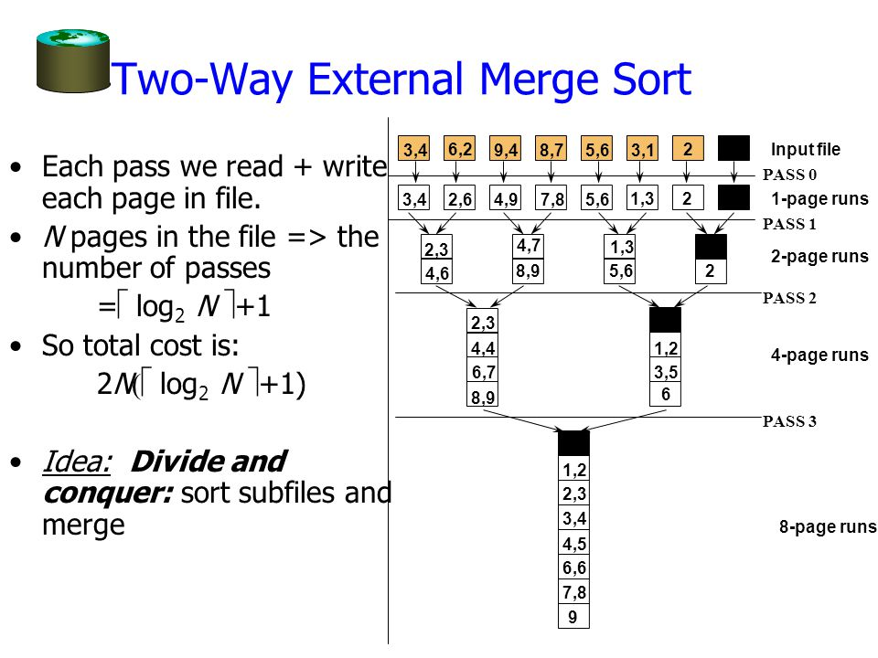

- [743 Network Delay Time](#743-network-delay-time)
  - [문제](#문제)
  - [조건](#조건)
  - [예제](#예제)
  - [해결](#해결)
    - [1st](#1st)
      - [1 생각](#1-생각)
      - [1 코드](#1-코드)
      - [1 결과: 실패](#1-결과-실패)
    - [2nd](#2nd)
      - [2 생각](#2-생각)
        - [다익스트라?](#다익스트라)
        - [heapq?](#heapq)
          - [`heapq.py` 내의 설명](#heapqpy-내의-설명)
          - [`heapq.py`의 `heappush`](#heapqpy의-heappush)
      - [2 코드](#2-코드)
      - [2 결과: 성공](#2-결과-성공)
    - [3rd](#3rd)
      - [책의 코드](#책의-코드)
    - [4th](#4th)
      - [Dijkstra 알고리즘대로 구현](#dijkstra-알고리즘대로-구현)

# [743 Network Delay Time](https://leetcode.com/problems/network-delay-time/)

## 문제

> You are given a network of n nodes, labeled from 1 to n.  
> You are also given times, a list of travel times as directed edges times[i] = (ui, vi, wi), where ui `is` the source node, `vi` is the target node, and `wi` is the time it takes for a signal to travel from source to target.  
> We will send a signal from a given node k.  
> Return the time it takes for all the n nodes to receive the signal. If it is impossible for all the n nodes to receive the signal, return `-1`.

- times[i][0] = ui = 시작 노드
- times[i][1] = vi = 타겟 노드
- times[i][2] = wi = 소요 시간
- k: 시작 노드
- n: 노드의 수
- -1: 불가능할 경우

## 조건

- 1 <= k <= n <= 100
- 1 <= times.length <= 6000
- times[i].length == 3
- 1 <= ui, vi <= n
- ui != vi
- 0 <= wi <= 100
- All the pairs (ui, vi) are unique. (i.e., no multiple edges.)

## 예제

```
Input: times = [[2,1,1],[2,3,1],[3,4,1]], n = 4, k = 2
Output: 2

Input: times = [[1,2,1]], n = 2, k = 1
Output: 1

Input: times = [[1,2,1]], n = 2, k = 2
Output: -1
```

## 해결

### 1st

#### 1 생각

- 방향이 있는 그래프.
  - 연결이 안 되어 있을 수도 있다
  - 연결되어 있어도 방향이 안 맞을 수 있다
  - **모든 노드**에 도달할 수 있어야 한다
- k에서 시작해서 연결된 노드들에서 신호를 받을 수 있는 시간
  - 총합? 은 아니고
  - 도달할 수 있는 노드까지의 최단 시간을 구하면 된다
  - [[2,1,1],[2,3,1],[3,4,1]]에서, 2에서 시작하면 그 다음 1, 3으로 갈 수 있고, 3에서는 다시 4로 갈 수 있다

#### 1 코드

```python
def first(self, times: List[List[int]], n: int, k: int) -> int:
    result = [None] * n
    # k를 찾는다
    loop_cnt = 0
    queue = [k]
    while queue and loop_cnt < n:
        node_curr = queue.pop(0)
        for node in times:
            if node[0] == node_curr:
                queue.append(node[1])
                if result[loop_cnt]:                        
                    result[loop_cnt].append(node[2])
                else:
                    result[loop_cnt] = [node[2]]
                
        loop_cnt += 1
    ans = 0
    print(result)
    for values in result:
        if values is not None:
            ans += max(values)

    if ans == 0:
        return -1
    else:
        return ans
```

#### 1 결과: 실패

```python
times=[
  [1, 2, 1],
  [2, 1, 3]
]
print(s.first(times, 2, 2)) # Expected: 3
```

- 처음 2 -> 1에서 모든 노드에 대한 시그널 전파 완료됐으므로, 결과는 3이어야 한다
- 하지만 [1 코드](#1-코드)에서는 2 -> 1, 1 -> 2까지 카운트 하므로 4가 나오면서 실패

```python
times=[
  [1,2,1],
  [2,3,2],
  [1,3,4]
]
print(s.first(times, 3, 1))  # Expected: 3
```

### 2nd

#### 2 생각

- 방문했는지 여부를 체크하면 되지 않을까?

##### [다익스트라?](https://ko.wikipedia.org/wiki/%EB%8D%B0%EC%9D%B4%ED%81%AC%EC%8A%A4%ED%8A%B8%EB%9D%BC_%EC%95%8C%EA%B3%A0%EB%A6%AC%EC%A6%98)

```python
def Dijkstra(Graph, source):
  dist[source] = 0
  # create vertex priotiry queue Q
  Q = []

  for v in Graph:
    if v != source:
      dist[v] = INFINITY
      prev[v] = UNDEFINED
    Q.add_with_priority(v, dist[v])
  
  while Q:
    u = Q.extract_min()
    for neighbor in u:
      alt = dist[u] + length(u, neighbor) # `u`까지의 거리에 `u`와 `v` 간의 거리를 더한다
      if alt < dist[neighbor]:  # 새로 구한 값이 기존 인접 노드까지의 거리보다 작다면
        # 값과 이전 노드를 바꾼다
        dist[neighbor] = alt
        prev[neighbor] = u
        Q.decrease_priority(neighbor, alt)
```

##### heapq?

###### `heapq.py` 내의 설명

- 최소 힙(min heap) 자료 구조로, 가장 작은 값은 언제나 0번 인덱스에 위치
- 모든 원소 `k`에 대하여, `a[k]`의 값은 항상 `a[2 * (k + 1)]`과 `a[2 * (k + 2)]`보다 작거나 같도록 유지하는 배열
- 비교를 위해, 존재하지 않는 요소는 무한으로 간주한다

```python
# 아래 숫자는 k를 의미하며, a[k]가 아니다
                                0
              1                                 2
      3               4                5               6
  7       8       9       10      11      12      13      14
15 16   17 18   19 20   21 22   23 24   25 26   27 28   29 30
```

- `k`는 항상 $(2 \times k) + 1$과 $(2 \times k) + 2$ 상위에 위치한다
- 힙에서의 트리는 스포츠에서의 토너먼트와 비슷하다
  - 상위에 위치한 숫자는 *승자*고, 아래에 위치한 숫자는 *상대*로 볼 수 있다
    - 한 셀과 그 하위의 두 셀은 서로 다른 항목을 갖고(`a[k]` != `a[2*k+1]` != `a[2*k+2]`)
    - 상위 셀이 두 하위 셀을 **이긴다(win)**
- 힙의 불변성이 항상 지켜진다면, 0번 인덱스가 최종적으로 승리하게 된다
- 기존 승자를 제거하고 *다음* 승자를 찾는 가장 간단한 알고리즘은,
  - 패자(예를 들어 30)를 0번 인덱스 위치로 옮긴 후
  - 힙의 불변성이 다시 성립할 때까지 새로운 0번 인덱스 밑의 트리를 여과(percolate)하고, 값을 치환한다
  - 모든 항목에 대해 순회하며, $O(n \log n)$ 정렬을 하게 된다
- 이 정렬의 좋은 특징은,
  - 새로 추가될 항목들이 0번 인덱스의 요소를 이기지 않는다면(not better), 정렬을 진행하면서 그 새로운 항목들을 효과적으로 삽입할 수 있다
  - 또한 다음과 같은 시뮬레이션 컨텍스트(스케쥴링)에서 유용하다
    - 트리가 모든 이벤트를 가지고 있고,
    - *승리* 조건이 가장 작게 예약된 시간(smallest scheduled time)인 경우
  - 어떤 이벤트가 실행을 위해 다른 이벤트를 예약(schedule)할 때, 그 이벤트는 미래에 예약되므로, 쉽게 힙에 들어갈 수 있다
  - 따라서 힙은 **스케쥴러 구현하기에 좋은 구조**
- 스케쥴러 구현 위한 다양한 구조가 연구 됐지만, 힙은 스케쥴에 좋고, 합리적으로 빠르며, 속도는 거의 상수 시간 속도이며, 최악의 경우에도 평균 케이스와 크게 다르지 않다.(하지만 전체적으로 더 효과적이지만, 최악의 경우 끔찍한 것들도 있다)
- 큰 디스크 정렬에도 매우 유용하다
  - 큰 정렬은, 미리 정렬된 시퀀스(크기는 CPU 메모리의 양과 관연 있음)인 "실행들(runs)" 생성을 의미
  - 그리고 실행들을 병합
  - 첫 정렬에서 가능한 가장 긴 runs를 생성하는 것이 매우 중요하며, 토너먼트가 이에 좋다
- 큰 정렬은 아래와 같이 여러 PASS와 runs로 구성



###### `heapq.py`의 `heappush`

```python
def heappush(heap, item):
    """Push item onto heap, maintaining the heap invariant."""
    heap.append(item)
    _siftdown(heap, 0, len(heap)-1)

# `heap`: 모든 인덱스가 `startpos`보다 크거나 같은 heap
# `pos`: 정리되지 않은(out-of-order) 값을 가질 가능성 있는 리프 노드
# 힙의 invariant 복구
def _siftdown(heap, startpos, pos):
    newitem = heap[pos] # 새로운 항목은 heap.append()로 항상 끝에 추가된다
    # 끝에서 루트까지, 새로운 항목이 들어 맞는 위치를 찾을 때까지 부모를 찾아 간다
    while pos > startpos:
        # k는 2*k+1과 2*k+2의 부모
        # 즉, 0은 1,2, 1은 3,4, 2는 5,6의 부모로, 리프 노드에서 부모를 찾으려면
        # (자식 인덱스 - 1)을 1비트 우로 움직여서 2로 나눈다
        parentpos = (pos - 1) >> 1 
        parent = heap[parentpos]
        if newitem < parent:
            heap[pos] = parent
            pos = parentpos
            continue
        break
    heap[pos] = newitem
```

- heap에 새로운 항목을 추가하고, 재탐색하여 힙의 불변성을 복원

```python
heappush(heap, 3)
# [3]
heappush(heap, 4)
# [3, 4]
heappush(heap, 5)
# [3, 4, 5]
heappush(heap, 6)
# [3, 4, 5, 6]
heappush(heap, 2)
# [3, 4, 5, 6, 2] heap 끝에 새로운 항목 추가
# [3, 4, 5, 6, 4] ((5-1)-1)/2=부모 위치=1. heap[1]=4. 4가 더 크므로 뒤로 보낸다. 2는 미정.
# [3, 3, 5, 6, 4] while문 돌아서 pos는 1, 부모는 0, a[0]=3 < 2이므로 a[1]=3으로 치환. 2는 미정.
# [2, 3, 5, 6, 4] while문 돌아서 pos는 0, 부모는 0, while문 종료, a[0]=2
""" 
      2
  3      5
6   4
"""
heappush(heap, 1)
# [2, 3, 5, 6, 4, 1]
# [2, 3, 5, 6, 4, 5]
# [2, 3, 2, 6, 4, 5]
# [1, 3, 2, 6, 4, 5]
"""
      1
  3       2
6   4   5 
"""
```

- 즉 해시 테이블처럼, 일정한 규칙에 따라 1차원 배열에서 부모 인덱스를 빠르게 찾아 값을 지환해 나간다
- 하지만 상위 cell이 하위 cell보다 작다는 것을 보장할 뿐, 상위 셀 하나와 하위 셀 둘 사이의 순서는 보장되지 않는다

#### 2 코드

```python
from typing import *

def second(self, times: List[List[int]], n: int, k: int) -> int:
    graph = {}
    # 인접 리스트 생성
    for node, node_next, time in times:
        # 소요 시간을 계속 추적해야 하므로, tuple로 관리
        if node in graph:
            graph[node].append((node_next, time))
        else:
            graph[node] = [(node_next, time)]
    # print(graph)
    
    loop_cnt = 0
    # 인접한 노드들을 탐색하기 위한 큐
    # (k까지, 소요되는 시간) 튜플로 저장
    queue = [(k, 0)]
    # ~까지의 시간을 저장하기 위한 딕셔너리
    time_to = {k:0} # 시작 지점의 시간은 처음에 셋팅해 둔다
    while queue:
        # 현재 정점
        node_curr = queue.pop(0)
        vertex_curr = node_curr[0]
        # 현재 정점 방문 표시
        time_accumulative = node_curr[1]

        if vertex_curr in graph:
            for node_next in graph[vertex_curr]:
                # 인접 노드
                vertex_next = node_next[0]
                # 방문한 적이 있어도, 축적된 값이 더 작으면 그 값으로 치환할 수 있어야 한다
                # 그렇다면 "다음 정점이 다시 이전 정점을 가리키면서 무한 반복하는 것 방지"은 어떻게?
                time_next = node_next[1]
                # 시간을 축적해 간다
                time_accumulative_new = time_accumulative + time_next

                if vertex_next in time_to:
                    # 새로 축적된 시간이 기존 시간보다 작으면 더 작은 값으로 바꾼다
                    if time_accumulative_new < time_to[vertex_next]:
                        time_to[vertex_next] = time_accumulative_new
                        # 더 적은 시간이 발견되면 해당 노드 탐색하도록 추가한다
                        queue.append((vertex_next, time_accumulative_new))
                else:
                    # 새로 축적된 시간없으면 저장
                    time_to[vertex_next] = time_accumulative_new
                    # 신규 노드 탐색하도록 추가한다
                    queue.append((vertex_next, time_accumulative_new))
    # print(time_to)
    if len(time_to) == n:
        return max(time_to.values())
    else:
        return -1

s = Solution()
case1 = [[2, 1, 1],[2, 3, 1],[3, 4, 1]]
case2 = [[1,2,1],[2,1,3]]
case3 = [[1,2,1],[2,3,2],[1,3,2]]
case4 = [[1,2,1],[2,3,2],[1,3,4]]
case5 = [[3, 1, 5],[3, 2, 2],[2, 1, 2],[3, 4, 1],[4, 5, 1],[5, 6, 1],[6, 7, 1],[7, 8, 1],[8, 1, 1]]
case6 = [[1,2,1],[2,1,3]]
case7 = [[1,2,1],[2,3,7],[1,3,4],[2,1,2]]
print(s.second(case1, 4, 2)) # expected: 2
print(s.second(case3, 3, 1)) # expected: 2
print(s.second(case3, 3, 2)) # expected: -1
print(s.second(case4, 3, 1)) # expected: 3
print(s.second(case5, 8, 3)) # expected: 5
print(s.second(case6, 2, 2)) # expected: 3
print(s.second(case7, 3, 2)) # expected: 6

```

#### 2 결과: 성공

> 52 / 52 test cases passed.  
> Status: Accepted  
> Runtime: 492 ms  
> Memory Usage: 16.3 MB

### 3rd

#### 책의 코드

```python
def answer(self, times: List[List[int]], n: int, k: int) -> int:
    graph = collections.defaultdict(list)
    """ 
    그래프 인접 리스트 구성
    {
        3: [(1, 5), (2, 2), (4, 1)], 
        2: [(1, 2)], 
        4: [(5, 1)], 
        5: [(6, 1)], 
        6: [(7, 1)], 
        7: [(8, 1)], 
        8: [(1, 1)]
    }
    """
    for u, v, w in times:
        graph[u].append((v, w))
    
    # 시작 노드
    Q = [(0, k)]
    distance = collections.defaultdict(list)
    
    # BFS지만, 최소 힙을 사용하여 시간이 작은 값부터 확인한다
    while Q:
        # https://docs.python.org/3/library/heapq.html
        # time이 가장 작은 원소를 꺼낸다
        time, node = heapq.heappop(Q)
        print('pop: ', (time, node))
        if node not in distance:
            # node까지의 거리에 소요되는 시간
            distance[node] = time
            for v, w in graph[node]:
                alt = time + w
                print('push: ', (alt, v))
                # https://docs.python.org/3/library/heapq.html#basic-examples
                # 첫번째 인자 시간(alt)을 최소값으로
                heapq.heappush(Q, (alt, v))
            print('distance: ', distance)
    
    # 모든 노드 방문했는지 여부 확인
    if len(distance) == n:
        return max(distance.values())
    else:
        return -1

```

### 4th

#### Dijkstra 알고리즘대로 구현
