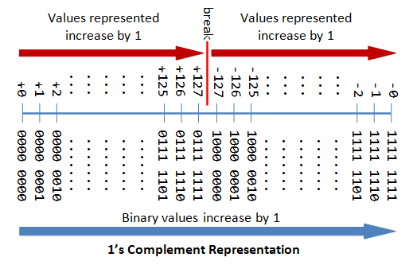
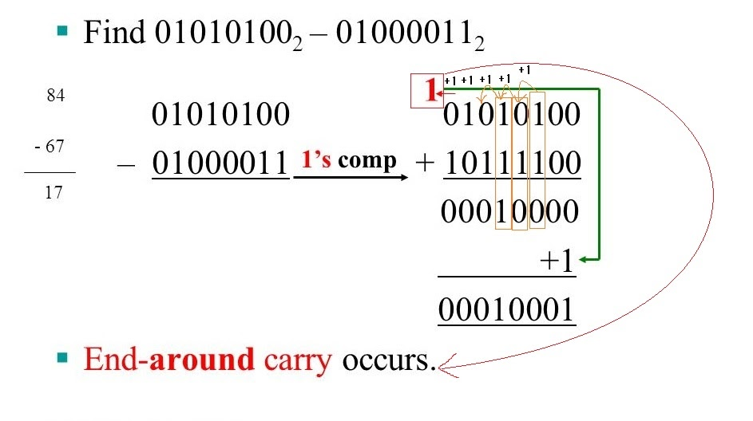

- [ch19 Bit Manipulation](#ch19-bit-manipulation)
  - [비트 조작 개요](#비트-조작-개요)
  - [부울 연산자](#부울-연산자)
    - [`NOT`](#not)
    - [`AND`](#and)
    - [`OR`](#or)
    - [`XOR`](#xor)
  - [비트 연산자(Bit Operator)](#비트-연산자bit-operator)
    - [비트 연산자 `~`](#비트-연산자-)
    - [비트 연산자 `&`](#비트-연산자--1)
    - [비트 연산자 `|`](#비트-연산자--2)
    - [비트 연산자 `^`](#비트-연산자--3)
  - [비트 조작 퀴즈](#비트-조작-퀴즈)
    - [비트 조작 `+`](#비트-조작-)
    - [비트 조작 `*`](#비트-조작--1)
    - [비트 조작 `>>`](#비트-조작--2)
    - [비트 조작 `<<`](#비트-조작--3)
    - [비트 조작 `~`](#비트-조작--4)
    - [비트 조작 `^`](#비트-조작--5)
  - [보수](#보수)
    - [1의 보수](#1의-보수)
    - [2의 보수](#2의-보수)
      - [2의 보수 as 숫자 포맷](#2의-보수-as-숫자-포맷)
      - [2의 보수 as 수학 연산](#2의-보수-as-수학-연산)
        - [예제1: `0111 = 7`](#예제1-0111--7)
          - [`0111`의 2의 보수 연산](#0111의-2의-보수-연산)
          - [`1001`의 NOT연산](#1001의-not연산)
        - [예제2](#예제2)
  - [비트 연산자 `NOT`](#비트-연산자-not)

# ch19 Bit Manipulation

## 비트 조작 개요

- 1937년 클로드 섀넌(Claude Shannon)의 스위칭 회로 연구 $\to$ `true`, `false` 두 값으로 논리 연산 설명하는 `부울 대수(Boolean Algebra)` $\to$ 논리 게이트(Logic Gate) $\to$ 논리 회로(Logic Circuit) $\to$ 디지털 컴퓨터의 기본 개념이자 근간을 이룸

## 부울 연산자

### `NOT`

| X       | `NOT` X |
| ------- | ------- |
| `false` | `true`  |
| `true`  | `false` |

```py
print("not True: {}".format(not True))  # -2: True는 1로 간주, -1 -1 = -2
print("not False: {}".format(not False))  # -1: False는 0으로 간주, 0 - 1 = -1
```

- `NOT` = `2의 보수 - 1` $\to$ `NOT x = -x - 1`

### `AND`

| X       | Y       | X `AND` Y |
| ------- | ------- | --------- |
| `false` | `false` | `false`   |
| `false` | `true`  | `false`   |
| `true`  | `false` | `false`   |
| `true`  | `true`  | `true`    |

```py
print("True and True: {}".format(True and True))
print("True and False: {}".format(True and False))
print("False and True: {}".format(False and True))
print("False and False: {}".format(False and False))
```

### `OR`

| X       | Y       | X `OR` Y |
| ------- | ------- | -------- |
| `false` | `false` | `false`  |
| `false` | `true`  | `true`   |
| `true`  | `false` | `true`   |
| `true`  | `true`  | `true`   |

```py
print("True or True: {}".format(True or True))
print("True or False: {}".format(True or False))
print("False or True: {}".format(False or True))
print("False or False: {}".format(False or False))
```

### `XOR`

| X       | Y       | X `OR` Y |
| ------- | ------- | -------- |
| `false` | `false` | `false`  |
| `false` | `true`  | `true`   |
| `true`  | `false` | `true`   |
| `true`  | `true`  | `false`  |

- 하나가 `true`, 하나가 `false`인 경우에만 `true`가 된다

```py
# and와 or를 조합하여 xor 구현
# (X and not Y) or (Y and not X)
# 1. X 또는 Y 두 변수 중 하나를 NOT 연산 후 AND 연산
# 2. 둘 중 하나라도 결과 True면 XOR에서 True
print("(True and not True) or (not True and True): {}".format((True and not True) or (not True and True)))
print("(True and not False) or (not True and False): {}".format((True and not False) or (not True and False)))
print("(False and not True) or (not False and True): {}".format((False and not True) or (not False and True)))
print("(False and not False) or (not False and False): {}".format((False and not False) or (not False and False)))
```

## 비트 연산자(Bit Operator)

### 비트 연산자 `~`

```py
print("~ True: {}".format(~ True)) # -2
print("~ False: {}".format(~ False)) # -1
```

- `True`는 1로 간주되어 `-2`가 된다. 왜?
  - `NOT` = `2의 보수 - 1` $\to$ `NOT x = -x - 1`
  - $\text{NOT } x  = -x -1$이 된다

### 비트 연산자 `&`

```py
print("True & True: {}".format(True & True))
print("True & False: {}".format(True & False))
print("False & True: {}".format(False & True))
print("False & False: {}".format(False & False))
```

### 비트 연산자 `|`

```py
print("True | True: {}".format(True | True))
print("True | False: {}".format(True | False))
print("False | True: {}".format(False | True))
print("False | False: {}".format(False | False))
```

### 비트 연산자 `^`

```py
print("True ^ True: {}".format(True ^ True))
print("True ^ False: {}".format(True ^ False))
print("False ^ True: {}".format(False ^ True))
print("False ^ False: {}".format(False ^ False))

print("True is not True: {}".format(True is not True))
print("True is not False: {}".format(True is not False))
print("False is not True: {}".format(False is not True))
print("False is not False: {}".format(False is not False))
```

## 비트 조작 퀴즈

### 비트 조작 `+`

```py
print("bin(0b0110 + 0b0010) = bin({} + {}) = {} = {}".format(0b0110, 0b0010, bin(0b0110 + 0b0010), 0b0110 + 0b0010))
# bin(0b0110 + 0b0010) = bin(6 + 2) = 0b1000 = 8
```

### 비트 조작 `*`

```py
print("bin(0b0011 * 0b0101) = bin({} * {}) = {} = {}".format(0b0011, 0b0101, bin(0b0011 * 0b0101), 0b0011 * 0b0101))
# bin(0b0011 * 0b0101) = bin(3 * 5) = 0b1111 = 15
```

### 비트 조작 `>>`

- `>> N`은 N개의 비트를 **우측**으로 옮기고 $2^{N}$으로 **나눈 몫**과 같다
  - 당연하게도, `N`개의 비트를 버리고 남은 비트를 정수로 표현하기 때문
  - `1000`에서 `>> 2`을 하면 `10`이 되며 이는 `2`가 되며, $\frac{8}{4}$와 같다

```py
# 비트 두 개 우측으로 옮기므로 2^2로 나눈 것과 같다
print("bin(0b1101 >> 2) = bin({} >> 2) = {} = {}".format(0b1101, bin(0b1101 >> 2), 0b1101 >> 2))
# bin(0b1101 >> 2) = bin(13 >> 2) = 0b11 = 3
```

### 비트 조작 `<<`

- `<< N`은 N개의 비트를 **좌측**으로 옮기고 $2^{N}$으로 **곱한** 것과 같다

```py
print("bin(0b1101 << 2) = bin({} << 2) = {} = {}".format(0b1101, bin(0b1101 << 2), 0b1101 << 2))
# bin(0b1101 << 2) = bin(13 << 2) = 0b110100 = 52
```

### 비트 조작 `~`

- `0b1100`의 부정은 `0b0011`이 아닌 `-0b1101`이 된다. 왜?
  - `NOT` = `2의 보수 - 1` $\to$ `NOT x = -x - 1`
  - `0b1100` = 12
  - `~0b1100` = ~12 = -12 - 1 = -13
  - -13 = `1111 0011`
  - 파이썬의 `bin()` 함수는 `-(13)` = `-(0b1101)` = `-0b1101`으로 나타낸다

```py
print("bin(~0b1100) = {} = {}".format(bin(~0b1100), ~0b1100))
# bin(~0b1100) = -0b1101 = -13
```

### 비트 조작 `^`

- `0b0101 ^ ~0b1100` = `0b0101 ^ -0b1101` = `0b0101 ^ 1111 0011` = `1111 0110` = `-10`

| EXPECTED |    ACTUAL |
| -------: | --------: |
|   0b0101 |    0b0101 |
|  ~0b1100 |   ~0b1100 |
|   0b0011 | 1111 0011 |
|   0b0110 | 1111 0110 |
|        6 |       -10 |

- [비트 연산자 `NOT`](#비트-연산자-not)에서 다시 설명

```py
print("bin(0b0101 ^ ~0b1100) = bin({} ^ {}) = bin({} ^ {}) = {} = {}".format(bin(0b0101), bin(~0b1100), 0b0101, ~0b1100, bin(0b0101 ^ ~0b1100), 0b0101 ^ ~0b1100))
# bin(0b0101 ^ ~0b1100) = bin(0b101 ^ -0b1101) = bin(5 ^ -13) = -0b1010 = -10
```

## 보수

- 보수(complement)가 필요한 이유?
  - 보수를 이용하면 덧셈의 원리로 뺄셈이 가능하다
  - 즉, **가산기[+]로 모든 사칙 연산이 가능**하며 **감산기[-]가 불필요**하다
- 컴퓨터가 `음수`를 저장하기 위해 일반적으로 취하는 여러 방법 중 하나
- 최상위 비트(`MSB, Most Significant Bit`)를 부호(`sign`) 비트로 사용

### 1의 보수

- 음수 표현 시 $0 \to 1$로, $1 \to 0$으로 바꾼다



- 덧셈 시 `순환 자리 올림(end around carry)` 발생 가능 $\to$ 연산 시 올림수를 더해야 한다



```py
84 - 67
  0101 0100
- 0100 0011

  0101 0100
+ 1011 1100 # 1의 보수
 10001 0000 # 순환 자리 올림수(end-around carry) 1이 생기면 다시 더한다

  0001 0000
+         1
  0001 0001 = 17
```

- `+`와 `-`시 0과 1을 각각 치환하면 되는 점은 편하다
- 하지만 `+0`과 `-0`이 생기고, `순환자리 올림수`를 처리해야 한다는 단점이 있다

### 2의 보수

- `2의 보수를 구하는 것`과 `NOT` 연산을 혼동하지 말자
  - `2의 보수를 구하는 것`: `비트를 뒤집고 +1하는 것`
  - `NOT 연산`: `NOT` = `2의 보수 - 1` $\to$ `NOT x = -x - 1`
- 2의 보수 **표현**과 **연산**
  - **표현**:
    - 2의 보수 방식에 따라 숫자를 나타내는 것
    - 4비트에서 `1000`
      - `1000`은 `-8`이 메모리에 저장되는 방식이다
      - `0111=7`이며, `NOT 7 = -7 - 1 = -8`이 된다
  - **연산**:
    - 보수 방식에 따라 실제 연산을 하는 것
    - 보수를 구하기 위해 `비트 반전 후 +1`
- 2의보수와 `NOT` 연산을 정리하면 아래와 같을 듯 하다

|             | 2의 보수        | `NOT`        |
| ----------- | --------------- | ------------ |
| 비트 연산   | 비트 반전 후 +1 | 2의 보수 - 1 |
| 10진수 표현 |                 | -x - 1       |

#### 2의 보수 as 숫자 포맷

|  십진수 |   비트   | 비트 반전 후 +1 |          |      |
| ------: | :------: | :-------------: | -------- | ---- |
|     `0` | **0**000 |    1111 + 1     | **0**000 | `0`  |
|     `1` | **0**001 |    1110 + 1     | **1**111 | `-1` |
|     `2` | **0**010 |    1101 + 1     | **1**110 | `-2` |
|     `3` | **0**011 |    1100 + 1     | **1**101 | `-3` |
|     `4` | **0**100 |    1011 + 1     | **1**100 | `-4` |
|     `5` | **0**101 |    1010 + 1     | **1**011 | `-5` |
|     `6` | **0**110 |    1001 + 1     | **1**010 | `-6` |
|     `7` | **0**111 |    1000 + 1     | **1**001 | `-7` |
| ~~`8`~~ | **1**000 |    0111 + 1     | **1**000 | `-8` |

- `-8`은?
  - 4비트 체계에서 첫 비트가 부호 비트로, 1이면 음수 의미
  - `1000`은 `8`인데, 음수이므로 `-8`이 된다
  - 따라서 4비트 체계인 경우 `8`이 없다
  - 8비트 체계라면?
    - `0000 1000 = 8`이 되고, `1111 1000 = -8`이 된다
- python에서 2의 보수를 표현하려면? 비트 마스크 사용

```py
MASK = 0xF # 15 = 1111
print("bin(1 & MASK) = {}".format(bin(1 & MASK)))
print("bin(7 & MASK) = {}".format(bin(7 & MASK)))
print("bin(-8 & MASK) = {}".format(bin(-8 & MASK)))
print("bin(-7 & MASK) = {}".format(bin(-7 & MASK)))
print("bin(-1 & MASK) = {}".format(bin(-1 & MASK)))
"""
bin(1 & MASK) = 0b1
bin(7 & MASK) = 0b111
bin(-8 & MASK) = 0b1000
bin(-7 & MASK) = 0b1001
bin(-1 & MASK) = 0b1111
"""
```

#### 2의 보수 as 수학 연산

- `2의 보수 수학 연산`
  - `가산 역 연산(Additive Inerse Operation)`
  - 양수를 음수로, 음수를 양수로 바꾸는 작업
- $1 \to 0$ 또는 $0 \to 1$로 비트를 뒤집은 후 비트에 `+1`을 해준다
- 오버플로우?
  - n 비트 데이터에 대한 연산 결과를 n 비트로 나타낼 수 없을 때 발생
  - 부호 있는 4비트는 $-2^{4-1} \text{\textasciitilde} 2^{4-1} - 1 = -8 \text{\textasciitilde} 7$이므로, 이 범위를 벗어나는 수는 표현할 수 없게 된다

##### 예제1: `0111 = 7`

- 4비트 체계인 경우

###### `0111`의 2의 보수 연산

|           |          |
| --------: | -------: |
|           | 0111 = 7 |
| 비트 반전 | **1**000 |
|        +1 | **1**001 |
|           |       -7 |

###### `1001`의 NOT연산

- `NOT` = `2의 보수 - 1` $\to$ `NOT x = -x - 1`

|       |           |
| ----: | --------: |
|       | 1001 = -7 |
| `NOT` | ~**1**000 |
|       |  **0**111 |
|    -1 |  **0**110 |
|       |         6 |

NOT **1**000 = ~**1**000 = -x(비트 반전) -1 = **0**111 -1 = **0**110 = 6

##### 예제2

- `NOT` = `2의 보수 - 1` $\to$ `NOT x = -x - 1`
- `1` = `0001`의 2의 보수는 `1110 + 1` = `1111` = `-1`

## 비트 연산자 `NOT`

- `NOT` = `2의 보수 - 1` $\to$ `NOT x = -x - 1`
  - 비트 내에서 0과 1을 바꿔준다
  - -1을 한다
- 4비트 체계에서 `~0111`을 다시 보자면 아래와 같다

|              절차 |         내용 |
| ----------------: | -----------: |
|                   |            7 |
|                   |         0111 |
|             `NOT` |        ~0111 |
|   0111의 2의 보수 |     1000 + 1 |
|      2의 보수 - 1 | 1000 + 1 - 1 |
|                   |         1000 |
| 10진수로 나타내기 |         1000 |
|                   |        -x -1 |
|                   |        -7 -1 |
|                   |           -8 |

```py
  0000 0101
^~0000 1100

# 먼저 NOT 연산
~0000 1100
 1111 0011

# 1111 0011을 십진수로 나타내면?
NOT x = -x - 1
NOT 12 = -12 - 1 = -13

# 다시 XOR 연산으로 돌아가면
 0000 0101
^1111 0011
 1111 0110

# 1111 0110을 십진수로 나타내면?
NOT x = -x - 1
x = 0000 1001 = 9
NOT 9 = -9 - 1 = -10
```
