- [A Tour of Computer Systems](#a-tour-of-computer-systems)
  - [개요](#개요)
    - [이 책을 통해 배우는 내용](#이-책을-통해-배우는-내용)
  - [1.1 정보는 Bits + Context](#11-정보는-bits--context)
  - [1.2 프로그램은 다른 프로그램에 의해 다른 형식으로 번역된다](#12-프로그램은-다른-프로그램에-의해-다른-형식으로-번역된다)
  - [1.3 컴파일 시스템 동작 방식을 이해하는 것이 좋다](#13-컴파일-시스템-동작-방식을-이해하는-것이-좋다)
    - [1.3.1 프로그램 성능 최적화](#131-프로그램-성능-최적화)
    - [1.3.2 link-time 에러 이해](#132-link-time-에러-이해)
    - [1.3.3 보안상의 구멍 피하기](#133-보안상의-구멍-피하기)
  - [1.4 메모리에 저장된 명령들을 읽고 해석하는 프로세서](#14-메모리에-저장된-명령들을-읽고-해석하는-프로세서)
    - [1.4.1 시스템의 하드웨어 구성](#141-시스템의-하드웨어-구성)
      - [Buses](#buses)
      - [I/O 장치](#io-장치)
      - [Main Memory](#main-memory)
      - [Processor](#processor)
    - [1.4.2 `hello` 프로그램 실행하기](#142-hello-프로그램-실행하기)
  - [1.5 Cache Matter](#15-cache-matter)
  - [1.6 계층 구조 형성하는 저장 장치](#16-계층-구조-형성하는-저장-장치)
  - [1.7 OS는 하드웨어를 관리한다](#17-os는-하드웨어를-관리한다)
    - [1.7.1 프로세스](#171-프로세스)
      - [a. context](#a-context)
      - [b. context switching 방식](#b-context-switching-방식)
      - [c. `hello`와 `shell` 예제](#c-hello와-shell-예제)
      - [d. `kernel`](#d-kernel)
    - [1.7.2 Thread](#172-thread)
    - [1.7.3 가상 메모리](#173-가상-메모리)
      - [가상 주소 공간의 영역](#가상-주소-공간의-영역)
        - [`Program code and data`](#program-code-and-data)
        - [`Heap`](#heap)
        - [`Shared libraries`](#shared-libraries)
        - [`Stack`](#stack)
        - [`Kernel virtual memory`](#kernel-virtual-memory)
    - [1.7.4 파일](#174-파일)
  - [1.8 시스템은 네트워크 사용한 단른 시스템과 통신한다](#18-시스템은-네트워크-사용한-단른-시스템과-통신한다)
    - [1.8.1 네트워크 통한 `hello` 실행](#181-네트워크-통한-hello-실행)
      - [step1](#step1)
      - [step2](#step2)
      - [step3](#step3)
      - [step4](#step4)
  - [1.9 중요한 테마](#19-중요한-테마)
    - [1.9.1 암달의 법칙](#191-암달의-법칙)
      - [개요](#개요-1)
      - [수식](#수식)
      - [예제](#예제)
    - [1.9.2. 동시성과 병행](#192-동시성과-병행)
      - [동시성(concurrency)](#동시성concurrency)
      - [병행(parallelism)](#병행parallelism)
        - [쓰레드 레벨의 동시성](#쓰레드-레벨의-동시성)
        - [명령어 레벨의 동시성](#명령어-레벨의-동시성)
        - [SIMD(Single-Instruction, Multiple-Data) Parallelism](#simdsingle-instruction-multiple-data-parallelism)
    - [1.9.3. 컴퓨터 시스템에서 추상화의 중요성](#193-컴퓨터-시스템에서-추상화의-중요성)
  - [1.10 요약](#110-요약)

# A Tour of Computer Systems

## 개요

- 컴퓨터 시스템 = 하드웨어 + 시스템 소프트웨어 &#8594; 응용 프로그램 실행

### 이 책을 통해 배우는 내용

- **컴퓨터가 숫자를 표현하는 방식**으로 인해 발생하는 수와 관련된 에러들을 피할 수 있는 실전적 스킬
- **현대 프로세서와 메모리 시스셈 디자인을 활용**하는 트릭을 활용하여 C 코드를 어떻게 최적화 할지
- **어떻게 컴파일러가 프로시저 콜을 구현**하고 어떻게 그 지식을 활용하여 네트워크와 인터넷 소프트웨어를 괴롭히는 버퍼 오버플로 취약점으로 인한 보안 허점을 피할 수 있는지
- 일반적인 개발자를 난처하게 만드는 linking 동안 발생하는 다루기 어려운 에러를 어떻게 식별하고 피할 것인지
- 어떻게 Unix shell, dynamic storage allocation package, Web server를 작성하는지
- 멀티 코어가 단일 칩에 통합되면서 중요도가 높아지고 있는 동시성(concurrency)의 전망과 위험
- 이를 hello 프로그램의 생애(lifetime)를 통해 알아본다

```cpp
#include <stdio.h>

int main(){
    printf("hello, world\n");

    return 0;
}
```

## 1.1 정보는 Bits + Context

- hello 프로그램은 개발자가 작성한 hello.c라는 텍스트 파일로 저장된 소스 프로그램(또는 소스 파일)에서 그 생이 시작된다
- 소스 프로그램은
  - 비트의 연속이며,
  - 각 비트는 0과 1이라는 값을 가지고,
  - 이는 `bytes`라 불리는 8-bits 뭉치를 구성
- 대부분의 컴퓨터 시스템은 텍스트 문자를 `ASCII 표준`을 사용하여 나타내며, ASCII 표준은 각 문자를 `고유한 byte 크기의 정수 값`으로 나타낸다.


- `hello.c` 프로그램 역시 **일련의 바이트** 파일로 저장
- `hello.c`처럼 오직 ASCII 문자로만 구성된 파일을 `text files`라 하며, 그 외에는 `binary files`라고 한다
- 즉, 시스템에서 모든 정보는 다수의 bits로 나타난다
- 우리가 정보를 보는 **컨텍스트**만이 서로 다른 데이터 오브젝트를 구별한다. 예를 들어, 같은 일련의 bytes라도 서로 다른 컨텍스트에서 정수, 실수, 문자열 또는 기계 명령(machine intruction)을 타나낸다

## 1.2 프로그램은 다른 프로그램에 의해 다른 형식으로 번역된다

- 기계가 C 프로그램 읽기 위해서는
  - 반드시 일련의 저레벨 _machine-language(기계어)_ 명령으로 번역되고,
  - 명령들은 _executable object program(executable object files)_ 이라 불리는 형식으로 패키징 되고
  - 바이너리 디스크 파일로 저장된다
- Unix 시스템에서, 소스 파일에서 오브젝트 파일로의 번역은 *compiler driver*에 의해 수행된다
- `$ gcc -o hello hello.c` 실행

  - hello.c 소스 프로그램(텍스트)
  - 전처리(Pre-processor, cpp): 수정된 소스 프로그램(텍스트) 생성
    - `#`으로 시작하는 지시(directives)에 따라 원본 C 프로그램을 수정
    - `#include <stdio.h>` 명령은 전처리로 하여금
      - `stdio.h` 시스템 헤더 파일의 내용을 읽어서
      - 프로그램 텍스트에 직접 삽입하도록 한다
    - `hello.i`: 전처리 결과 새롭게 생성된 C 프로그램
  - 컴파일러(cc1): 어셈블리 프로그램(텍스트) 생성
    - `hello.s`: cc1 컴파일러가 `hello.i`를 번역하여 생성하는 파일. _assembly-language program_ 포함한다.

```assembly
main:
  subq  $8, %rsp
  movl  $.LC0, %edi
  call  puts
  movl  $0, %eax
  addq  $8, %rsp
  ret
```

- Assembler(as): 재배치 가능한 오브젝트 프로그램(바이너리) 생성
  - `hello.o`: `main` 함수에 대한 명령을 인코딩하기 위한 17바이트를 포함하는 바이너리 파일
    - 어셈블러가 `hello.s`를 기계어 명령으로 번역하고,
    - _relocatable object program_ 형식으로 패키징 하여
    - 그 결과를 저장한 파일
- Linker(ld): 실행 가능한 오브젝트 프로그램(바이너리) 생성
  - `printf` 함수는
    - 모든 C 컴파일러가 제공하는 표준 C 라이브러리의 일부로
    - `printf.o`라 불리는 미리 컴파일된 오브젝트 파일에 있으며,
    - 어떤 식으로든 반드시 `hello.o` 프로그램으로 합쳐져야 한다
  - 링커(ld)는 이 합치는 것을 다룬다
  - `hello`:
    - ld의 결과
    - 시스템에 의해 메모리로 로드되고 실행될 준비가 된 실행 가능한 오브젝트 파일(_executable_)

```
hello.c
-> 전처리 -> # 지시에 따라 수정된 hello.i
-> 컴파일 -> 어셈블리어로 번역된 hello.s
-> 에셈블러 -> 재배치 가능 파일 hello.o
-> Linker -> prinf.o와 hello.o 연결
-> 실행 가능한 hello 파일
```

## 1.3 컴파일 시스템 동작 방식을 이해하는 것이 좋다

- 정확하고 효율적인 머신 코드 생성 위해 컴파일 시스템에 의존할 수 있지만,
- 개발자가 어떻게 컴파일 시스템이 작동하는지 알아야 할 몇 가지 중요한 이유가 있다

### 1.3.1 프로그램 성능 최적화

- C 프로그램에서 좋은 코딩을 하기 위한 결정을 내리기 위해서는, 기계 수준의 코드와 어떻게 컴파일러가 서로 다른 C 문장을 기계 코드로 번역하는지에 대한 기본적인 이해가 필요하다
- 예를 들어,
  - 연속된 _if-else_ 구문보다 _switch_ 구문이 언제나 더 효과적인가?
  - 함수 모출마다 얼만큼의 오버헤드가 발생하는가?
  - _while_ 반복문이 _for_ 반복문보다 더 효율적인가?
  - 포인터 참조가 배열 인덱스보다 효율적인가?
  - 왜 반복문은 참조로 전달(passed by reference)되는 인자 대신 지역 변수로 통합(sum into)했을 때 훨씬 빠른가? (TODO 지역 변수로 통합이란?)
  - 산술 표현식에서 단순히 괄호를 재배열할 때 어떻게 함수 속도가 더 빨리지는가?

### 1.3.2 link-time 에러 이해

- 경험상, 대부분의 복잡한(perplexing) 개발 에러는 linker 작업과 관련이 있다
- 예를 들어,
  - 링커가 참조를 확인할 수 없다(cannot resolve a reference)는 보고는 무슨 의미인가?
  - 정적 변수와 전역 변수의 차이점은 무엇인가?
  - 서로 다른 C 파일에서 같은 이름으로 두 전역 변수를 선언하면 어떻게 되는가?
  - 정적 라이브러리와 동적 라이브러리의 차이는 무엇인가?
  - 명령 줄(command line)에서 어떤 순서로 라이브러리를 나열하는 것이 무슨 상관일까?
  - 무엇보다 가장 두려운 것은, 왜 링커 관련된 에러는 런타임 때까지 나타나지 않을까?

### 1.3.3 보안상의 구멍 피하기

- 수년 동안 _buffer overflow_ 취약점은 네트워크와 인터넷 서버에서 보안 허점의 많은 부분을 차지했다
- 이러한 취약점은 신뢰할 수 없는 출처로부터 수신하는 데이터의 양(quantity)과 형태(form)를 신중하게 제한할 필요성을 극히 적은 개발자들만 이해했기 때문에 존재한다
- 안전한 프로그래밍을 배우는 첫번째 단계는 **데이터와 제어 정보가 프로그램 스택에 저장되는 방식의 결과**를 이해하는 것

## 1.4 메모리에 저장된 명령들을 읽고 해석하는 프로세서

- 실행 가능한 오브젝트 파일 `hello`가 저장된 후, _shell_ 애플리케이션 프로그램에 이름을 입력하여 실행
- shell은 명령 줄(command-line) 해석기로, 내장 쉘 명령어 아닌 단어 입력하면, 해당 단어가 실행 가능한 파일의 이름으로 간주
- shell은 `hello` 프로그램을 로드하고 실행 후 종료될 때까지 기다린다

### 1.4.1 시스템의 하드웨어 구성

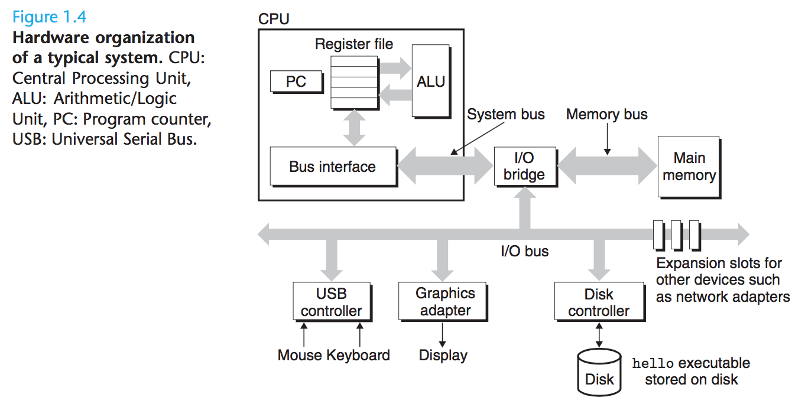

#### Buses

- 컴포넌트 간에 정보의 바이트를 주고 받는 *buses*라 불리는 전자적 파이프의 집합이 시스템 전체에 걸쳐 실행된다
- Bus는 `words`라는 고정된 크기의 바이트를 전송하도록 설계되어 있으며, 오늘날에는 보통
  - 4 bytes = 32 bits
  - 8 bytes = 64 bits

#### I/O 장치

- Input/Output 장치
  - 키보드 또는 마우스
  - 디스플레이
  - 디스크 드라이브
- 각 I/O 장치는 _controller_ 또는 _adapter_ 로 I/O 버스에 연결되어 있으며, I/O 버스와 I/O 장치 간에 정보를 주고 받기 위한 목적으로 사용된다
  - Controller: 장지 자체의 칩셋 또는 `motherboard`라 불리는 시스템의 주 인쇄 회로 기판(main printed circuit board)
  - Adapter: 마더보드의 슬롯에 플러그인 되는 카드

#### Main Memory

- 주기억장치는 프로그램과 프로세서가 프로그램을 실행 중인 동안 제어하는 데이터를 유지하는 임시 저장 장치
- 물리적으로 DRAM(_dynamic random access memory_) 집합으로 구성
- 논리적으로,
  - 0부터 시작하는
  - 각각 고유한 주소(배열 인덱스)를 가지는 바이트의
  - 선형 배열
- 프로그램 구성하는 기계 명령들은 가변적인 개수의 바이트로 구성
- 데이터 항목의 크기는 C 프로그램 변수 타입에 따라 다양하다
  - 리눅스 실행중인 x86-64 머신에서,
    - _short_ 타입은 2 bytes 필요
    - _int_ 및 _float_ 타입은 4 bytes 필요
    - _long_ 및 _double_ 타입은 8 bytes 필요

#### Processor

- 중앙 처리 장치(_Central Processing Unit_)라 하며, 주기억장치에 저장된 명령을 해석하거나 실행하는 엔진
- 핵임은 _program counter_(PC)라 불리는 word 크기의 저장 장치(또는 _register_)
- 프로세서는 전원이 들어온 후부터 꺼질 때까지,
  - 프로그램 카운터가 가리키는 명령을 실행하고
  - 프로그램 카운터가 다음 명령을 가리키도록 업데이트
- 프로세서는 `instruction set architecture`에 의해 정의된 매우 간단한 명령 실행 모델에 따라 작동하는 것으로 보인다
- 명령은 엄격한 순서로 실행되고, 한 명령의 실행은 여러 단계를 거친다
  - PC가 메모리에서 가리키는 명령을 읽는다
  - 읽은 명령의 bits를 해석한다
  - 명령이 지시하는 작업을 수행한다
  - PC를 다음 명령을 가리키도록 업데이트한다(앞서 실행된 명령에 연속될 수도 있고 아닐 수도 있다)
- 이런 간단한 작업은 몇 안 되며, 주기억장치, _register file_, 그리고 _arithmetic/logic unir_(ALU)을 돈다
  - register file: word 크기의 레지스터 집합으로 구성된 작은 저장 장치
  - ALU: 새로운 데이터와 주소 값들을 계산
- CPU가 명령의 요청을 처리하는 간단한 예제
  - _Load_: 주기억장치의 바이트 또는 word &#8594; 레지스터로 복사하여 이전 내용 덮어쓴다
  - _Store_: 레지스터의 바이트 또는 word &#8594; 주기억장치의 어떤 위치에 복사하여 해당 위치의 이전 내용 덮어쓴다
  - _Operate_: 두 레지스터의 내용 &#8594; ALU로 복사
    - 두 word에 대한 산술 연산 수행
    - 결과를 레지스터에 저장하여 이전 내용 덮어쓴다
  - _Jump_: 명령 자체에서 추출한 word &#8594; PC로 복사하여 이전 내용 덮어쓴다
- 오늘날에는 실행 속도 높이기 위해 훨씬 복잡한 매커니즘 사용하므로, 명령어 집합 구조와 _microarchitecture_ 구별
  - 명령어 집합 구조(_instruction set architecture_): 각 기계 코드 명령어의 영향 설명
  - _microarchitecture_: 프로세서가 실제로 어떻게 구현됐는지 설명

### 1.4.2 `hello` 프로그램 실행하기

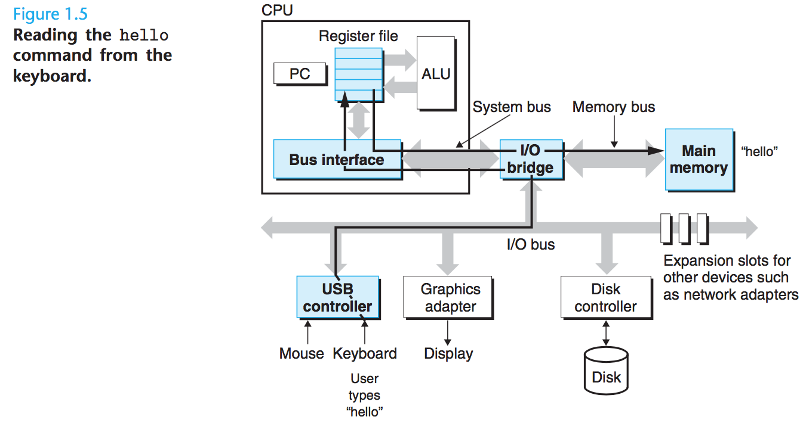

1. 쉘 프로그램은 사용자의 명령어 입력을 대기
2. `./hello` 명령어 입력
3. 쉘 프로그램은 `.`, `/`, `h`, `e` 등을 각각 읽어서 레지스터에 기입하고 주기억장치에 저장
4. _enter_ 입력함으로써 쉘 프로그램은 명령어 입력이 끝났음을 감지

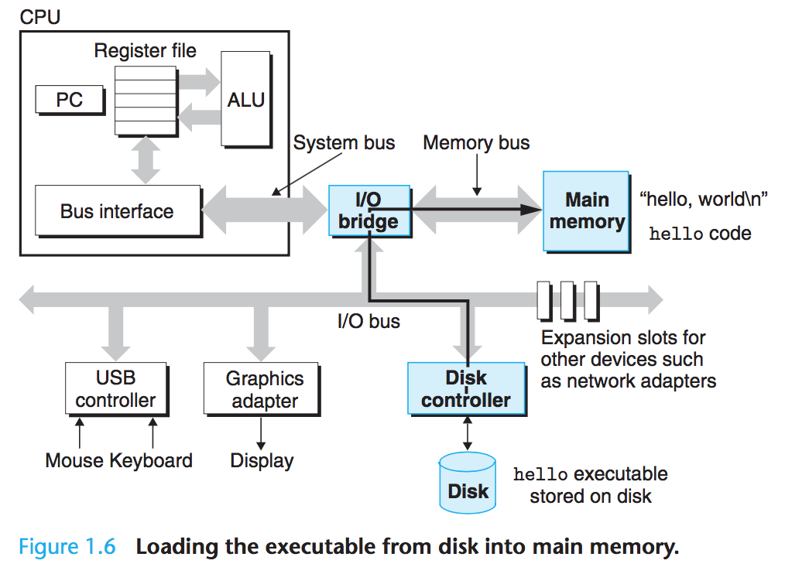

5. 쉘 프로그램은 _direct memory access_(DMA) 기술 사용하여 프로세서를 거치지 않고 디스크의 데이터를 직접 주기억장치로 전달
   1. 인련의 명령어를 실행하여 디스크의 `hello` 오브젝트 파일의 코드와 `hello, world\n` 문자열 포함하는 데이터 &#8594; 주기적장치로 복사
   2. 실행 가능한 `hello` 파일 로드

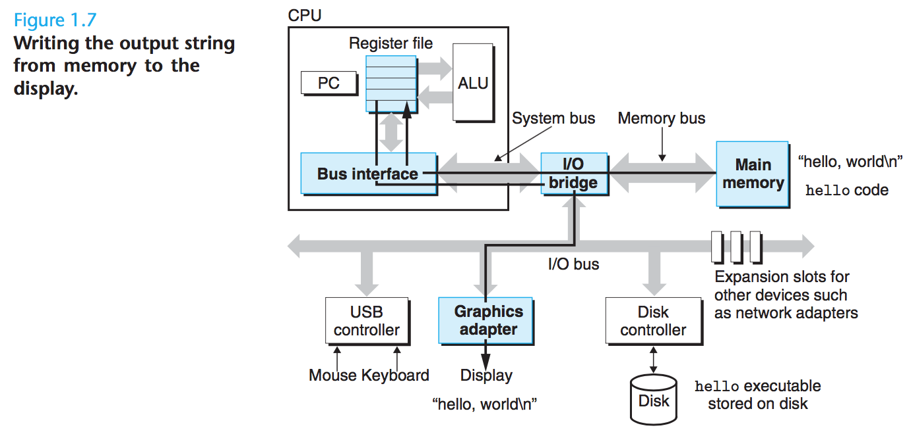

6. `hello` 오브젝트 파일의 코드와 데이터가 주기억장치에 로드되면
   1. 프로세서가 `hello` 프로그램의 `main` 루틴(routine)의 기계어 명령어들을 실행
   2. 기계어 명령어들은 주기억장치의 `hello, world\n` 문자열 bytes &#8594; _register file_ 로 복사 &#8594; 디스플레이 장치로 복사

## 1.5 Cache Matter

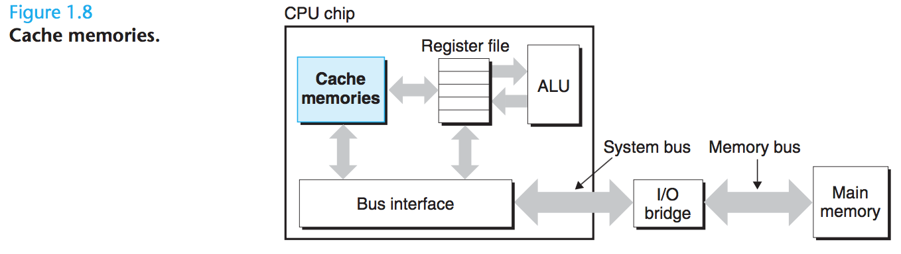

- 개발자 관점에서 실제 작업을 느리게 하는 너무 많은 복사 오버헤드가 있기에, 시스템 설계자의 주된 목표는 이러한 복사 작업을 가능한 한 빠르게 실행되도록 만드는 것
  - 프로그램 로드 시 주기억장치로 **복사**
  - 프로세서가 프로그램 실행 시 명령어 **복사**
  - 주기억 장치로 **복사**하고 주기억장치에서 디스플레이로 **복사**
- 큰 저장 장치는 작은 저장장치보다 느리다. 가령 각 장치에 대한 프로세서의 읽기 속도는 대략:
  - 1 register 읽기 속도 = \(\frac{1}{100}\) 메모리 읽기 속도 = \(\frac{1}{1,000,000,000}\) 디스크 읽기 속도
- 이러한 _processor-memory_ 차이가 커지면서, 시스템 설계자는 프로세서가 가까운 미래에 필요로 할 것 같은 정보를 잠시 스테이징(staging)하는 데 사용할 *cache memories*라는 더 작고 더 빠른 저장 장치를 포함시켰다
  - _L1 cache_: 수만 바이트를 유지하면서 레지스터 파일만큼 빠르게 접근할 수 있다
  - _L2 cache_: 수십만에서 수백만 바이트를 유지하면서 프로세서와 특별한 bus로 연결되어 있다
  - 프로세서 접근 속도: L1 Cache = \(\frac{1}{5}\) L2 Cache = \(\frac{1}{25\text{\textasciitilde}50}\) 메모리 읽기 속도

## 1.6 계층 구조 형성하는 저장 장치

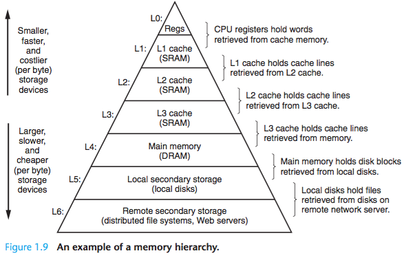

- 메모리 계층 구조의 메인 아이디어는 _한 단계의 저장소는 다음 하위 레벨의 캐시_ 역할한다는 것

## 1.7 OS는 하드웨어를 관리한다

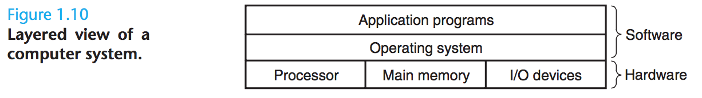

- *operating system*은 애플리케이션 프로그램과 하드웨어 사이에 위치한 레이어(layer)로 볼 수 있으며, 하드웨어를 제어하려는 응용 프로그램의 모든 시도는 **반드시** OS를 거쳐야 한다
- OS는 두 가지 주요 목적을 갖는데
  - [runaway 응용 프로그램](http://osr5doc.xinuos.com/en/HANDBOOK/runaway_proc.html)에 의한 하드웨어 오용 방지
  - 복잡하고 종종 완전히 다른 하드웨어 장치를 제어하기 위한 간단하고 균일한 매커니즘을 응용 프로그램에 제공

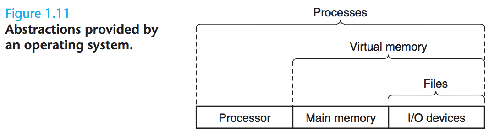

- OS는 이를 _process_, _virtual memory_, _files_ 이라는 기초적인 추상화(fundamental abstraction) 통해 목표를 달성한다
  - file: 'I/O 장치'의 추상화
  - virtual memory: '주기억장치 + I/O 장치'의 추상화
  - process: '프로세서 + 주기억장치 + I/O 장치'의 추상화

### 1.7.1 프로세스

- 요즘 같은 시스템에서 `hello` 프로그램 실행 시, OS는 해당 프로그램이 시스템에서 **유일하게 실행되고 있는 것처럼** 보여주며, 이는 컴퓨터 공학에서 가장 중요하고도 성공적인 아이디어들 중 하나인 프로세스 개념(notion) 덕분
- 프로세스 = 실행중인 프로그램에 대한 OS의 추상화
- 여러 프로세스가 같은 시스템에서 _동시에(concurrently)_ 실행되고, 각 프로세스가 하드웨어를 배타적으로 사용하는 것처럼 보이지만, 여기서 *동시에(concurrently)*는 한 프로세스의 명령어들이 다른 프로세스의 명령어들 사이에 섞일 수 있다는 것(interleaved)을 의미한다
- 단일 코어든 멀티 코어든 다중 프로세스 실행이 가능한데, 이는 _context switching_ 메커니즘 덕분이다

#### a. context

- OS가 추적하는 프로세스가 실행되기 위한 모든 상태 정보(all the state information)
- PC(Program Counter)의 현재 값들
- 레지스터 파일의 현재 값들
- 주기억장치의 현재 값들

#### b. context switching 방식

- 현재 프로세스의 컨텍스트 저장
- 새로운 프로세스의 컨텍스트 복원
- 새로운 프로세스에 제어 전달

#### c. `hello`와 `shell` 예제

- 초기에 쉘 프로세스 단독 실행
- `hello` 프로그램 실행 요청
- 쉘은 제어를 OS로 넘기는 `system call`라는 특별한 함수 호출하여 요청 처리
- 제어권을 가진 OS는
  - 쉘의 컨텍스트 저장하고
  - 새로운 `hello` 프로세스와 컨텍스트를 생성하고
  - 제어를 새로운 `hello` 프로세스에 넘긴다
- `hello` 프로세스 종료 후, OS는 쉘 프로세스의 컨텍스트를 복원하고 다시 제어권을 넘긴다
- 쉘은 다음 명령 줄 입력을 대기

#### d. `kernel`

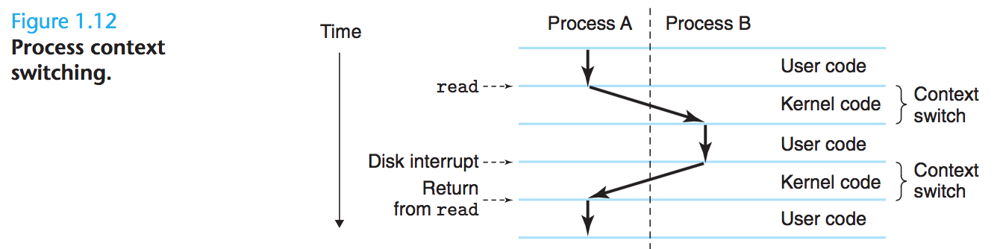

- 위 이미지는 `kernel`에 의한 프로세스 컨텍스트 전환을 보여준다
- 커널 = 메모리에 상주하는 OS 코드의 일부(TODO 일부러 주기억장치라고 안했는지?)
- 절차
  - 응용 프로그램
  - &#8594; OS 액션 요청(파일 읽고 쓰기 등)
  - &#8594; `system call` 명령어 실행
  - &#8594; 커널로 제어권 넘김
  - &#8594; 커널이 요청된 작업 수행하고 응용 프로그램으로 반환
- 커널은 **별도의 프로세스가 아니며, 시스템이 모든 프로세스를 관리하기 위해 사용하는 코드와 데이터 집합**이다

### 1.7.2 Thread

- 오늘날 프로세스의 프로세스는 다중 실행 단위(unit) `threads`로 구성
- 쓰레드는
  - 각 프로세스의 컨텍스트 내에서 실행되고
  - 같은 코드와 전역(global) 데이터를 공유
- 네트워크 서버에서 동시성을 요구하기 때문에, 다중 프로세스보다 다중 쓰레드 간의 데이터 공유가 더 쉽다는 점에서 점점 더 중요해지고 있는 프로그래밍 모델이다

### 1.7.3 가상 메모리

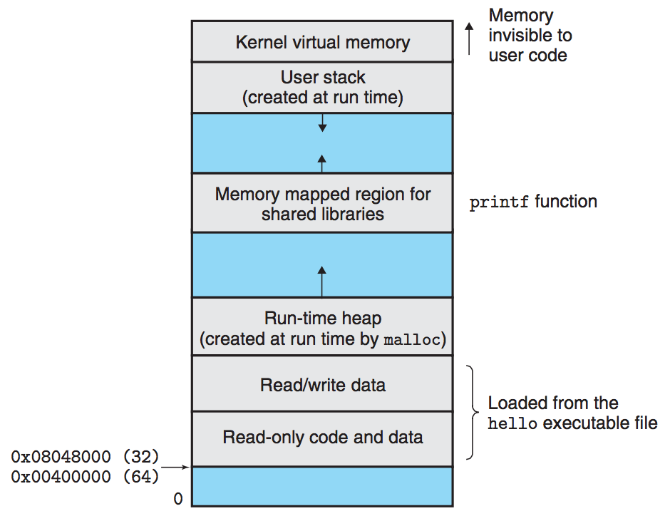

- 프로세스 가상 메모리의 내용을 디스크에 저장하고, 주기억장치를 디스크의 캐시로 사용하는 것이 골자
- 프로세스로 하여금 마치 주기억장치를 배타적으로 점유하고 있다고 착각하게 만든다
  - 각 프로세스가 각 디스크 영역을 배타적으로 점유하고, 주기억장치를 캐시로 사용하기 때문에 가능
- 각 프로세스는 `virtual address space`라는 메모리에 대한 똑같은 공통의 관점(view)을 갖는다
- 구성
  - 상부(topmost): 모든 프로세스에 공통인 OS의 코드와 데이터를 위해 예약된 주소 공간
  - 하부(lower region): 사용자 프로세스에 의해 정의된 코드와 데이터 유지하는 주소 공간
- 각 프로세스에서 보이는 가상 주소 공간은 각자의 목적에 따라 여러 개의 잘 정의된 영역으로 구성

#### 가상 주소 공간의 영역

- 코드 시작(lower) &#8594; 전역 C 변수 &#8594; 힙 &#8594; 공유 라이브러리 &#8594; 사용자 스택 &#8594; 커널 가상 메모리(topmost)

##### `Program code and data`

- 코드는
  - 모든 프로세스에서 동일한 고정된 주소에서 시작하며,
  - 전역 C 변수(global C variables)에 해당하는 데이터 위치가 뒤따른다
- 그 코드와 데이터 영역은 실행 가능한 오브젝트 파일(`hello`)로부터 직접 초기화된다

##### `Heap`

- 코드와 데이터 영역 다음에 즉시 런타임 _heap_ 이 따른다
- 코드 및 데이터는 프로세스 시작 시 크기가 고정
- 반면 힙 영역은 `malloc`과 `free` 같은 C 표준 라이브러리 루틴을 호출한 결과에 따라 **실행 시에 동적으로 확장/수축**한다

##### `Shared libraries`

- 가장 주소 공간의 중간쯤에 위치
- C 표준 라이브러와 수작 라이브러리 같은 코드와 데이터에 대한 _shared libarries_ 유지하는 영역

##### `Stack`

- `user stack`: 컴파일러가 함수 호출을 구현하기 위해 사용하는 사용자의 가상 주소 공간
- heap처럼 프로그램 실행 동안 사용자 스택은 동적으로 확장/축소
  - 함수 호출 &#8594; 스택 증가
  - 함수 리턴 &#8594; 스택 감소

##### `Kernel virtual memory`

- 가장 주소 공간의 최상단은 커널에 예약
- 응용 프로그램은
  - 이 영역의 내용에 대해 읽기/쓰기 불가능
  - 커널 코드에 정의된 함수 직접 호출 불가능

### 1.7.4 파일

- 일련의 바이트
- 디스크, 키보드, 디스플레이, 심지어 네트워크까지 모든 I/O 장치는 파일로 만들어지며(modeled), 시스템의 모든 입출력은 *Unix I/O*라는 작은 시스템 호출 집합을 사용하여 파일을 읽고 쓰는 것으로 이뤄진다
- 다양한 입출력에 대해 공통된 관점을 제공함으로써, 특정 기술을 몰라도 조작할 수 있다

## 1.8 시스템은 네트워크 사용한 단른 시스템과 통신한다

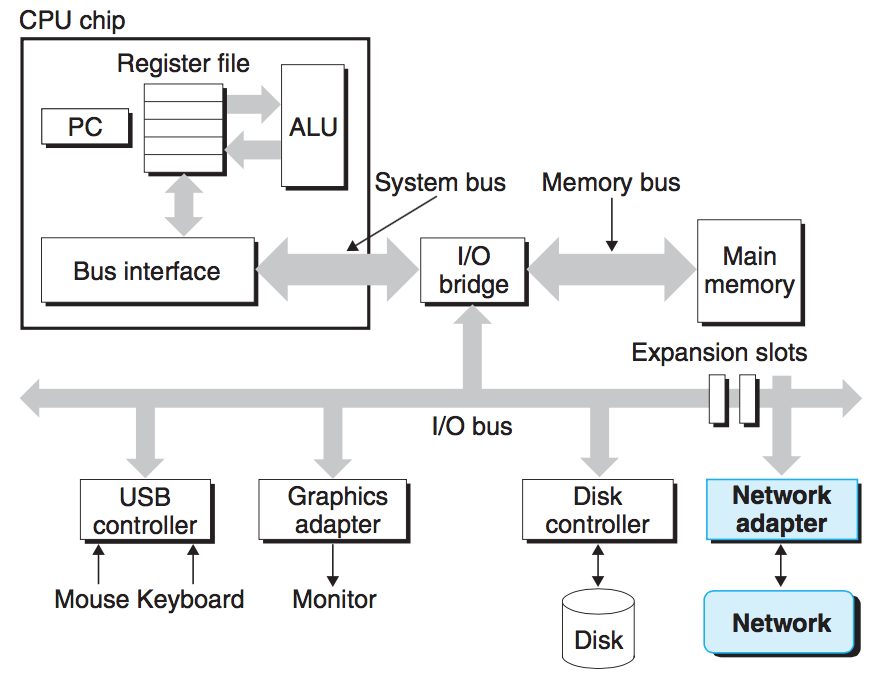

- 네트워크 역시 입출력 장치 중 하나
- 시스템 &#8594; 주기억장치에서 일련의 바이트를 복사 &#8594; 네트워크 어댑터 &#8594; 네트워크 &#8594; 다른 머신

### 1.8.1 네트워크 통한 `hello` 실행

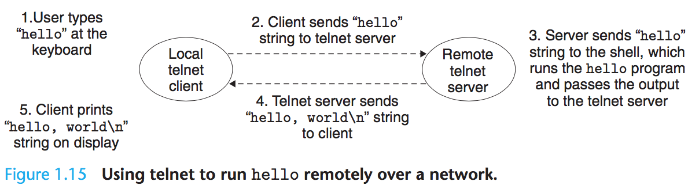

#### step1

- 로컬 머신의 telnet _client_ 사용하여 telnet *server*에 연결
- 원격 머신에 로그인하고 shell 실행하면, 원격 쉘은 입력 명령을 대기
- 유저는 telnet client에 `hello`를 입력하고 `enter`

#### step2

- telnet client는 `hello` 문자열을 서버로 전송

#### step3

- 원격 서버는 네트워크로부터 문자열을 받아서 원격 쉘 프로그램으로 전달
- 원격 쉘은 `hello` 프로그램 실행하고 출력을 telnet server로 반환

#### step4

- telnet server는 네트워크 통해 telnet client로 결과 전송(forward)하고 클라이언트는 결과를 로컬 터미널에 출력

## 1.9 중요한 테마

- 컴퓨터 역사를 통틀어 두 가지 요소가 개선의 추진력이었다
  - 더 빠르게 &#8594; 암달의 법칙
  - 더 많이 &#8594; 동시성과 병행

### 1.9.1 암달의 법칙

#### 개요

- 시스템 일부의 속도 증가 시, 전체 시스템의 성능은 다음 두 요소에 의존한다
  1. 그 일부의 중요도
  2. 속도의 증가 정도
- 시스템의 중요 부분을 충분히 개선한다 해도, 순 속도 향상(net speedup)은 해당 부분의 속도 향상보다 상당히 적다
- 즉, 전체 시스템의 속도를 유의미하게(significantly) 향상시키려면, 반드시 전체 시스템의 매우 큰 부분의 속도를 향상시켜야 한다

#### 수식

\(S(=speed up) = T_{old} / T_{new}\)

- \(T_{old}\)가 느리므로 당연히 \(T_{new}\)보다 시간값이 크다

\(T_{new}\)
\(= (1 - a)T_{old} + (a \times T_{old})/k\)
\(= T_{old}[(1 - a) + a/k]\)

- \(T_{old}\): 시스템에서 어떤 응용 프로그램 실행에 필요한 시간
- \(a\): 시스템이 필요로 하는 \(T_{old}\) 시간의 일부. 중요도를 나타낸다.
- \(a\times T_{old}\): 시스템의 일부가 원래 필요로 했던 시간
- \(k\): \(a\)를 k배만큼 증가
- \((1 - a)\): 속도가 증가하지 않는 부분

\(S = T_{old}/T_{new} = \frac{1}{(1-a) + a/k}\)

- \(a/k\): 원래 차지하던 시간 비중\(a\)가 \(k\)만큼 분할되므로, 더 빨라짐을 의미

여기서 \(k = \infty\)로 가정한다면, \(a/k\) 부분은 무시할만큼 적은 시작이 되고, \(S_{\infin} = \frac{1}{(1-a)}\)를 얻을 수 있다. 만약 시스템의 60%를 거의 시간이 필요 없을 정도로 속도를 향상 시킨다면, 순 속도 향상은 1 / 0.4 = 2.5배가 된다

#### 예제

- 시스템의 어떤 일부분에서 기존 \(T_{old}\) 시간의 60%를 소모했고(\(a\) = 60% = 0.6),
- 그 속도가 3배 빨라졌을 때(k = 3)

\(S = 1 / [(1 - 0.6) + 0.6/3] = \frac{10}{6} = 1.67배\)

> 예제 1.1
> 트럭 운전사로 Boise, Idaho에서 Minneapolis, Minnesota로 감자를 운반하기 위해 총 2,500 키로미터를 이동한다고 해보자. 평균 100 km/hr로 운전한다고 했을 때, 총 25시간이 소요된다
> A. 뉴스에서 막 Montana가 막 속도 제한을 없앴다는 소식을 들었다. Montana 지역은 1,500 km를 차지하는 구간이다. 트럭은 150 km/hr로 이동할 수 있다. 속도 향상(speedup)은 얼마인가?

- 1,500 / 2,500 = 3 / 5 = 0.6 = a
- 150 / 100 = 1.5 = k
- \(T_{old}/T_{new} = 1 / [(1 - 0.6) + 0.6/1.5] = 1.25배\)

> B. 새로운 turbocharger를 살 수 있다. 종류가 다양한데, 더 빠른 것은 더 비싸다. 이동의 전체 속도가 1.67배 향상되려면 얼마나 빨리 Montana를 통과해야 하는가?

- \(T_{old}/T_{new} = 1 / [(1 - 0.6) + 0.6/k] = 1.67배\)가 되려면 앞서 본 것처럼 k는 3이 되어야 한다
- \(x / 100 = 3\)이 되려면 x는 300이 되어야 한다

> 예제1.2
> 자동차 제조사는 고객에게 나음 출시되는 새로운 엔진은 4배의 성능 향상을 보여줄 것이라고 고객에게 약속을 했다. 당신은 이 약속을 이행(deliverying on)하는 업무를 맡게 됐다(왓더...). 당신은 엔진의 오직 90%만 개선할 수 있다고 정했다. 엔진의 목표 전체 성능 향상에 달성하려면, 얼만큼 향상시킬 필요가 있는가?(즉 k값은?)

\(1 / [(1 - 0.9) + 0.9/k] = 4배\)
&#8594; \(0.1 + 0.9/k = 1/4\)
&#8594; \(0.4 + 3.6/k = 1\)
&#8594; \(3.6/k = 0.6\)
&#8594; \(k = 3.6/0.6\)
&#8594; \(k = 6\)

### 1.9.2. 동시성과 병행

#### 동시성(concurrency)

- 여럿이(multiple)
- 동시에(simultaneous)

#### 병행(parallelism)

- 시스템이 더 빨라지도록 **동시성을 사용하는 것**
- 컴퓨터 시스템의 여러 추상화 단계에서 사용될 수 있다

##### 쓰레드 레벨의 동시성

##### 명령어 레벨의 동시성

##### SIMD(Single-Instruction, Multiple-Data) Parallelism

([참고](https://blog.naver.com/dev_seung2/221379096180))

### 1.9.3. 컴퓨터 시스템에서 추상화의 중요성

## 1.10 요약
