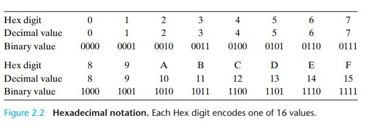

# 2 정보의 표현과 조작(Representing and Manipulating Information)

## 2.0 개요

### 2.0.1 이진 수

- 컴퓨터는 두 개의 값으로 된 신호(two-valued signal = binary digit = *bits*)로 표현되는 정보를 저장하고 처리
- 두 개의 값으로 된 신호를 저장하고 연산하는 것은 매우 간단 $\to$ 수백만, 수십억의 회로를 단일 실리콘 칩에 집적 가능
- *해석(interpretation)*: bits를 묶어서 가능한 서로 다른 비트 패턴에 의미를 부여 $\to$ 비트 패턴으로 유한 집합의 요소들을 나타낼 수 있다
  - 비트 묶음(groups of bits)을 사용하여 양의 숫자를 인코딩 가능
  - 표준 문자 코드 사용하여 문서의 문자와 기호들을 인코딩 가능

### 2.0.2 세 가지 가장 중요한 숫자 표현

- *부호 없는(Unsigned) 수*: 전통적인 이진 표기법에 기반하여 0보다 크거나 같은 숫자를 표현
- *2의 보수(Two's-complement)*: 부호 있는(signed) 음과 양의 정수를 표현하는 가장 흔한 인코딩 방법
- *Floating-point*: 밑수(`base`)를 2(base-2, 이진수)로 실수(real numbers)를 나타내는 과학적 표기법

### 2.0.3 overflow

- 컴퓨터는 제한된 수의 비트로 숫자를 표현하므로, 결과가 나타내기에 너무 크면 발생
- 정수 연산의 경우, 32비트 컴퓨터에서, $200 \times 300 \times 400 \times 500$는 $-884,901,888$이 된다

### 2.0.4 정수 연산과 실수 연산

- 정수 연산의 경우 $200 \times 300 \times 400 \times 500$가 $-884,901,888$ 되는 것은 비정상
  - 여러 양의 수를 곱해 음수를 결과 $\to$ 정수 산술 연산의 속성에 반한다(run counter to)
  - 하지만 그 와중에도 *결합법칙(associative)*과 *교환법칙(commuative)*은 만족
- 반면 실수 연산의 경우,
  - 여러 양의 수를 곱하면 언제나 양수의 결과가 나온다. $+\infin$ 같은 특별한 값이 나오기도 하지만.
  - 또한 한정된 정확도 표현으로 인해, *결합법칙(associative)*가 적용되지 않는다
    - 가령 $(3.14+1\mathrm{e}{20})-1\mathrm{e}{20} = 0.0$이 되지만, $3.14 + (1\mathrm{e}{20}-1\mathrm{e}{20}) = 3.14$가 된다
- 정수 산술 연산과 부동소수점 산술 연산이 다름은 표현의 한계를 어떻게 다루는가에 유래한다
  - 정수 표현: 비교적 적은 범위의 값을 인코딩할 수 있지만 정확하다
  - 실수 표현: 비교적 넓은 범위의 값을 인코딩할 수 있지만 대략적이다

### 2.0.5 정보 표현을 배우는 목적

- 실제 숫자를 표현하는 것에 대해 배움으로써
  - 나타낼 수 있는 값의 범위를 이해하고
  - 서로 다른 산술 연산의 속성을 이해
- 그렇다면 표현 가능한 값의 범위를 이해하고 서로 다른 산술 연산의 속성을 이해하는 것은 왜 중요할까?
  - 숫자 값 전체 범위에 걸쳐서 올바르게 작동한느 프로그램 작성에 중요
  - 다양한 머신, OS 그리고 컴파일러 조합에 이식(portable)될 수 있는 프로그램 작성에 중요
  - 또한 이러한 컴퓨터 연산의 미묘함(subtleties) 때문에 다수의 컴퓨터 보안 취약점 발생
- 비트 단위로 표현된 숫자들을 직접 조작한 산술 연산 이해 $\to$ 산술 연산 식 평가(arithmetic expression evaluation)의 성능을 최적화하기 위해 컴파일러에 의해 생성된 **기계 레벨의 코드 이해**에 중요
- C와 C++에서는 숫자 표현과 연산이 같지만, Java 언어에서는 숫자 표현과 연산에 대한 새로운 표준 집합 생성
- [Java와 C 비교](https://en.wikipedia.org/wiki/Comparison_of_Java_and_C%2B%2B)

>Java built-in types are of a specified size and range defined by the language specification. In C++, a minimal range of values is defined for built-in types, but the exact representation (number of bits) can be mapped to whatever native types are preferred on a given platform.
>
> - For instance, Java characters are 16-bit Unicode characters, and strings are composed of a sequence of such characters. C++ offers both narrow and wide characters, but the actual size of each is platform dependent, as is the character set used. Strings can be formed from either type.
> - This also implies that C++ compilers can automatically select the most efficient representation for the target platform (i.e., 64-bit integers for a 64-bit platform), while the representation is fixed in Java, meaning the values can either be stored in the less-efficient size, or must pad the remaining bits and add code to emulate the reduced-width behavior.

## 2.1 정보 저장

### 2.1.0 개요

### 2.1.0.1 용어

- 8 bits(또는 *bytes*) 블록: 메모리의 주소 지정 가능한(addressable) 가장 작은 단위
- *virtual memory*: 기계 레벨의 프로그램은 메모리를 아주 큰 바이트 배열로 보며, 이를 가상 메모리라 한다
- *address*: 메모리의 각 바이트를 가리키는 유니크한 숫자
- *virtual address space*:
  - 모든 가능한 주소의 집합
  - 이름에서 알 수 있듯이, 기계 레벨 프로그램에 표시되는 개념적인 이미지이며, 실제로는 DRAM, flash memory, 디스크, 특별한 하드웨어 그리고 OS의 조합을 사용하여 단일(monolithic) 바이트 배열로 보이는 프로그램을 제공

### 2.1.0.1 저장

- 컴파일러와 런타임 시스템은 서로 다른 *program obejct*(또는 프로그램 데이터, 명령어, 그리고 제어 정보)를 저장하기 위해 메모리 공간을 보다 다루기 쉬운(more managable) 단위로 나눈다
- 프로그램의 서로 다른 부분들을 저장소에 저장하고 관리하기 위해 다양한 메커니즘 사용하며, 이러한 관리 작업들은 모두 가상 주소 공간에서 수행된다
  - 예를 들어, C에서 포인터의 값은 저장소 블록의 첫 바이트의 가상 주소
  - 또한 C 컴파일러는 *type* 정보를 각 포인터와 연관시 $\to$ 값의 타입에 따라 포인터가 가리키는(designated) 위치의 값에 접근할 수 있는 서로 다른 기계 레벨의 코드를 생성 가능

> C에서 포인터의 역할?
> 배열을 포함한 데이터 구조의 요소(elements)를 참조하기 위한 메커니즘을 제공. 변수와 마찬가지로, 포인터는 *value*와 *type*이라는 두 측면을 갖는다.
>
> - *value*: 어떤 오브젝트의 위치를 가리킨다
> - *type*: 그 위치에 어떤 타입(예를 들어 정수 또는 실수)의 데이터가 저장되었는지 가리킨다
> 포인터를 제대로 이해하려면 포인터가 기계 레벨에서 어떻게 표현되고 구현되는지 확인할 필요가 있다.

### 2.1.1 16진수 표기법

- 8bits는 2진과 10진으로 아래와 같이 나타낼 수 있다
  - 2진 표기법: $\to 00000000_{2} \sim 11111111_{2}$ 범위로 나타낼 수 있다
  - 10진 표기법: $0_{2} \sim 255_{10}$
- 하지만 2진, 10진 표기법은 비트 패턴을 나타내기에 그렇게 편하지 않다. 왜?
  - 이진 표기법은 너무 장황하고
  - 10진 표기법은 비트 패턴으로 바꾸거나 비트 패턴에서 10진수로 바꾸기 지겹다(tedious)?
- 대신 $0 \sim 9$의 숫자와 $A \sim F$ 문자를 사용하여 16개의 값을 나타낼 수 있는 16진수 사용



- 기계 레벨의 프로그램에서 가장 흔한 작업은 비트 패턴의 10진, 2진, 16진 표현을 변환하는 것

```c
hex     1    7    3    A    4    C
bin  0001 0111 0011 1010 0100 1100
```

> 연습 문제 2.1
>
> - A. 0x25B9D2를 이진수로 변환
> - B. 1010111001001001를 16진수로 변환
> - C. 0xA8B3D를 이진수로 변환
> - D. 1100100010110110010110를 16진수로 변환

```c
#include <stdio.h>
#include <math.h>
#include <string.h>
#include <stdlib.h>

int get_char_length(char arr[]){
    int length;
    for (length = 0; arr[length] != '\0'; ++length);

    return length;
}

void print_buf(char *buf, int length) {
    for(int k = length - 1; k >= 0; k--) {
        printf("%d", buf[k]);
        if(k % 4 == 0) {
            printf(" ");
        }
    }
    printf("\n");
}

// https://stackoverflow.com/a/26615844
int hexadecimal_to_binary(char hex[], char *buf) {
    int i;
    int decimal = 0;
    int length = get_char_length(hex);

    // 16진수를 10진수로 변환
    for (i = 0; hex[i] != '\0'; ++i, --length) {
        if(hex[i] >= '0' && hex[i] <= '9') {
            decimal += (hex[i] - '0') * pow(16, length - 1);
        }
        if(hex[i] >= 'A' && hex[i] <= 'F') {
            // printf("%c(%d): %d - %d\n",hex[i], hex[i], hex[i] - 'A', 'A');
            // 'A' = 65, 하지만 16진수에서 A는 10이어야 하므로 55를 뺀다
            decimal += (hex[i] - ('A' - 10)) * pow(16, length - 1);
        }
        if(hex[i] >= 'a' && hex[i] <= 'f') {
            decimal += (hex[i] - ('a' - 10)) * pow(16, length - 1);
        }
    }

    int j = 0;
    // 10진수를 2진수로 변환
    while (decimal != 0) {
        // 0번 인덱스부터 채워넣는다
        buf[j++] = decimal % 2;
        decimal /= 2;
    }
    
    print_buf(buf, j);

    return j;
}

// https://stackoverflow.com/a/5307692
int binary_to_hexadecimal(char bin[], char *buf) {
    int num = 0;
    // bin의 메모리 위치
    char * tmp = bin;
    // bin의 메모리 위치
    char * a =  tmp;
    do {
        int b = *a == '1' ? 1 : 0;
        // printf("tmp: %d, a: %d, (%d << 1) | %d: %d\n", tmp, a, num, b, (num << 1) | b);
        // 1비트씩 앞으로 밀어내고, 그 다음 0 또는 1인 b 비트를 합쳐 나간다. 이렇게 간단해지네...
        num = (num << 1) | b;
        a++;
    } while (*a);
    // https://stackoverflow.com/a/14733875 hex 출력
    printf("0x%08X\n", num);    

    return 0;
}

int main() {
    char bin[100];
    char buf[100];
    char hex[100];
    int result;

    strcpy(hex, "0x25B9D2");
    result = hexadecimal_to_binary(hex, buf); // 10 0101 1011 1001 1101 0010
    strcpy(bin, "1010111001001001");
    result = binary_to_hexadecimal(bin, buf); // 0x0000AE49
    strcpy(hex, "0xA8B3D");
    result = hexadecimal_to_binary(hex, buf); // 1010 1000 1011 0011 1101
    strcpy(bin, "1100100010110110010110");
    result = binary_to_hexadecimal(bin, buf); // 0x00322D96

    return 0;
}
```

- 이러고 또 까먹겠지만... 코드가 있으면 다시 확인할 수 있겠지!

## 2.2 정수 표현

## 2.3 정수 산술 연산(Integer Arithmetic)

## 2.4 부동소수점(Floating Point)
