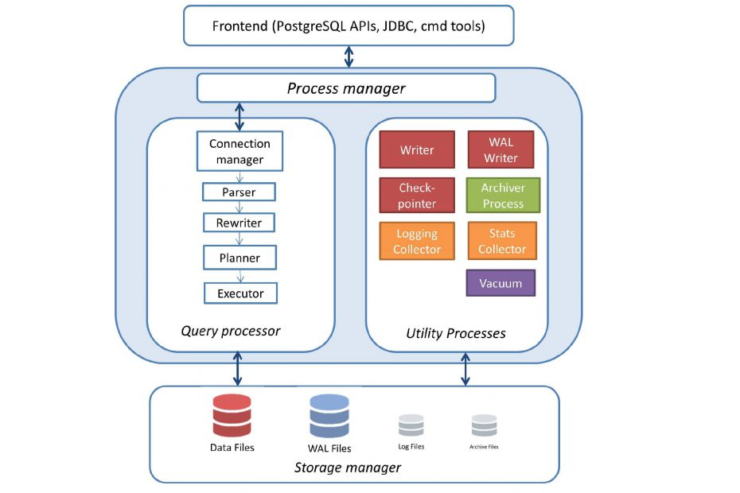

- [개요](#개요)
  - [Shared Memory](#shared-memory)
    - [Shared Buffer](#shared-buffer)
    - [WAL Buffer](#wal-buffer)
      - [개요](#개요-1)
      - [`CHECKPOINT`](#checkpoint)
        - [`checkpoint_timeout` 조회](#checkpoint_timeout-조회)
        - [`checkpoint_completion_target`](#checkpoint_completion_target)
      - [`max_wal_size` 조회](#max_wal_size-조회)
      - [`Dynamic WAL Switching`](#dynamic-wal-switching)
  - [프로세스](#프로세스)
    - [`Postmaster`](#postmaster)
      - [`postgres`](#postgres)
      - [하는 일](#하는-일)
    - [`Background`](#background)
    - [`Backend`](#backend)
      - [`work_mem` 파라미터](#work_mem-파라미터)
      - [`maintenance_work_mem` 파라미터](#maintenance_work_mem-파라미터)
      - [`temp_buffers` 파라미터](#temp_buffers-파라미터)
    - [`Client`](#client)
    - [참고 링크](#참고-링크)
  - [데이터베이스 구조](#데이터베이스-구조)
    - [데이터베이스 관련 사항](#데이터베이스-관련-사항)
      - [`template0`, `template1`?](#template0-template1)
    - [테이블스페이스 관련 사항](#테이블스페이스-관련-사항)
      - [`pg_default`](#pg_default)
      - [`pg_global`](#pg_global)
      - [사용자 테이블 스페이스](#사용자-테이블-스페이스)
    - [테이블 관련 사항](#테이블-관련-사항)
      - [테이블 데이터 저장 파일](#테이블-데이터-저장-파일)
      - [테이블 여유 공간 관리 파일](#테이블-여유-공간-관리-파일)
      - [테이블 블록 visibility 관리 파일](#테이블-블록-visibility-관리-파일)

# 개요

[](https://distributedsystemsauthority.com/postgresql-high-performance-guide-architecture/)

## Shared Memory

### Shared Buffer

- DISK I/O 최소화가 목적
  - 매우 큰(수십, 수백 GB) 버퍼를 빠르게 액세스
  - 많은 사용자 동시 접근 시 경합 최소화
  - 자주 사용되는 블록은 최대한 오랫동안 버퍼 내 유지
- 백엔드 프로세스는 파일을 읽고 쓰는 게 아니라 버퍼와 램을 읽고 쓴다
- `postgresql.config` 파일의 `shared_buffers` 변수에 정해진 고정된 값의 메모리가 서버가 시작될 때 할당된다

### WAL Buffer

#### 개요

> DB의 데이터 변경  
> $\to$ WAL 버퍼와 Data 버퍼 쓰기  
> $\to$ COMMIT 발생  
> $\to$ WAL 버퍼의 데이터를 디스크로 flush  
> $\to$ CHECKPOINT 발생  
> $\to$ 모든 데이터 버퍼를 디스크로 flush

- `WAL(Write-Ahead Log)`? 말 그대로 **로그를 남기고 데이터를 저장**한다는 의미
- `WAL Buffer`? 데이터베이스의 변경 사항을 잠시 저장하는 버퍼
- 매번 모든 커밋을 바로 파일에 쓰지 않기 때문에 성능 향상
- 모든 변화는 WAL 파일에 기록되므로 장애 시에도 복구가 용이하다

#### `CHECKPOINT`

- `CHECKPOINT`?
  - 만약 DB가 모든 데이터 변경 사항이 디스크로 flush된 WAL 로그의 위치를 보장할 수 있다면? 장애 복구 시 나머지 WAL 부분에 대해서만 replay를 하면 된다
  - 체크포인트는 특정 시점 이전의 WAL에 대한 복구가 더이상 필요치 않음을 보장한다
  - 이를 통해 디스크 공간 요구사항과 복구 시간을 줄일 수 있다
- `CHECKPOINT` 발생 시점?
  - `CHECKPOINT` 명령어 실행
  - `CHECKPOINT`를 필요로 하는 명령 실행(`pg_start_backup`, `pg_ctl start|restart` 등)
  - `checkpoint_timeout` 시간에 도달
  - `max_wal_size`가 가득찬 경우
- [`CHECKPOINT` 발생 시 DB는 다음 세 단계 수행](https://www.2ndquadrant.com/en/blog/basics-of-tuning-checkpoints/)
  - shared buffer에 dirty block(수정된 블록)이 있는지 찾는다
  - 모두 디스크(또는 파일 시스템 캐시)에 쓰기
  - 모든 수정된 파일들을 디스크에 `fsync()`

##### `checkpoint_timeout` 조회

```sql
postgres=# SHOW checkpoint_timeout;
 checkpoint_timeout
--------------------
 5min
(1개 행)
```

##### `checkpoint_completion_target`

- 대량의 페이지 쓰기가 갑작스럽게 이뤄져서 I/O 부하가 발생하는 것을 피하기 위한 설정
- `checkpoint_timeout`이 5min, `checkpoint_completion_target`가 0.5면?
  - DB는 마지막 쓰기가 2.5분 뒤에 이뤄지도록 쓰기를 제한(throttle)
  - OS는 데이터를 디스크에 쓸 2.5분이 더 생기고
  - `fsync()`는 그만큼 비용이 저렴해지고 빨라진다

#### `max_wal_size` 조회

```sql
postgres=# SHOW max_wal_size;
 max_wal_size
--------------
 1GB
(1개 행)
```

#### `Dynamic WAL Switching`

- pg 9.6 버전부터 도입된 모델

> 단일 WAL 파일이 가득 차고(기본 16MB) 남은 디스크 공간이 부족해질 때까지 WAL log 쓰기  
> $\to$ 다음 쓰기를 위해 오래된 WAL 파일 사용

## 프로세스

```c
[root@vultr ~]# systemctl status postgresql-13
● postgresql-13.service - PostgreSQL 13 database server
   Loaded: loaded (/usr/lib/systemd/system/postgresql-13.service; disabled; vendor preset: disabled)
   Active: active (running) since Thu 2021-07-22 23:26:23 KST; 2s ago
     Docs: https://www.postgresql.org/docs/13/static/
  Process: 3794307 ExecStartPre=/usr/pgsql-13/bin/postgresql-13-check-db-dir ${PGDATA} (code=exited, status=0/SUCCESS)
 Main PID: 3794313 (postmaster)
    Tasks: 8 (limit: 49532)
   Memory: 30.6M
   CGroup: /system.slice/postgresql-13.service
           ├─3794313 /usr/pgsql-13/bin/postmaster -D /var/lib/pgsql/13/data/
           ├─3794314 postgres: logger
           ├─3794316 postgres: checkpointer
           ├─3794317 postgres: background writer
           ├─3794318 postgres: walwriter
           ├─3794319 postgres: autovacuum launcher
           ├─3794320 postgres: stats collector
           └─3794321 postgres: logical replication launcher

[root@vultr ~]# pstree -p 3794313
postmaster(3794313)─┬─postmaster(3794314)
                    ├─postmaster(3794316)
                    ├─postmaster(3794317)
                    ├─postmaster(3794318)
                    ├─postmaster(3794319)
                    ├─postmaster(3794320)
                    └─postmaster(3794321)
```

### [`Postmaster`](https://www.postgresql.org/docs/13/app-postmaster.html)

- PostgreSQL 기동 시 가장  먼저 시작되는 프로세스
- 모든 프로세스의 부모 프로세스
- 문서상으로는 deprecate된 `postgres`의 alias라고 한다

```c
[root@vultr ~]# ll /usr/pgsql-13/bin/postmaster
lrwxrwxrwx. 1 root root 8  5월 18 22:23 /usr/pgsql-13/bin/postmaster -> postgres
```

#### [`postgres`](https://www.postgresql.org/docs/13/app-postgres.html)

- PostgreSQL 데이터베이스 서버
- 하나의 `postgres`는 공통된 파일 시스템 경로("data area")에 저장되는 데이터베이스 집합인 데이터베이스 클러스터 한 개를 관리
- 여러 데이터베이스 클러스터가 서로 다른 data area와 통신 포트를 사용할 경우, 여러 `postgres` 인스턴스가 한 시스템에서 실행될 수 있다
- `-D` 옵션 또는 `PGDATA` 환경변수로 반드시 data area 영역이 지정되어야 한다

#### 하는 일

- 초기 기동 시
  - 복구 작업
  - Shared 메모리 초기화 작업
  - 백그라운드 프로세스 구동 작업
- 클라이언트 프로세스의 접속 요청 시 Backend 프로세스 생성

### `Background`

- pgsql 운영에 필요한 백그라운드 프로세스
  - `logger`: 에러 메시지를 로그 파일에 기록
  - `checkpointer`: 체크포인트 발생 시 dirty 버퍼를 파일에 기록
  - `writer`: 주기적으로 dirty 버퍼를 파일에 기록
  - `wal writer`: WAL 버퍼 내용을 WAL 파일에 기록
  - `autovacuum launcer`: `Vacuum` 필요 시점에 `autovacuum worker`를 fork
  - `archiver`: Archive log 모드일 때, WAL 파일을 지정된 디렉토리에 복사
  - `stats collector`: DBMS 사용 통계 정보 수집
    - `pg_stat_activity`: 세션 수행 정보
    - `pg_stat_all_tables`: 테이블 사용 통계 정보

### `Backend`

- 사용자 프로세스의 쿼리 요청 수행 후 결과 전송 역할 수행
- `max_connections` 파라미터로 최대 개수 설정 가능

#### [`work_mem` 파라미터](https://www.postgresql.org/docs/13/runtime-config-resource.html)

- 다음과 같이 복잡한 쿼리 등의 작업이 있는 경우 사용되는 공간
  - 정렬 작업
  - Bitmap 작업
  - 해시 조인 작업
  - Merge 조인 작업 등
- 기본 설정 값은 4MiB

#### [`maintenance_work_mem` 파라미터](https://www.postgresql.org/docs/13/runtime-config-resource.html)

- 말 그대로 관리를 위한 작업에 사용되는 메모리 공간 설정 값
  - `Vacuum`
  - `CREATE INDEX`
  - `ALTER TABLE ADD FOREIGN KEY` 등
- 기본 설정 값은 64MiB

#### [`temp_buffers` 파라미터](https://www.postgresql.org/docs/13/runtime-config-resource.html)

- 각 데이터베이스 세션 내의 temporary buffer가 사용하는 메모리 공간
- 이 session-local 버퍼는 temporary table 접근할 때만 사용
- 세션은 필요 시`temp_buffers`의 값에 따라 임시 버퍼를 할당
- 단위 없이 지정된 경우, [`BLCKSZ` 바이트인 블록](https://www.postgresql.org/docs/13/runtime-config-preset.html)으로 받아들여지며, `BLCKSZ`는 일반적으로 8kB(8192 bytes)(즉, 단위가 블록이 된다는 의미인 듯)
- 기본 설정값은 8MiB가 되고, `BLCKSZ`가 8kB가 아니면 기본값은 그 값에 비례하여 조정된다

### `Client`

- 접속, 쿼리 등 요청

### 참고 링크

- [Chapter 2 Process and Memory Architecture](https://www.interdb.jp/pg/pgsql02.html)

## 데이터베이스 구조

### 데이터베이스 관련 사항

- pgsql은 여러 데이터베이스로 구정되고, 이를 데이터베이스 클러스터라고 한다
- [`initdb()`](https://www.postgresql.org/docs/13/app-initdb.html) 수행 시 `template0`, `template1`, `postgres` 데이터베이스 생성

#### `template0`, `template1`?

- 사용자 데이터베이스 생성 위한 템플릿 데이터베이스
- 시스템 카탈로그 테이블 포함
- `template0`, `template1`의 테이블 목록은 같다
- `template1` 데이터베이스에는 사용자가 필요한 오브젝트 생성 가능
- `template1` 사용하여 사용자 데이터베이스 생성

### 테이블스페이스 관련 사항

- `initdb()` 수행 직후 `pg_default`, `pg_global` 테이블스페이스 생성된다
- 1개의 테이블스페이스를 여러 개의 데이터베이스가 사용 가능. 테이블스페이스 디렉토리 내에 데이터베이스별 서브 디렉토리 생성

#### `pg_default`

- 테이블 생성 시 테이블스페이스 지정하지 않으면 `pg_default`에 저장
- 물리적 위치: `$PGDATA/base`

#### `pg_global`

- 데이터베이스 클러스터 레벨에서 관리되는 테이블은 `pg_global`에 저장
- 물리적 위치: `$PGDATA/global`

#### 사용자 테이블 스페이스

- 물리적 위치에 사용자 테이블스페이스와 관련된 심볼릭 링크 생성된다
- 물리적 위치: `$PGDATA/tblspc`

### 테이블 관련 사항

- 테이블별로 3개의 파일이 존재
  - `OID`
  - `OID_fsm`
  - `OID_vm`
- 인덱스는? _vm 파일이 없다.
  - `OID`
  - `OID_fsm`
- 주의 사항
  - 테이블 & 인덱스 생성 시점의 파일명 = `OID` = `pg_class.relfilenode`
  - **Rewrite** 작업(`Truncate`, `CLUSTER`, `Vacuum Full`, `REINDEX` 등) 수행 $\to$ 영향받은 오브젝트의 `relfilenode` 값 변경 $\to$ 파일명도 `relfilenode` 값으로 변경
  - `pg_relation_filepath('오브젝트명')` 명령어로 파일 위치와 이름 쉽게 확인 가능

#### 테이블 데이터 저장 파일

- 파일명: 테이블의 `OID`

#### 테이블 여유 공간 관리 파일

- 파일명: `OID_fsm`

#### 테이블 블록 visibility 관리 파일

- 파일명: `OID_vm`
