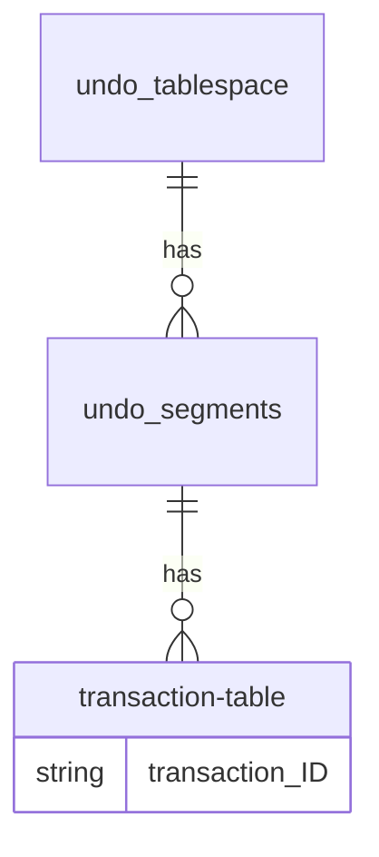

- [RDBMS와 MVCC 아키텍처](#rdbms와-mvcc-아키텍처)
  - [MVCC 아키텍처의 발전](#mvcc-아키텍처의-발전)
    - [RDBMS와 Concurrency Control](#rdbms와-concurrency-control)
    - [MVCC 발전](#mvcc-발전)
      - [1970년](#1970년)
      - [1974년](#1974년)
      - [1976년](#1976년)
      - [1978년](#1978년)
      - [1981년](#1981년)
      - [1984년](#1984년)
      - [1986년](#1986년)
      - [1999년](#1999년)
  - [MVCC의 두 가지 흐름](#mvcc의-두-가지-흐름)
    - [첫번째 흐름](#첫번째-흐름)
      - [`MGA` 예제](#mga-예제)
    - [두번째 흐름](#두번째-흐름)
      - [`Rollback segment` 예제](#rollback-segment-예제)
  - [트랜잭션](#트랜잭션)
    - [샘플 트랜잭션: 계좌의 debit(차변)/credit(대변)](#샘플-트랜잭션-계좌의-debit차변credit대변)
    - [오라클의 락과 데드락](#오라클의-락과-데드락)
      - [`lock`?](#lock)
      - [`deadlock`?](#deadlock)
  - [DBMS별 MVCC 메커니즘 비교](#dbms별-mvcc-메커니즘-비교)
    - [비교 내용](#비교-내용)
      - [TX 식별자](#tx-식별자)
      - [Old Version 저장 위치](#old-version-저장-위치)
      - [Old Version 포인터](#old-version-포인터)
      - [레코드 포인터](#레코드-포인터)
      - [페이지 내 레코드 저장 순서](#페이지-내-레코드-저장-순서)
      - [COMMIT 시점의 Action](#commit-시점의-action)
      - [ReadView 사용 여부](#readview-사용-여부)
      - [레코드 헤더 크기](#레코드-헤더-크기)
      - [트랜잭션 리스트 관리](#트랜잭션-리스트-관리)
    - [트랜잭션 처리 위한 ID](#트랜잭션-처리-위한-id)
      - [Oracle](#oracle)
      - [PostgreSQL](#postgresql)
      - [MySQL/InnoDB](#mysqlinnodb)
    - [Old Version의 저장위치와 포인터](#old-version의-저장위치와-포인터)
      - [Oracle - Old Version](#oracle---old-version)
      - [PostgreSQL - Old Version](#postgresql---old-version)
    - [데이터 블록 내의 레코드 관리](#데이터-블록-내의-레코드-관리)
      - [Oracle와 PostgreSQL 레코드 관리](#oracle와-postgresql-레코드-관리)
    - [트랜잭션의 COMMIT 후 처리](#트랜잭션의-commit-후-처리)
      - [오라클의 커밋 후 처리](#오라클의-커밋-후-처리)
      - [PostgreSQL의 커밋 후 처리](#postgresql의-커밋-후-처리)
    - [Readview](#readview)

# RDBMS와 MVCC 아키텍처

- `Oracle, PostgreSQL, MySQL Core Architecture`, `Oracle, PostgreSQL, MySQL Core Architecture II` 책 공부
- 주로 PostgreSQL 위주로 정리. 오라클이 앞에 있어서 먼저 보는데 오라클 문서 보다 생을 마감할 거 같다...

## MVCC 아키텍처의 발전

### RDBMS와 Concurrency Control

- 무려 50년 전부터 현 RDBMS와 트랜잭션 등에 대한 연구가 미국에서 이뤄지고 있었다...
- `Multiversion Concurrency control(MVCC)`?
  - Write 세션이 Read 세션을 블로킹하지 않고
  - Read 세션이 Write 세션을 블로킹하지 않고
  - 서로 다른 세션이 동일 데이터에 접근했을 때 각 세션마다 스냅샷 이미지를 보장해주는 매커니즘
  - `Multiversion`이라는 말 그대로, **데이터 변화를 여러 버전으로 관리**하여 동시성 제어를 한다

### MVCC 발전

#### 1970년

- E. F. Codd 박사 $\to$ RDBMS 논문(A relational model of data for large **shared data** banks)
  - 데이터의 독립성
  - 구조적인 간결함
  - SQL 같은 고급 언어를 통한 집합 처리

#### 1974년

- IBM에서 System R프로젝트 시작
- Raymond F. Boyce, Donald D. Chamberlin $\to$ SEQUEL(Structured English Query Language)
- Jim Gray $\to$ ACID, Locking, Recovery 매커니즘 등 트랜잭션 처리 관한 이론 정립
- Michael Stonebraker, 동료 및 제자 $\to$ Ingres(Interactive Graphics and Retrieval System)

#### 1976년

- Bob Miner, Ed Oates, Lally Ellison $\to$ SDL 찹업 후 Oracle DBMS 발표

#### 1978년

- David P. Reed $\to$ READ와 WRITE 경합 최소화 아이디어 제시
  - 어떤 데이터에 여러 차례 수정이 있다고 가정할 때
  - 수정이 가해진 각 시점의 개별 버전을 모두 저장하고(`Multiversion`)
  - 데이터 객체는 이러한 개별 버전들의 연속체로 정의
- `Synchronization`? a mechnism
  - for naming versions to be read and
  - for defining where in the sequence of versions the version resulting from some update should be placed

#### 1981년

- Philip A. Bernstein, Nathan Goodman $\to$ `MVCC`

#### 1984년

- Jim Starkey
  - $\to$ 최초로 Rdb/ELN 제품에 처음으로 MVCC 아키텍처 도입
  - $\to$ 두번째로 Interbase DB에 발전시킨 MVCC 도입하는데, `Multi Generation Architecture(MGA, 추기형)`라고 한다

#### 1986년

- Bob Miner $\to$ 오라클 version 6에서 `Rollback Segment` 도입

#### 1999년

- Mikheev Vadim B. $\to$ `MGA` 아키텍처 채택하여 PostgreSQL 6.5에 MVCC 아키텍처 도입

## MVCC의 두 가지 흐름

### 첫번째 흐름

- PostgreSQL, Firebird/Interbase, SQL Server 등
- 데이터베이스 내에 다중 버전의 레코드 저장하고 더 이상 필요하지 않을 때 모아둔 레코드 버림
- `Multi Generation Architecture, MGA`
  - Tuple 업데이트 시 새로운 값으로 대체하지 않고, 동일한 데이터 페이지 내에서 New Tuple을 새롭게 추가하고 Old Tuple은 유효 범위를 마킹하여 처리

#### `MGA` 예제

- 업데이트 전
  - `XMIN`에 `XID 10` 세팅 & `XMAX` 세팅된 값 없음 = **`XID 10`부터 현재까지 유효** 의미

|         |         |         |
| ------- | ------- | ------- |
| XMIN 10 | XMAX -- | TUPLE 1 |
| XMIN 10 | XMAX -- | TUPLE 2 |
| XMIN 10 | XMAX -- | TUPLE 3 |

- TUPLE 2 업데이트
  - **OLD** TUPLE 2:
    - `XID 30`일 때, 기존 TUPLE 2의 `XMAX`에 `XID 30` 세팅하여 OLD 버전임을 표시
    - $\to$ `XID 10`부터 `XID 30` 범위에서 visible한 값
  - **NEW** TUPLE 2:
    - `XMIN`의 `XID 30`, `XMAX`는 없음
    - $\to$ **`XID 30`부터 현재까지 유효** 의미

|             |             |                 |
| ----------- | ----------- | --------------- |
| XMIN 10     | XMAX --     | TUPLE 1         |
| XMIN 10     | XMAX **30** | **OLD** TUPLE 2 |
| XMIN 10     | XMAX --     | TUPLE 2         |
| XMIN 10     | XMAX --     | TUPLE 3         |
| XMIN **30** | XMAX --     | **NEW** TUPLE 2 |

- 서로 다른 세션끼리 어떻게 Snapshot image를 SELECT?
  - 시점별 XID:
    - T0: `XID 10`
    - T1: `XID 20`
    - T2: `XID 30`
    - T3: `XID 40`

- T1 시점: *SESSION-1* OPEN
  - *SESSION-1* SELECT $\to$ TUPLE 1, TUPLE 2, TUPLE 3 조회

```
PAGE HEADER

          ... FREE SPACE ...

      [TUPLE 3][TUPLE 2][TUPLE 1][PAGE TAIL]
```

- T2 시점:
  - UPDATE TUPLE 2
  - $\to$ 새로운 NEW TUPLE 2가 추가
  - $\to$ OLD TUPLE 2는 XMAX에 유효한 XID 범위값 세팅

```
PAGE HEADER

          ... FREE SPACE ...
                               [NEW TUPLE 2]
  [TUPLE 3][OLD TUPLE 2][TUPLE 1][PAGE TAIL]
```

- T3 시점: *SESSION-3* OPEN
  - *SESSION-1* SELECT $\to$ TUPLE 1, **OLD** TUPLE 2, TUPLE 3 조회
  - *SESSION-3* SELECT $\to$ TUPLE 1, **NEW** TUPLE 2, TUPLE 3 조회

### 두번째 흐름

- Oracle, MySQL/InnoDB 등
- 최신 버전의 데이터만 데이터베이스 내에 저장하고 언두를 이용하여 이전 버전 데이터 재구성
- 1986년 Bob Miner는 오라클 version 6에서 `Rollback Segment` 도입하여 MVCC 구현
- `Rollback segment` 메커니즘
  - UPDATE 실행
    - $\to$ 기존 데이터 블록 내의 데이터 레코드를 New Version으로 변경
    - $\to$ Old Version을 별도의 저장소인 `Rollback segment`에 보관
  - SELECT 실행
    - $\to$ `SELECT SCN(System Change Number)`과 `데이터 블록의 SCN(System Change Number)`을 비교
    - $\to$ **Consistent Read**가 필요하다고 판단
    - $\to$ 롤백 세그먼트의 Old Version을 읽어서 버퍼캐시에 `CR(Consistence Read) 블록`을 생성
  - SELECT 쿼리의 Snapshot Read를 보장
  - `Ora-1555 snapshot too old`라는 한계점 제외하고는 동시성을 극대화해주는 최고의 방법이었다

#### `Rollback segment` 예제

- 업데이트 전

| data block                       | undo block                 |
| -------------------------------- | -------------------------- |
| ITL(Interested Transaction List) | TX(Transaction) Table Slot |
| Data Row `A`                     |                            |

- 업데이트 후

| data block                       |        | undo block                      |
| -------------------------------- | ------ | ------------------------------- |
| ITL(Interested Transaction List) | ┬XID─> | TX(Transaction) Table Slot ┐UBA |
| Data Row (new Image `B`)         | └UBA─> | Undo Record(Old Image `A`)<┘    |

- `ITL`?
  - [`Interested Transaction List`](https://datacadamia.com/db/oracle/transaction_table)의 약자이며, `transaction table`이라고도 한다
  - [ITL structure in detail](https://avdeo.com/2008/06/16/interested-transaction-list-itl/) 참고
    - Variable header는 위에서 아래로 필요에 따라 증가하고, row는 아래에서 위로 증가
    - ITL은 variable portion of data block header에 위치한다(그러니까 Variable header...?)
    - 이 데이터 블록 헤더의 가변 영역은 트랜잭션에 대한 슬롯들을 갖는다
      - 만약 어떤 row가 lock 된다면? $\to$ 트랜잭션은 lock 된 row의 rowid와 함께 한 슬롯에 lock을 넣는다
      - 달리 말하자면, **트랜잭션이 해당 row에 관심이 있다고 표시**하는 것(그래서 *Interested Transaction List*다)
- `UBA`?
  - `Undo Block Address`
- `Consistence Read`?
  - [[Oracle] 문장수준 읽기 일관성 Consistent Mode, Current Mode 차이 :: 마이자몽](https://myjamong.tistory.com/195) 참고
  - `Consistent`? 일관된, 언행이 일치된, 모순이 없는
  - Consistent Read 위해서, SELECT 시점에 SCN을 비교해서 Undo Segment에 존재하는 해당 Old Versions을 찾아서 버퍼 캐시에 CR 블록 생성

## 트랜잭션

### [샘플 트랜잭션: 계좌의 debit(차변)/credit(대변)](https://docs.oracle.com/cd/E11882_01/server.112/e40540.pdf)

- Savings 계좌의 금액 감소
- Checking 계좌의 금액 증가

|     | DML                     |                                                     |                      |          비고           |
| --- | ----------------------- | --------------------------------------------------- | -------------------- | :---------------------: |
| 1   | UPDATE savings_accounts | SET balance = balance - 500                         | WHERE account = 3209 | Savings 계좌 금액 감소  |
| 2   | UPDATE savings_accounts | SET balance = balance + 500                         | WHERE account = 3208 | Checking 계좌 금액 증가 |
| 3   | INSERT INTO journal     | VALUES (journal_seq.NEXTVAL, '1B', 3209, 3208, 500) |                      |  트랜잭션 저널에 기록   |
| 4   | COMMIT WORK             |                                                     |                      |      트랜잭션 종료      |

### 오라클의 락과 데드락

#### `lock`?

| lock        |                                                                                           |                                                                  |
| ----------- | ----------------------------------------------------------------------------------------- | ---------------------------------------------------------------- |
| DML Lock    | 데이터 보호. 테이블 락은 테이블 전체를 잠그고, 로우 락은 선택된 로우만 잠근다             | Row Lock(TX), Table Lock(TM)                                     |
| DDL Lock    | 스키마 오브젝트의 구조를 보호. 가령 테이블과 뷰의 데이터 사전 정의(Dictionary definition) | `Exlusive DDL Locks`, `Share DDL Locks`, `Breakable Parse Locks` |
| System Lock | `data file` 같은 내부 데이터베이스 구조 보호.                                             | `Latches`, `Mutexes`, `Internal Locks`                           |

#### `deadlock`?

- 둘 이상의 사용자가 각 상대발에 의해 잠긴(locked) 데이터를 기다리는 상황으로, 트랜잭션이 진행되는 것을 막는다

| 시간 | Session1                     | Session2                  |                                                                       |
| ---- | ---------------------------- | ------------------------- | --------------------------------------------------------------------- |
| t0   | UPDATE employees             | UPDATE employees          | 각 트랜잭션은 수정하려는 로우를 잠그고 있으므로 문제 없다             |
|      | SET salary = salary * 1.1    | SET salary = salary * 1.1 |                                                                       |
|      | WHERE employees_id = 100;    | WHERE employees_id = 200; |                                                                       |
|      | 1 row updated.               | 1 row updated.            | 나중에 데드락으로 롤백할 때 이 시점의 변경 사항은 **롤백하지 않는다** |
| t1   | UPDATE employees             | UPDATE employees          | 데드락 발생                                                           |
|      | SET salary = salary * 1.1    | SET salary = salary * 1.1 | `employees_id=100`은 Session1이 잠그고 있고,                          |
|      | WHERE employees_id = 200;    | WHERE employees_id = 100; | `employees_id=200`은 Session2가 잠그고 있다                           |
| t2   | ORA-00060: deadlock detected |                           | Session1은 데드락 시그널을 받고 `t1` 시점의 `UPDATE`는 롤백된다       |
|      | while waiting for resource   |                           | 오직 한 세션만 데드락 에러를 받으며, 둘 중 한 세션이 받을 수 있다     |
| t3   | SQL> COMMIT;                 |                           | `t0` 시점의 수정 사항을 커밋하고 Session1의 트랜잭션이 끝난다         |
|      | Commit complete.             |                           | `t1` 시점의 수정 사항은 커밋되지 않는다                               |
| t4   |                              | 1 row updated.            | `t1` 시점에 Session1에 의해 막혔던 Session2의 `UPDATE`가 실행된다     |
| t5   |                              | SQL> COMMIT;              | `t0`과 `t1` 시점의 수정 사항이 커밋되고 Session2는 종료               |
|      |                              | Commit complete.          |                                                                       |

## DBMS별 MVCC 메커니즘 비교

### 비교 내용

#### TX 식별자

- Oracle
  - TX 시작:
    - 무엇을? 트랜잭션 테이블의 위치정보인 `XID(위치 정보)`를
    - 어디에? 블록의 `ITL`에 저장
  - TX 완료:
    - 무엇을? TX 수행되면서 증가하는 `SCN(시간관련정보)`을
    - 어디에? `트랜잭션 테이블`과 `ITL`에 저장
- PostgreSQL
  - TX 시작:
    - 무엇을? TX 수행되면서 증가하는 `XID(시간관련정보)`
    - 어디에? `튜플 헤더`에
    - 어떻게? `t_xmin`, `t_xmax` 컬럼에 저장
- MySQL
  - TX 시작:
    - 무엇을? TX 수행되면서 증가하는 `TRX_ID(시간관련정보)`를
    - 어디에? `레코드 헤더`에 저장
  - TX 완료:
    - 무엇을? `TRX_ID(시간관련정보)`를
    - 어디에? `언두 블록`에 저장

#### Old Version 저장 위치

- Oracle: 별도로 분리된 `언두 세그먼트`에 저장
- PostgreSQL: `동일 데이터 페이지`에 저장
- MySQL: 별도로 분리된 `언두 세그먼트`에 저장

#### Old Version 포인터

- Oracle: `UBA(Undo Block Address)`
- PostgreSQL: `T_CTID(Current Tuple ID)`
- MySQL: `Roll Pointer`

#### 레코드 포인터

- Oracle: `Row offset`
- PostgreSQL: `Line pointer`
- MySQL: `Directory Slot`

#### 페이지 내 레코드 저장 순서

- Oracle: 블록 아래 $\to$ 블록 위
- PostgreSQL: 페이지 아래 $\to$ 페이지 위
- MySQL: 페이지 헤더 $\to$ 페이지 아래

#### COMMIT 시점의 Action

- Oracle: 블록 클린 아웃
- PostgreSQL: 튜플헤더 `t_nfomask` 칼럼에 상태정보 업데이트
- MySQL:
  - 페이지 클린 아웃 없음.
  - `언두 블록`의 `TRX_NO` 컬럼에 `TRX_ID(시간관련정보)` 저장
  - `히스터리 리스트` 등록
  - `TRX_SYS`의 `TRX_STRUCTURE` 더블 링크트 리스트에서 제외

#### ReadView 사용 여부

- Oracle: ReadView 사용하지 않음
- PostgreSQL: Snapshot Structure 사용
- MySQL: ReadView 사용

#### 레코드 헤더 크기

- Oracle: 3 Bytes +
- PostgreSQL: 24 Bytes
- MySQL: 18 Bytes +

#### 트랜잭션 리스트 관리

- Oracle: `언두 헤더`에 위치한 `트랜잭션 테이블`. v$transaction
- PostgreSQL: `pg_log` 디렉토리 아래에 256 Kbyte의 `clog` 파일들
- MySQL:
  - `언두 세그먼트`의 `언두 블록`에 저장
  - `TRX_SYS`의 `TRX_STRUCTURE` 더블 링크트 리스트

### 트랜잭션 처리 위한 ID

|              | 위치정보 | 시간관련정보 |
| ------------ | -------- | ------------ |
| Oracle       | `XID`    | `SCN`        |
| PostgreSQL   |          | `XID`        |
| MySQL/InnoDB |          | `TRX_ID`     |

#### Oracle

- [데이터 블록, 익스텐트, 세그먼트](https://docs.oracle.com/cd/B19306_01/server.102/b14220/logical.htm)

[](https://docs.oracle.com/cd/B19306_01/server.102/b14220/logical.htm#CHDGJJEJ)

[](https://docs.oracle.com/cd/E11882_01/server.112/e40540/logical.htm#CNCPT301)

- [`data block`](https://docs.oracle.com/cd/E11882_01/server.112/e40540/glossary.htm#i432306)?
  - 오라클 데이터베이스에서 논리적으로 가장 작은 단위
  - 한 데이터 블록은 물리적인 디스크 공간 내 특정 수의 바이트에 해당한다
- [`extent`](https://docs.oracle.com/cd/E11882_01/server.112/e40540/glossary.htm#i432386)?
  - 특정 타입의 정보를 저장하기 저장하기 위해 할당된 논리적으로 연속된 데이터 블록 집합
- [`segment`](https://docs.oracle.com/cd/E11882_01/server.112/e40540/glossary.htm#i432714)?
  - [테이블](https://docs.oracle.com/cd/E11882_01/server.112/e40540/glossary.htm#i432801) 같은 특정한 데이터베이스 오브젝트를 위해 할당된 익스텐트의 집합
  - 각 `segment`는 오직 하나의 테이블 스페이스에 속한다. 즉, 어떤 `segment`의 `extent`들도 모두 같은 테이블스페이스에 저장된다
- [`tablespace`](https://docs.oracle.com/cd/E11882_01/server.112/e40540/glossary.htm#i996731)?
  - 데이터베이스 저장 단위
  - 논리적으로 함께 연관된 구조들을 그룹화 한다
  - 데이터베이스의 [`data file`](https://docs.oracle.com/cd/E11882_01/server.112/e40540/glossary.htm#CHDHJCCC)이 `tablespace`에 저장된다

- [Introduction to Automatic Undo Management](https://docs.oracle.com/cd/B19306_01/server.102/b14220/logical.htm#CHDGJJEJ)
  - 데이터베이스의 변화를 무효화하기 위해 undo 사용
  - 오라클은 다음을 위해 undo를 사용
    - active transaction를 **롤백**
    - termincated transaction을 **복구**
    - 읽기 일관성(read consistency) 제공
    - 논리적 오염(logical corruptions)으로부터의 복구
  - 자동 언두 관리는 `undo tablespace`를 기반으로 하며, 롤백 세그먼트를 다양한 크기로 할당하기보다는, 언두 테이블스페이스의 형식으로 공간을 할당한다



```sql
SQL> UPDATE hr.employees SET salary=salary;
107 rows updated.
SQL> SELECT 
  XID AS "txn id", 
  XIDUSN AS "undo seg", 
  XIDSLOT AS "slot",
  XIDSQN AS "seq", STATUS AS "txn status"
FROM V$TRANSACTION;

txn id undo seg slot seq txn status
---------------- ---------- ---------- ---------- ----------------
0600060037000000 6 6 55 ACTIVE
```

- XID 생성 $\to$ 언두 헤더의 TX 테이블에 저장 $\to$ SCN을 언두 헤더에 저장 $\to$ 최신 데이터에 유지되던 SCN과 언두 블록의 SCN을 비교하여 예전 데이터로 찾아간다
- `XID(공간 정보)`와 `SCN(시간관련정보)`를 적절하게 조합하여 사용
  - `XID`:
    - 언두 정보가 기록되는 *위치*에 관한 정보
    - 언제? 트랜잭션 시작 시 할당
    - 어떻게? `Undo Segment Number` + `Slot` + `Sequence number`
  - `SCN(System Change Number)`
    - 시간에 따라 증가하는 시간관련정보
    - 언제? 트랜잭션 COMMIT 시 할당
    - 어떻게? 6 Bytes 데이터
- 참고 링크
  - [Rollback Segment and Undo Internals](https://www.yumpu.com/en/document/read/10495342/rollback-segment-and-undo-internals-dsvolkru)
  - [Undo Header Block & Undo Block 스트럭처](http://wiki.gurubee.net/pages/viewpage.action?pageId=9601080)

#### PostgreSQL


출처:exem

- `XID(시간관련정보)`를 `t_xmin`과 `t_xmax`를 적절하게 조합하여 사용
  - `XID`
    - 언제? 트랜잭션 시작 시점에만 할당
    - INSERT 시? `t_xmin`에 저장
    - DELETE 시? `t_xmax`에 저장
    - MySQL/InnoDB의 ReadView와 비슷한 `Snapshop Structure`에서 SELECT 시작 시점의 ACTIVE TX 리스트 관리해야 한다

#### MySQL/InnoDB

- *위치정보*와 *시간관련정보* 분리되어 있지 않다
- `TRX_ID(시간관련정보)`
  - 언제? 트랜잭션 시작 시점
  - 어디에? `페이지의 데이터 레코드`에 저장
- `TRX_NO`
  - 언두 블록을 회수하기 위한 비교 시점으로 사용
  - 언제? COMMIT 시
  - 무엇을? `TRX_ID`를
  - 어디에?
    - 언두 블록의 `TRX_NO` 컬럼에 저장.
    - UNDO_BLOCK['`TRX_NO`'] = `TRX_ID`
- 레코드의 Visibility는 세션마다 생성되는 Readview의 `Up_Limit_ID`, `Low_Limit_ID`, `Active TX List`에 의해 결정

### Old Version의 저장위치와 포인터

#### Oracle - Old Version

- 데이터 블록의 데이터 레코드 업데이트 시
  - 트랜잭션의 상태 정보 $\to$ *언두 헤더 트랜잭션 테이블*에 기록
  - Old Version $\to$ *언두 블록*에 기록
  - Old Versions의 위치 정보
    - $\to$ 데이터 블록의 ITL의 UBA 컬럼
    - $\to$ 트랜잭션 테이블의 Slot의 UBA 컬럼
- SELECT에서 Old Versions 필요
  - 언두 블록 $\to$ Old Version $\to$ 버퍼캐시 $\to$ CR 블록

#### PostgreSQL - Old Version

- 데이터 튜플 업데이트
  - 동일한 데이터 페이지 내에 Old Tuple와 New Tuple 저장
  - `t_ctid`는 New Version의 위치를 가리킨다
- SELECT에서 Old Versions 필요
  - `t_ctid` 컬럼에 저장된 New Version의 위치를 찾아간다
- SELECT 시점에는 Snapshot Structure를 가지고 아래 세 값을 비교하여 튜플의 visibility 결정
  - `SELECT XID`
  - `t_xmin`의 XID
  - `t_xmax`의 XID

### 데이터 블록 내의 레코드 관리

- DBMS는 기본적으로 데이터 레코드를 `블록` 또는 `페이지`라 불리는 단위 구조에 저장
- 스토리지와 메모리 버퍼 간의 SELECT와 WRITE할 때에도 이 `블록` 단위로 I/O
- `블록`의 크기는 8K 또는 16K 주로 사용하지만 내부 구조는 DBMS마다 다르며 구조에 따라 트랜잭션 처리 및 각 DBMS의 주요 특성 결정

#### Oracle와 PostgreSQL 레코드 관리

- `INSERT` 시 `블록` 아래쪽부터 차례대로 저장
- `블록 헤더`에에는 새로운 레코드를 가리키는 포인터가 차례대로 생긴다

### 트랜잭션의 COMMIT 후 처리

#### 오라클의 커밋 후 처리

- 커밋되면 트랜잭션 테이블에서
  - 해당 슬롯의 상태 값을 `10(Active)` $\to$ `9(Committed)`로 변경
  - `SCN` 칼럼에 `커밋 시점의 SCN` 기록
  - 블록 클린 아웃
    - 데이터 블록의 `ITL`: `Flag`, `Lock`, `Scn/Fsc` 칼럼을 커밋 시의 값으로 정리
    - 데이터 블록: `Lock Byte` 칼럼을 커밋 시의 값으로 정리
- Delayed Block Cleanout
  - 클린 아웃 대상이 과다하면 메모리 있는 일부 블록들만 우선적으로 클린아웃 하고 나머지 블록은 향후 SELECT 시에 클린 아웃

#### PostgreSQL의 커밋 후 처리

- `UPDATE` 시
  - Old Version이 `DELETE` 되고
  - New Version이 `INSERT` 된다
  - 이를 구분하기 위해 `t_infomask` 칼럼의 상위 4bits를 사용(`0010(0x2)`)
- 커밋되면 튜플 헤더의 `t_infomask` 칼럼에서
  - 첫 바이트의 하위 4bit에 COMMIT, ABORT 등 상태값 정리
  - 첫 바이트의 상위 4bit는
    - `DELETE` 시의 `DELETE bit`와
    - `UPDATE` 시의 `DELETE bit`를 구분

| COMMAND  | COMMIT 여부 | xmax invalid/aborted | xmax committed | xmin invalid/aborted | xmin committed | value                                 |
| -------- | ----------- | -------------------- | -------------- | -------------------- | -------------- | ------------------------------------- |
| `INSERT` | X           | 1                    | 0              | 0                    | 0              | $2^{3}$ = 8                           |
| `INSERT` | O           | 1                    | 0              | 0                    | 1              | $2^{3} + 2^{0}$ = 9                   |
| `DELETE` | X           | 0                    | 0              | 0                    | 1              | $2^{0}$ = 1                           |
| `DELETE` | O           | 0                    | 1              | 0                    | 1              | $2^{2} + 2^{0}$ = 5                   |
| `FROZEN` |             | 1                    | 0              | 1                    | 1              | $2^{3} + 2^{1} + 2^{0}$ = 11 = B(hex) |

### Readview

- `Readview(Snapshop)`?
  - 쿼리 시작 시점의 액티브 트랜잭션들의 집합을 저장
- PostgreSQL은 트랜잭션 시작 시 트랜잭션의 식별자만을 레코드 헤더에 저장하므로 MVCC 구현 위해서하는 반드시 필요
