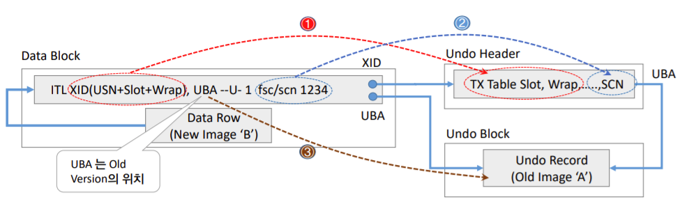
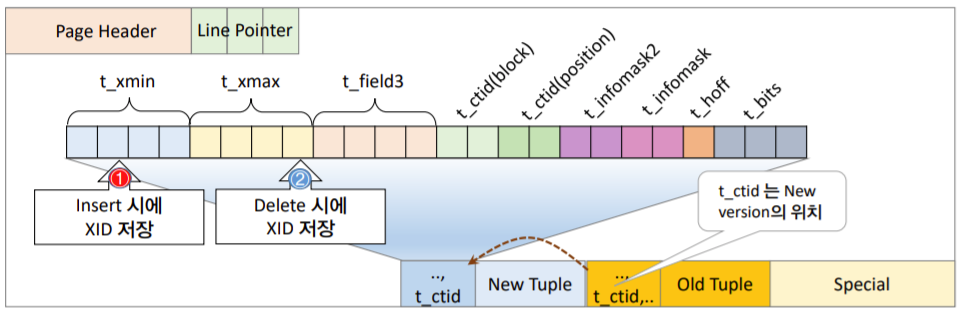

- [RDBMS와 MVCC 아키텍처](#rdbms와-mvcc-아키텍처)
  - [MVCC 아키텍처의 발전](#mvcc-아키텍처의-발전)
    - [RDBMS와 Concurrency Control](#rdbms와-concurrency-control)
    - [MVCC 발전](#mvcc-발전)
      - [1970년](#1970년)
      - [1974년](#1974년)
      - [1976년](#1976년)
      - [1978년](#1978년)
      - [1981년](#1981년)
      - [1984년](#1984년)
      - [1986년](#1986년)
      - [1999년](#1999년)
  - [MVCC의 두 가지 흐름](#mvcc의-두-가지-흐름)
    - [첫번째 흐름](#첫번째-흐름)
      - [`MGA` 예제](#mga-예제)
    - [두번째 흐름](#두번째-흐름)
      - [`Rollback segment` 예제](#rollback-segment-예제)
  - [DBMS별 MVCC 메커니즘 비교](#dbms별-mvcc-메커니즘-비교)
    - [비교 내용](#비교-내용)
      - [TX 식별자](#tx-식별자)
      - [Old Version 저장 위치](#old-version-저장-위치)
      - [Old Version 포인터](#old-version-포인터)
      - [레코드 포인터](#레코드-포인터)
      - [페이지 내 레코드 저장 순서](#페이지-내-레코드-저장-순서)
      - [COMMIT 시점의 Action](#commit-시점의-action)
      - [ReadView 사용 여부](#readview-사용-여부)
      - [레코드 헤더 크기](#레코드-헤더-크기)
      - [트랜잭션 리스트 관리](#트랜잭션-리스트-관리)
    - [트랜잭션 처리 위한 ID](#트랜잭션-처리-위한-id)
      - [Oracle](#oracle)
      - [PostgreSQL](#postgresql)
      - [MySQL/InnoDB](#mysqlinnodb)

# RDBMS와 MVCC 아키텍처

## MVCC 아키텍처의 발전

### RDBMS와 Concurrency Control

- 무려 50년 전부터 현 RDBMS와 트랜잭션 등에 대한 연구가 미국에서 이뤄지고 있었다...
- `Multiversion Concurrency control(MVCC)`?
  - Write 세션이 Read 세션을 블로킹하지 않고
  - Read 세션이 Write 세션을 블로킹하지 않고
  - 서로 다른 세션이 동일 데이터에 접근했을 때 각 세션마다 스냅샷 이미지를 보장해주는 매커니즘
  - `Multiversion`이라는 말 그대로, **데이터 변화를 여러 버전으로 관리**하여 동시성 제어를 한다

### MVCC 발전

#### 1970년

- E. F. Codd 박사 $\to$ RDBMS 논문(A relational model of data for large **shared data** banks)
  - 데이터의 독립성
  - 구조적인 간결함
  - SQL 같은 고급 언어를 통한 집합 처리

#### 1974년

- IBM에서 System R프로젝트 시작
- Raymond F. Boyce, Donald D. Chamberlin $\to$ SEQUEL(Structured English Query Language)
- Jim Gray $\to$ ACID, Locking, Recovery 매커니즘 등 트랜잭션 처리 관한 이론 정립
- Michael Stonebraker, 동료 및 제자 $\to$ Ingres(Interactive Graphics and Retrieval System)

#### 1976년

- Bob Miner, Ed Oates, Lally Ellison $\to$ SDL 찹업 후 Oracle DBMS 발표

#### 1978년

- David P. Reed $\to$ READ와 WRITE 경합 최소화 아이디어 제시
  - 어떤 데이터에 여러 차례 수정이 있다고 가정할 때
  - 수정이 가해진 각 시점의 개별 버전을 모두 저장하고(`Multiversion`)
  - 데이터 객체는 이러한 개별 버전들의 연속체로 정의
- `Synchronization`? a mechnism
  - for naming versions to be read and
  - for defining where in the sequence of versions the version resulting from some update should be placed

#### 1981년

- Philip A. Bernstein, Nathan Goodman $\to$ `MVCC`

#### 1984년

- Jim Starkey
  - $\to$ 최초로 Rdb/ELN 제품에 처음으로 MVCC 아키텍처 도입
  - $\to$ 두번째로 Interbase DB에 발전시킨 MVCC 도입하는데, `Multi Generation Architecture(MGA, 추기형)`라고 한다

#### 1986년

- Bob Miner $\to$ 오라클 version 6에서 `Rollback Segment` 도입

#### 1999년

- Mikheev Vadim B. $\to$ `MGA` 아키텍처 채택하여 PostgreSQL 6.5에 MVCC 아키텍처 도입

## MVCC의 두 가지 흐름

### 첫번째 흐름

- PostgreSQL, Firebird/Interbase, SQL Server 등
- 데이터베이스 내에 다중 버전의 레코드 저장하고 더 이상 필요하지 않을 때 모아둔 레코드 버림
- `Multi Generation Architecture, MGA`
  - Tuple 업데이트 시 새로운 값으로 대체하지 않고, 동일한 데이터 페이지 내에서 New Tuple을 새롭게 추가하고 Old Tuple은 유효 범위를 마킹하여 처리

#### `MGA` 예제

- 업데이트 전
  - `XMIN`에 `XID 10` 세팅 & `XMAX` 세팅된 값 없음 = **`XID 10`부터 현재까지 유효** 의미

|         |         |         |
| ------- | ------- | ------- |
| XMIN 10 | XMAX -- | TUPLE 1 |
| XMIN 10 | XMAX -- | TUPLE 2 |
| XMIN 10 | XMAX -- | TUPLE 3 |

- TUPLE 2 업데이트
  - **OLD** TUPLE 2:
    - `XID 30`일 때, 기존 TUPLE 2의 `XMAX`에 `XID 30` 세팅하여 OLD 버전임을 표시
    - $\to$ `XID 10`부터 `XID 30` 범위에서 visible한 값
  - **NEW** TUPLE 2:
    - `XMIN`의 `XID 30`, `XMAX`는 없음
    - $\to$ **`XID 30`부터 현재까지 유효** 의미

|             |             |                 |
| ----------- | ----------- | --------------- |
| XMIN 10     | XMAX --     | TUPLE 1         |
| XMIN 10     | XMAX **30** | **OLD** TUPLE 2 |
| XMIN 10     | XMAX --     | TUPLE 2         |
| XMIN 10     | XMAX --     | TUPLE 3         |
| XMIN **30** | XMAX --     | **NEW** TUPLE 2 |

- 서로 다른 세션끼리 어떻게 Snapshot image를 SELECT?
  - 시점별 XID:
    - T0: `XID 10`
    - T1: `XID 20`
    - T2: `XID 30`
    - T3: `XID 40`

- T1 시점: *SESSION-1* OPEN
  - *SESSION-1* SELECT $\to$ TUPLE 1, TUPLE 2, TUPLE 3 조회

```
PAGE HEADER

          ... FREE SPACE ...

      [TUPLE 3][TUPLE 2][TUPLE 1][PAGE TAIL]
```

- T2 시점:
  - UPDATE TUPLE 2
  - $\to$ 새로운 NEW TUPLE 2가 추가
  - $\to$ OLD TUPLE 2는 XMAX에 유효한 XID 범위값 세팅

```
PAGE HEADER

          ... FREE SPACE ...
                               [NEW TUPLE 2]
  [TUPLE 3][OLD TUPLE 2][TUPLE 1][PAGE TAIL]
```

- T3 시점: *SESSION-3* OPEN
  - *SESSION-1* SELECT $\to$ TUPLE 1, **OLD** TUPLE 2, TUPLE 3 조회
  - *SESSION-3* SELECT $\to$ TUPLE 1, **NEW** TUPLE 2, TUPLE 3 조회

### 두번째 흐름

- Oracle, MySQL/InnoDB 등
- 최신 버전의 데이터만 데이터베이스 내에 저장하고 언두를 이용하여 이전 버전 데이터 재구성
- 1986년 Bob Miner는 오라클 version 6에서 `Rollback Segment` 도입하여 MVCC 구현
- `Rollback segment` 메커니즘
  - UPDATE 실행
    - $\to$ 기존 데이터 블록 내의 데이터 레코드를 New Version으로 변경
    - $\to$ Old Version을 별도의 저장소인 `Rollback segment`에 보관
  - SELECT 실행
    - $\to$ `SELECT SCN(System Change Number)`과 `데이터 블록의 SCN(System Change Number)`을 비교
    - $\to$ **Consistent Read**가 필요하다고 판단
    - $\to$ 롤백 세그먼트의 Old Version을 읽어서 버퍼캐시에 `CR(Consistence Read) 블록`을 생성
  - SELECT 쿼리의 Snapshot Read를 보장
  - `Ora-1555 snapshot too old`라는 한계점 제외하고는 동시성을 극대화해주는 최고의 방법이었다

#### `Rollback segment` 예제

- 업데이트 전

| data block                       | undo block                 |
| -------------------------------- | -------------------------- |
| ITL(Interested Transaction List) | TX(Transaction) Table Slot |
| Data Row `A`                     |                            |

- 업데이트 후

| data block                       |        | undo block                      |
| -------------------------------- | ------ | ------------------------------- |
| ITL(Interested Transaction List) | ┬XID─> | TX(Transaction) Table Slot ┐UBA |
| Data Row (new Image `B`)         | └UBA─> | Undo Record(Old Image `A`)<┘    |

- `ITL`?
  - [`Interested Transaction List`](https://datacadamia.com/db/oracle/transaction_table)의 약자이며, `transaction table`이라고도 한다
  - [ITL structure in detail](https://avdeo.com/2008/06/16/interested-transaction-list-itl/) 참고
    - Variable header는 위에서 아래로 필요에 따라 증가하고, row는 아래에서 위로 증가
    - ITL은 variable portion of data block header에 위치한다(그러니까 Variable header...?)
    - 이 데이터 블록 헤더의 가변 영역은 트랜잭션에 대한 슬롯들을 갖는다
      - 만약 어떤 row가 lock 된다면? $\to$ 트랜잭션은 lock 된 row의 rowid와 함께 한 슬롯에 lock을 넣는다
      - 달리 말하자면, **트랜잭션이 해당 row에 관심이 있다고 표시**하는 것(그래서 *Interested Transaction List*다)
- `UBA`?
  - `Undo Block Address`
- `Consistence Read`?
  - [[Oracle] 문장수준 읽기 일관성 Consistent Mode, Current Mode 차이 :: 마이자몽](https://myjamong.tistory.com/195) 참고
  - `Consistent`? 일관된, 언행이 일치된, 모순이 없는
  - Consistent Read 위해서, SELECT 시점에 SCN을 비교해서 Undo Segment에 존재하는 해당 Old Versions을 찾아서 버퍼 캐시에 CR 블록 생성

## DBMS별 MVCC 메커니즘 비교

### 비교 내용

#### TX 식별자

- Oracle
  - TX 시작:
    - 무엇을? 트랜잭션 테이블의 위치정보인 `XID(위치 정보)`를
    - 어디에? 블록의 `ITL`에 저장
  - TX 완료:
    - 무엇을? TX 수행되면서 증가하는 `SCN(시간 정보)`을
    - 어디에? `트랜잭션 테이블`과 `ITL`에 저장
- PostgreSQL
  - TX 시작:
    - 무엇을? TX 수행되면서 증가하는 `XID(시간 정보)`
    - 어디에? `튜플 헤더`에
    - 어떻게? `t_xmin`, `t_xmax` 컬럼에 저장
- MySQL
  - TX 시작:
    - 무엇을? TX 수행되면서 증가하는 `TRX_ID(시간 정보)`를
    - 어디에? `레코드 헤더`에 저장
  - TX 완료:
    - 무엇을? `TRX_ID(시간 정보)`를
    - 어디에? `언두 블록`에 저장

#### Old Version 저장 위치

- Oracle: 별도로 분리된 `언두 세그먼트`에 저장
- PostgreSQL: `동일 데이터 페이지`에 저장
- MySQL: 별도로 분리된 `언두 세그먼트`에 저장

#### Old Version 포인터

- Oracle: `UBA(Undo Block Address)`
- PostgreSQL: `T_CTID(Current Tuple ID)`
- MySQL: `Roll Pointer`

#### 레코드 포인터

- Oracle: `Row offset`
- PostgreSQL: `Line pointer`
- MySQL: `Directory Slot`

#### 페이지 내 레코드 저장 순서

- Oracle: 블록 아래 $\to$ 블록 위
- PostgreSQL: 페이지 아래 $\to$ 페이지 위
- MySQL: 페이지 헤더 $\to$ 페이지 아래

#### COMMIT 시점의 Action

- Oracle: 블록 클린 아웃
- PostgreSQL: 튜플헤더 `t_nfomask` 칼럼에 상태정보 업데이트
- MySQL:
  - 페이지 클린 아웃 없음.
  - `언두 블록`의 `TRX_NO` 컬럼에 `TRX_ID(시간 정보)` 저장
  - `히스터리 리스트` 등록
  - `TRX_SYS`의 `TRX_STRUCTURE` 더블 링크트 리스트에서 제외

#### ReadView 사용 여부

- Oracle: ReadView 사용하지 않음
- PostgreSQL: Snapshot Structure 사용
- MySQL: ReadView 사용

#### 레코드 헤더 크기

- Oracle: 3 Bytes +
- PostgreSQL: 24 Bytes
- MySQL: 18 Bytes +

#### 트랜잭션 리스트 관리

- Oracle: `언두 헤더`에 위치한 `트랜잭션 테이블`. v$transaction
- PostgreSQL: `pg_log` 디렉토리 아래에 256 Kbyte의 `clog` 파일들
- MySQL:
  - `언두 세그먼트`의 `언두 블록`에 저장
  - `TRX_SYS`의 `TRX_STRUCTURE` 더블 링크트 리스트

### 트랜잭션 처리 위한 ID

#### Oracle


출처:exem

- XID 생성 $\to$ 언두 헤더의 TX 테이블에 저장 $\to$ SCN을 언두 헤더에 저장 $\to$ 최신 데이터에 유지되던 SCN과 언두 블록의 SCN을 비교하여 예전 데이터로 찾아간다
- `XID(공간 정보)`와 `SCN(시간 정보)`를 적절하게 조합하여 사용
  - `XID`:
    - 언두 정보가 기록되는 *위치*에 관한 정보
    - 언제? 트랜잭션 시작 시 할당
    - 어떻게? `Undo Segment#` + `Slot#` + `Wrap#`
  - `SCN(System Change Number)`
    - 시간에 따라 증가하는 시간 정보
    - 언제? 트랜잭션 COMMIT 시 할당
    - 어떻게? 6 Bytes 데이터
- 참고 링크
  - [Rollback Segment and Undo Internals](https://www.yumpu.com/en/document/read/10495342/rollback-segment-and-undo-internals-dsvolkru)
  - [Undo Header Block & Undo Block 스트럭처](http://wiki.gurubee.net/pages/viewpage.action?pageId=9601080)

#### PostgreSQL


출처:exem

- `XID(시간 정보)`를 `t_xmin`과 `t_xmax`를 적절하게 조합하여 사용
  - `XID`
    - 언제? 트랜잭션 시작 시점에만 할당
    - INSERT 시? `t_xmin`에 저장
    - DELETE 시? `t_xmax`에 저장
    - MySQL/InnoDB의 ReadView와 비슷한 `Snapshop Structure`에서 SELECT 시작 시점의 ACTIVE TX 리스트 관리해야 한다

#### MySQL/InnoDB

- `TRX_ID(시간 정보)`
  - 언제? 트랜잭션 시작 시점
  - 어디에? `페이지의 데이터 레코드`에 저장
- `TRX_NO`
  - 언두 블록을 회수하기 위한 비교 시점으로 사용
  - 언제? COMMIT 시
  - 무엇을? `TRX_ID`를
  - 어디에? 언두 블록의 `TRX_NO` 컬럼에 저장
- 레코드의 Visibility는 세션마다 생성되는 Readview의 `Up_Limit_ID`, `Low_Limit_ID`, `Active TX List`에 의해 결정
