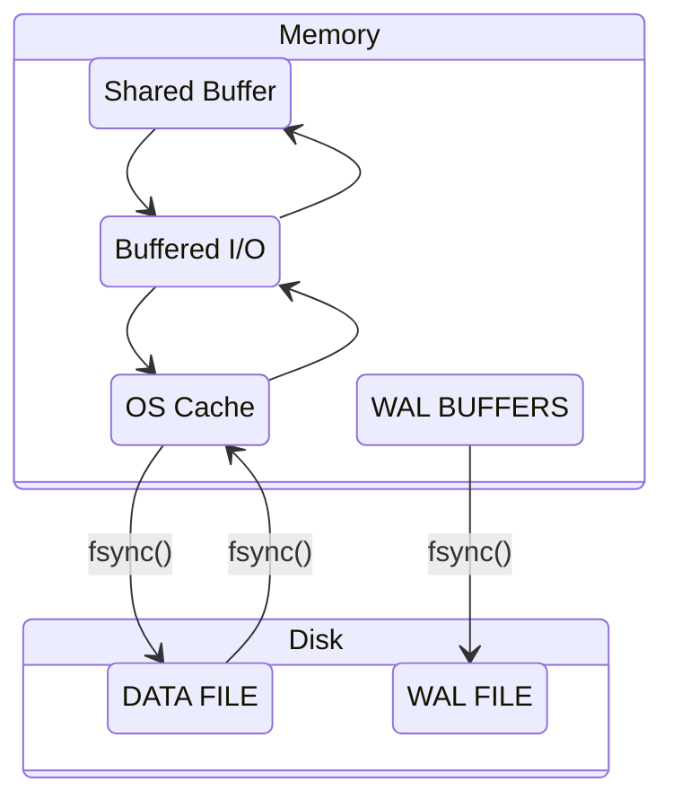
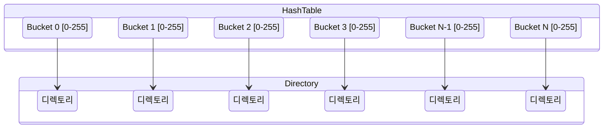

- [Shared Buffer 동작 원리](#shared-buffer-동작-원리)
  - [개요](#개요)
  - [성능 향상 위한 Shared Buffer의 3가지 목표](#성능-향상-위한-shared-buffer의-3가지-목표)
    - [매우 큰(수십, 수백 GB) 버퍼를 빠르게 액세스](#매우-큰수십-수백-gb-버퍼를-빠르게-액세스)
    - [많은 사용자가 동시 접근 시 경합 최소화](#많은-사용자가-동시-접근-시-경합-최소화)
    - [자주 사용되는 블록은 최대한 오랫동안 버퍼에 생존](#자주-사용되는-블록은-최대한-오랫동안-버퍼에-생존)
  - [Shared Buffer 구조](#shared-buffer-구조)
    - [해시 테이블](#해시-테이블)
      - [해시 테이블 크기와 해시 세그먼트](#해시-테이블-크기와-해시-세그먼트)
      - [해시 테이블 크기 중간 정리](#해시-테이블-크기-중간-정리)
    - [버퍼 파티션?](#버퍼-파티션)
      - [버퍼 파티션 개수](#버퍼-파티션-개수)
    - [해시 엘리먼트](#해시-엘리먼트)
      - [구성](#구성)
      - [엘리먼트 구성 요소](#엘리먼트-구성-요소)
      - [엘리먼트 키 구성 요소](#엘리먼트-키-구성-요소)
      - [`BufferTag`?](#buffertag)
      - [해시 엘리먼트 메모리 할당 방식](#해시-엘리먼트-메모리-할당-방식)
      - [여러 개의 `freeList`](#여러-개의-freelist)
    - [버퍼 디스크립터](#버퍼-디스크립터)
  - [기타](#기타)
    - [참고 링크](#참고-링크)

# Shared Buffer 동작 원리

- from PostgreSQL 9.6 성능 이야기

## 개요

- 디스크에서 데이터 읽기/쓰기하는 것보다 메모리에서 읽기/쓰기하는 게 더 빠르며, 이를 위해 PostgreSQL에서는 `shared_buffer`로 제어되는 공유 버퍼를 사용
- 공유 버퍼는 PostgreSQL 인스턴스의 생애 동안 고정된다
- 공유 버퍼는 모든 백그라운드 서버와 데이터베이스에 연결하려는 유저 프로세스가 접근한다
- 공유 버퍼는 dirty buffer를 OS 캐시에 쓰기하고, 별도의 시스템 콜을 통해 페이지를 디스크에 flush 한다
- 특징들을 알아야 I/O 처리가 갑자기 느려질 때 원인 파악할 수 있다
  - I/O 전략
  - Ring 버퍼
  - Clock Sweep 알고리즘



## 성능 향상 위한 Shared Buffer의 3가지 목표

### 매우 큰(수십, 수백 GB) 버퍼를 빠르게 액세스

- *빠르게*가 관건인 만큼,
  - 버퍼에 있는지 없는지 여부 판단 속도
  - 버퍼에 있다면 해당 블록을 찾는 속도
- 자료구조의 형태가 중요하며, shared buffer는 이 목표를 위한 노력의 결과물

### 많은 사용자가 동시 접근 시 경합 최소화

- 공유 자원 보호 위해 Lock 메커니즘이 필수
- Lock의 경합 최소화 위해 여러 Lock 사용 방식 필요

### 자주 사용되는 블록은 최대한 오랫동안 버퍼에 생존

- Clock sweep 알고리즘 사용
  - [Second Chance (or Clock) Page Replacement Policy](https://www.geeksforgeeks.org/second-chance-or-clock-page-replacement-policy/)
  - [The Second Chance Page Replacement Policy](http://www.mathcs.emory.edu/~cheung/Courses/355/Syllabus/9-virtual-mem/SC-replace.html)
- 메모리 상에서 연달아 방문이 이뤄지면 기회를 한번 주고, 그 다음에 방문을 하지 않으면 그 기회를 없앤다.

## Shared Buffer 구조

1. 해시 테이블
2. 해시 테이블의 엘리먼트 및 엘리먼트 키
3. 버퍼 디스크립터: 버퍼 상태 관리
4. 버퍼 풀: 실제 블록을 저장

### 해시 테이블

- `Segmented hash table`
  - 키를 해시해서 특정 규칙에 따라 메모리 공간에서 빠르게 찾아갈 수 있어서 읽기/쓰기에 좋다. 하지만 해시 충돌(hash colision) 발생 가능
  - 해시 충돌 완화 위해 해시 테이블을 *논리적인 N개의 세그먼트(해시 세그먼트)로 나누어서* 관리
- 해시 테이블을
  - 논리적으로 버퍼 파티션과 해시 세그먼트로 나눈다
  - 각 해시 세그먼트는 256개의 버킷으로 구성된다



- `Directory`?
  - 논리적으로 나눈 N개의 세그먼트의 각 시작 위치를 가리키는 별도의 배열 필요한데, 이 배열을 디렉토리라 한다
  - 기본값 설정은 256
  - `shared_buffer`를 크게 설정한 경우 디렉코리 크기 증가
- `해시 세그먼트`?
  - 해시 테이블을 논리적으로 나누는 단위
  - 256개의 버킷으로 구성
- `버킷`?
  - 배열의 요소를 의미
  - 버킷의 개수 = 배열의 길이

#### 해시 테이블 크기와 해시 세그먼트

```c++
// src/backend/utils/hash/dynahash.c
#define DEF_SEGSIZE         256
#define DEF_SEGSIZE_SHIFT   8 /* must be log2(DEF_SEGSIZE) */
#define DEF_DIRSIZE         256
#define DEF_FFACTOR         1 /* default fill factor */
```

```c++
// src/include/storage/lwlock.h
/* Number of partitions of the shared buffer mapping hashtable */
#define NUM_BUFFER_PARTITIONS  128
```

```c++
// src/backend/utils/hash/dynahash.c
/*
 * Top control structure for a hashtable --- in a shared table, each backend
 * has its own copy (OK since no fields change at runtime)
 */
struct HTAB
{
  HASHHDR           *hctl;        /* => shared control information */
  HASHSEGMENT       *dir;         /* directory of segment starts */
  HashValueFunc     hash;         /* hash function */
  HashCompareFunc   match;        /* key comparison function */
  HashCopyFunc      keycopy;      /* key copying function */
  HashAllocFunc     alloc;        /* memory allocator */
  MemoryContext     hcxt;         /* memory context if default allocator used */
  char              *tabname;     /* table name (for error messages) */
  bool              isshared;     /* true if table is in shared memory */
  bool              isfixed;      /* if true, don't enlarge */

  /* freezing a shared table isn't allowed, so we can keep state here */
  bool              frozen;       /* true = no more inserts allowed */

  /* We keep local copies of these fixed values to reduce contention */
  Size              keysize;      /* hash key length in bytes */
  long              ssize;        /* segment size --- must be power of 2 */
  int               sshift;       /* segment shift = log2(ssize) */
};

/* calculate first power of 2 >= num, bounded to what will fit in an int */
static int
next_pow2_int(long num)
{
 if (num > INT_MAX / 2)
  num = INT_MAX / 2;
 return 1 << my_log2(num); /* my_log2: calculate ceil(log base 2) of num */
}

/*
 * Compute derived fields of hctl and build the initial directory/segment
 * arrays
 */
static bool
init_htab(HTAB *hashp, long nelem)
{
  HASHHDR     *hctl = hashp->hctl;
  HASHSEGMENT *segp;
  int         nbuckets;
  int         nsegs;
  int         i;

  /*
    * initialize mutexes if it's a partitioned table
    */
  if (IS_PARTITIONED(hctl))
    for (i = 0; i < NUM_FREELISTS; i++)
      SpinLockInit(&(hctl->freeList[i].mutex));

  /*
    * Divide number of elements by the fill factor to determine a desired
    * number of buckets.  Allocate space for the next greater power of two
    * number of buckets
    */
  nbuckets = next_pow2_int((nelem - 1) / hctl->ffactor + 1);

  /*
    * In a partitioned table, nbuckets must be at least equal to
    * num_partitions; were it less, keys with apparently different partition
    * numbers would map to the same bucket, breaking partition independence.
    * (Normally nbuckets will be much bigger; this is just a safety check.)
    */
  while (nbuckets < hctl->num_partitions)
    nbuckets <<= 1;

  hctl->max_bucket = hctl->low_mask = nbuckets - 1;
  hctl->high_mask = (nbuckets << 1) - 1;

  /*
    * Figure number of directory segments needed, round up to a power of 2
    */
  nsegs = (nbuckets - 1) / hctl->ssize + 1;
  nsegs = next_pow2_int(nsegs);

  /*
    * Make sure directory is big enough. If pre-allocated directory is too
    * small, choke (caller screwed up).
    */
  if (nsegs > hctl->dsize)
  {
    if (!(hashp->dir))
      hctl->dsize = nsegs;
    else
      return false;
  }

  /* Allocate a directory */
  if (!(hashp->dir))
  {
    CurrentDynaHashCxt = hashp->hcxt;
    hashp->dir = (HASHSEGMENT *)
      hashp->alloc(hctl->dsize * sizeof(HASHSEGMENT));
    if (!hashp->dir)
      return false;
  }

  /* Allocate initial segments */
  for (segp = hashp->dir; hctl->nsegs < nsegs; hctl->nsegs++, segp++)
  {
    *segp = seg_alloc(hashp);
    if (*segp == NULL)
      return false;
  }

  /* Choose number of entries to allocate at a time */
  hctl->nelem_alloc = choose_nelem_alloc(hctl->entrysize);
}
```

- 조건: **Shared Buffer가 1 GiB**
- `nbuckets = next_pow2_int((nelem - 1) / hctl->ffactor + 1);`
  - `nbuckets`?
    - 해시 테이블 버킷 수
    - 실제 버퍼 수보다 크게 잡는데, **해시 충돌을 피하기** 위함
  - `next_pow2_int`?
    - 입력 값보다 큰 2의 지수 값을 리턴하는 함수
    - next_pow2_int$(((131,200 -1)\div{1}) + 1)$
    - `(1 << Math.log2(131200)) * 2 = 262,144` = $2^{18}$
      - 참고로 `1 << {NUM}`하면 $2^{NUM}$이 된다
  - `nelem`?
    - 주석에 따르면 *예상되는 최대 엘레먼트 수(maximum number of elements expected)*. 해시 테이블의 버킷 수 계산 위한 입력 값으로 사용.
    - 버퍼 수 + `NUM_BUFFER_PARTITIONS`
    - 버퍼 수는 131,072 + NUM_BUFFER_PARTITIONS 128 = 131,200
      - 1 GiB 버퍼 수 계산법
        - $1 GiB(= 2^{30}$) / $8 KiB(= 2^{3}\times{2^{10}} = 2^{13})$
        - = $2^{30-13} = 2^{17} = 131,072$
  - [`ffactor`](https://www.cybertec-postgresql.com/en/what-is-fillfactor-and-how-does-it-affect-postgresql-performance/)?
    - 이 값에 따라 버킷의 수를 결정.
    - fillfactor의 기본값은 1() `#define DEF_FFACTOR      1`)
      - 어디서는 기본값이 100이라고도 하는데, 이는 [테이블에 대한 fill factor](https://www.cybertec-postgresql.com/en/what-is-fillfactor-and-how-does-it-affect-postgresql-performance/)다
    - ffactor 증가 $\to$ 버킷 수 감소 $\to$ 해시 충돌 가능성 증가
    - ffactor 감소 $\to$ 버킷 수 증가 $\to$ 해시 충돌 가능성 감소(GOOD)
- `hctl->max_bucket = hctl->low_mask = nbuckets - 1;`
  - `max_bucket`?
    - 해시 테이블 버킷 수(= 배열의 크기)
    - 배열의 인덱스는 0부터 시작하므로 `nbuckets - 1`로 설정
- `nsegs = (nbuckets - 1) / hctl->ssize + 1;`
  - `nsegs`?
    - 해시 세그먼트 개수. 주석에 따르면 필요한 디렉토리 세그먼트의 개수.
  - 계산?
    - `nbuckets`은 262,144(`(1 << Math.log2(131200)) * 2`).
    - $((262,144 -1)\div{256}) + 1$
- `nsegs = next_pow2_int(nsegs);`
  - next_pow2_int(nsegs) = next_pow2_int(1024) = 1024(`1 << Math.log2(1024) = 1024`)

#### 해시 테이블 크기 중간 정리
  
- `버퍼 수`: Share Buffer 크기에 따라 버퍼의 수가 정해지고,
- `버킷 수`:
  - 버퍼 수 + NUM_BUFFER_PARTITIONS와 `fill factor`로 좀 더 넉넉한 수의 버킷 수를 계산한다. 기본값은 1로 결국 할당된 버퍼 수보다 바로 다음으로 큰 2의 지수 값을 버킷 수로 정한다
- `최대 버킷 인덱스`: 인덱스가 0부터 시작함을 감안하여 계산한 `nbuckets`(계산된 버킷 수)의 -1을 한다
- `세그먼트 수`:
  - (최대 버킷 인덱스 $\div$ 세그먼트의 크기) + 1
  - 그리고 최대 버킷 수를 세그먼트 사이즈로 나누고 +1을 하여 세그먼트의 개수를 구하고, 마찬가지로 공간을 넉넉하게 잡아두기 위해 그 다음으로 큰 2의 지수 값을 구한다
- `버퍼 수`, `버킷 수`, `세그먼트 수`를 가지고 해시 테이블 공간을 잡는다

### 버퍼 파티션?

- 공유 리소스:
  - 디렉토리
  - 해시 세그먼트
  - 해시 테이블 등
- `LW` 락
  - 공유 리소스는 `Light Weight(LW)` 락을 이용해서 보호 $\to$ 여러 프로세스가 마구 접근하는 것 보호
  - Backend 프로세스가 공유 메모리 액세스 하려면 `LW` 락을 획득 필요 $\to$ 경합 발생으로 성능 저하 가능
  - 오라클에서는 `Latch`라고 표현한다
- 버퍼 파티션
  - `LW` 락 경합을 줄이기 위해 해시 테이블을 버퍼 파티션으로 나누고, 나눠진 버퍼 파티션마다 1개의 `LW` 락을 할당

#### 버퍼 파티션 개수

- `NUM_BUFFER_PARTITIONS`
  - 앞서 `nelem`에서 버킷의 개수를 구할 때 사용된다
- postgres < 9.4까지는 버퍼 파티션 수가 16개로 동시성 높은 환경에서는 버퍼 파티션 액세스 시 LW 락 경합 발생 가능성이 컸다
- postgres >= 9.5부터는
  - 버퍼 파티션 개수를 128개로 상향 조정
  - 버퍼 파티션 관리하는 `LW` 락의 개수 또한 128개로 상향 조정

### 해시 엘리먼트

#### 구성

1. 엘리먼트
2. 엘리먼트 키

#### 엘리먼트 구성 요소

```c++
/********** src/include/utils/hsearch.h **********/
/*
 * HASHELEMENT is the private part of a hashtable entry.  The caller's data
 * follows the HASHELEMENT structure (on a MAXALIGN'd boundary).  The hash key
 * is expected to be at the start of the caller's hash entry data structure.
 */
typedef struct HASHELEMENT
{
 struct HASHELEMENT *link; /* link to next entry in same bucket */
 uint32  hashvalue;  /* hash function result for this entry */
} HASHELEMENT;
```

- `link`: 같은 버킷의 다음 엘리먼트 가리키는 포인터
- `hashvalue`: 이 엔트리(키/값 한 쌍)의 해시 함수 결과. `BufferTag` 이용해서 계산.
  - `BufferTag`? 버퍼가 어떤 디스크 블록을 갖는지 식별

```c++
/********** src/backend/utils/hash/dynahash.c **********/
/*
 * get_hash_value -- exported routine to calculate a key's hash value
 *
 * We export this because for partitioned tables, callers need to compute
 * the partition number (from the low-order bits of the hash value) before
 * searching.
 */
uint32
get_hash_value(HTAB *hashp, const void *keyPtr)
{
 return hashp->hash(keyPtr, hashp->keysize);
}

/********** src/backend/storage/buffer/buf_table.c **********/
/*
 * BufTableHashCode
 *  Compute the hash code associated with a BufferTag
 *
 * This must be passed to the lookup/insert/delete routines along with the
 * tag.  We do it like this because the callers need to know the hash code
 * in order to determine which buffer partition to lock, and we don't want
 * to do the hash computation twice (hash_any is a bit slow).
 */
uint32
BufTableHashCode(BufferTag *tagPtr)
{
 return get_hash_value(SharedBufHash, (void *) tagPtr);
}
```

#### 엘리먼트 키 구성 요소

- `BufferLookupEnt`: `엘리먼트 키` = `BufferTag` 구조체 + 버퍼 디스크립터 배열 인덱스
  - `BufferTag` 구조체: `RelFileNode` 구조체 + `forkNum` + `blockNum`
    - `RelFileNode` 구조체: 테이블스페이스 번호 + 데이터베이스 번호 + 오브젝트 번호

```c++
/***** src/backend/storage/buffer/buf_table.c *****/
/* entry for buffer lookup hashtable */
typedef struct
{
 BufferTag key;   /* Tag of a disk page */
 int   id;    /* Associated buffer ID */
} BufferLookupEnt;


/***** src/include/storage/buf_internals.h *****/
/*
 * Buffer tag identifies which disk block the buffer contains.
 *
 * Note: the BufferTag data must be sufficient to determine where to write the
 * block, without reference to pg_class or pg_tablespace entries.  It's
 * possible that the backend flushing the buffer doesn't even believe the
 * relation is visible yet (its xact may have started before the xact that
 * created the rel).  The storage manager must be able to cope anyway.
 *
 * Note: if there's any pad bytes in the struct, INIT_BUFFERTAG will have
 * to be fixed to zero them, since this struct is used as a hash key.
 */
typedef struct buftag
{
 RelFileNode rnode;   /* physical relation identifier */
 ForkNumber forkNum;
 BlockNumber blockNum;  /* blknum relative to begin of reln */
} BufferTag;


/***** src/include/storage/relfilenode.h *****/
/*
 * RelFileNode must provide all that we need to know to physically access
 * a relation, with the exception of the backend ID, which can be provided
 * separately. Note, however, that a "physical" relation is comprised of
 * multiple files on the filesystem, as each fork is stored as a separate
 * file, and each fork can be divided into multiple segments. See md.c.
 *
 * spcNode identifies the tablespace of the relation.  It corresponds to
 * pg_tablespace.oid.
 *
 * dbNode identifies the database of the relation.  It is zero for
 * "shared" relations (those common to all databases of a cluster).
 * Nonzero dbNode values correspond to pg_database.oid.
 *
 * relNode identifies the specific relation.  relNode corresponds to
 * pg_class.relfilenode (NOT pg_class.oid, because we need to be able
 * to assign new physical files to relations in some situations).
 * Notice that relNode is only unique within a database in a particular
 * tablespace.
 *
 * Note: spcNode must be GLOBALTABLESPACE_OID if and only if dbNode is
 * zero.  We support shared relations only in the "global" tablespace.
 *
 * Note: in pg_class we allow reltablespace == 0 to denote that the
 * relation is stored in its database's "default" tablespace (as
 * identified by pg_database.dattablespace).  However this shorthand
 * is NOT allowed in RelFileNode structs --- the real tablespace ID
 * must be supplied when setting spcNode.
 *
 * Note: in pg_class, relfilenode can be zero to denote that the relation
 * is a "mapped" relation, whose current true filenode number is available
 * from relmapper.c.  Again, this case is NOT allowed in RelFileNodes.
 *
 * Note: various places use RelFileNode in hashtable keys.  Therefore,
 * there *must not* be any unused padding bytes in this struct.  That
 * should be safe as long as all the fields are of type Oid.
 */
typedef struct RelFileNode
{
 Oid   spcNode;  /* tablespace */
 Oid   dbNode;   /* database */
 Oid   relNode;  /* relation */
} RelFileNode;
```

#### `BufferTag`?

- 블록의 주민등록번호 같은 개념
- 클러스터 데이터베이스 내에서 각 블록을 유일하게 식별할 수 있는 데이터로 구성
  - *the BufferTag data must be sufficient to determine where to write the block*
- 구성
  - 유일한 오브젝트 번호
    - `RelFileNode`: 클러스터 데이터베이스 내에서 유일한 오브젝트 번호 획득. (*must provide all that we need to know to physically access a relation*)
  - 유일한 오브젝트 유형별 블록 번호
    - `ForkNumber`: 오브젝트 유형
      - 0: 테이블 또는 인덱스
      - 1: [FSM, Free Space Map](https://www.postgresql.org/docs/13/storage-fsm.html)
      - 2: [VM, Visibility Map](https://www.postgresql.org/docs/13/storage-vm.html)
    - `BlockNumber`: 블록 번호

#### 해시 엘리먼트 메모리 할당 방식

- DB 기동 시 `버퍼 수 + NUM_BUFFER_PARTITIONS` 개의 해시 엘리먼트 배열을 미리 할당
- 필요 시, 즉 버퍼 할당 시마다 맨 뒤에 있는 해시 엘리먼트부터 꺼내 쓰는 방식 사용
  - 해시 엘리먼트는 맨 뒤에서부터 앞으로 링크가 연결된 구조
- 여러 개의 `freeList`를 사용하여 해시 엘리먼트 배열 관리

```c++
/***** src/backend/utils/hash/dynahash.c *****/
/*
 * Per-freelist data.
 *
 * In a partitioned hash table, each freelist is associated with a specific
 * set of hashcodes, as determined by the FREELIST_IDX() macro below.
 * nentries tracks the number of live hashtable entries having those hashcodes
 * (NOT the number of entries in the freelist, as you might expect).
 *
 * The coverage of a freelist might be more or less than one partition, so it
 * needs its own lock rather than relying on caller locking.  Relying on that
 * wouldn't work even if the coverage was the same, because of the occasional
 * need to "borrow" entries from another freelist; see get_hash_entry().
 *
 * Using an array of FreeListData instead of separate arrays of mutexes,
 * nentries and freeLists helps to reduce sharing of cache lines between
 * different mutexes.
 */
typedef struct
{
 slock_t  mutex;   /* spinlock for this freelist */
 long  nentries;  /* number of entries in associated buckets */
 HASHELEMENT *freeList;  /* chain of free elements */
} FreeListData;

/*
 * Header structure for a hash table --- contains all changeable info
 *
 * In a shared-memory hash table, the HASHHDR is in shared memory, while
 * each backend has a local HTAB struct.  For a non-shared table, there isn't
 * any functional difference between HASHHDR and HTAB, but we separate them
 * anyway to share code between shared and non-shared tables.
 */
struct HASHHDR
{
 /*
  * The freelist can become a point of contention in high-concurrency hash
  * tables, so we use an array of freelists, each with its own mutex and
  * nentries count, instead of just a single one.  Although the freelists
  * normally operate independently, we will scavenge entries from freelists
  * other than a hashcode's default freelist when necessary.
  *
  * If the hash table is not partitioned, only freeList[0] is used and its
  * spinlock is not used at all; callers' locking is assumed sufficient.
  */
 FreeListData freeList[NUM_FREELISTS];
 /* 이하 생략 */
}
```

#### 여러 개의 `freeList`

- postgres >= 9.6, 32개의 `freeList` 사용
- `NUM_FRESSLISTS`로 설정 가능
- 계산법
  - Shared Buffer = 1GiB(=$2^{30}$ bytes) / 8 KiB(=$2^{3}\times{2^{10}} bytes)$ = 131,072 + `NUM_BUFFER_PARTITIONS`(=128) = 131200
  - 131,200 / `NUM_FREELIST`(=32) = 4,100개

```js
[
  freeList0 => [
    [
      el4099_key,
      el4099 => [
        /* ...4100개... */
        el0_key,
        el0
      ]
    ]
  ],
  /* ...32개... */
  freeList31 => [
    [
      el4099_key,
      el4099 => [
        /* ...4100개... */
        el0_key,
        el0
      ]
    ]
  ]
]
```

### 버퍼 디스크립터

- 버퍼 메타 데이터 관리 위한 구조체

## 기타

### 참고 링크

- [There is always a bit of mystery around the different memory components of a PostgreSQL instance.](https://www.postgresql.fastware.com/blog/back-to-basics-with-postgresql-memory-components)
- [A Comprehensive Guide: PostgreSQL Shared Buffers](https://postgreshelp.com/postgresql_shared_buffers/)
- [Postgres FILLFACTOR — deep dive](https://medium.com/nerd-for-tech/postgres-fillfactor-baf3117aca0a)
