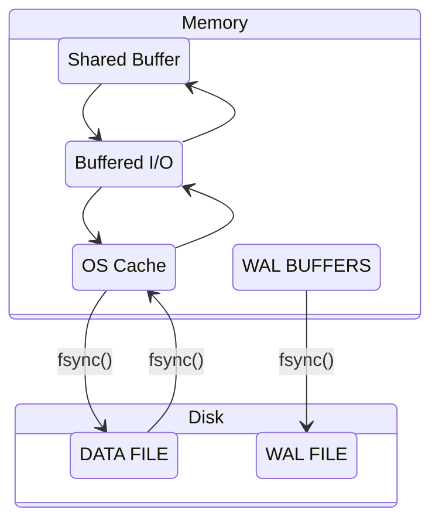
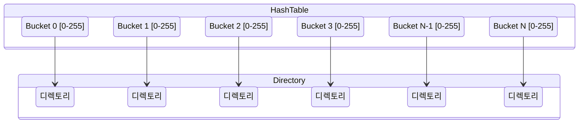
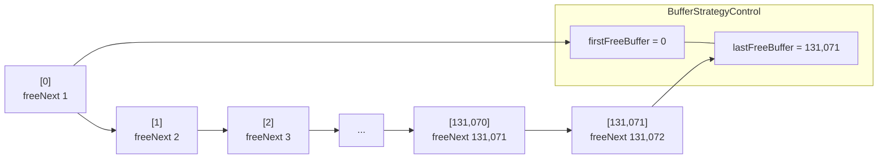
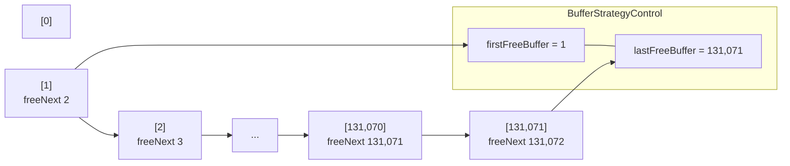
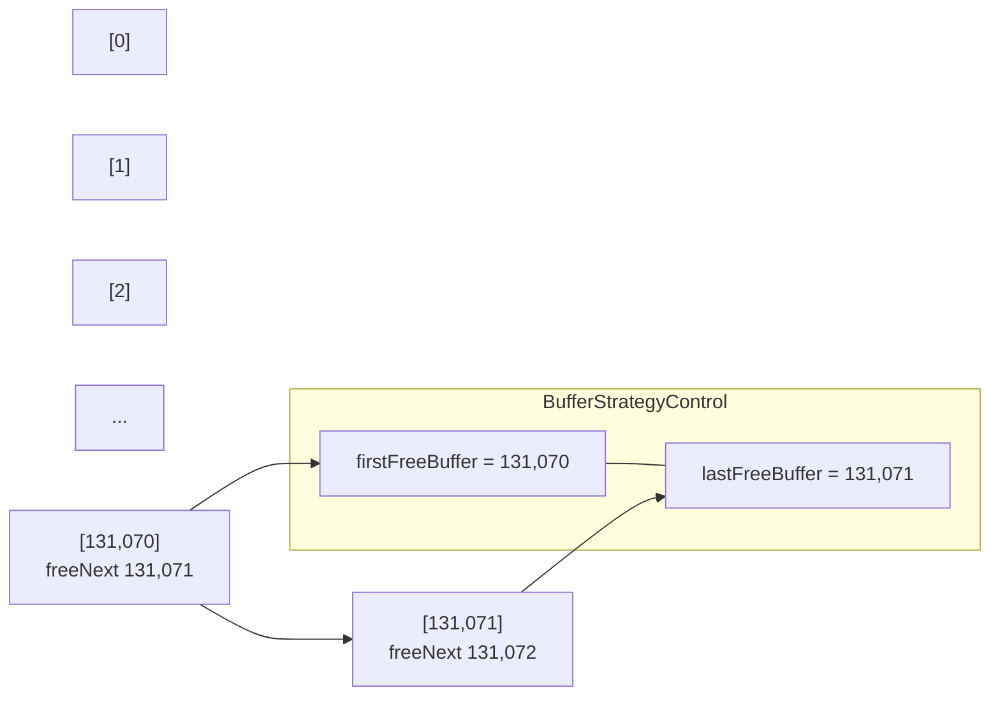
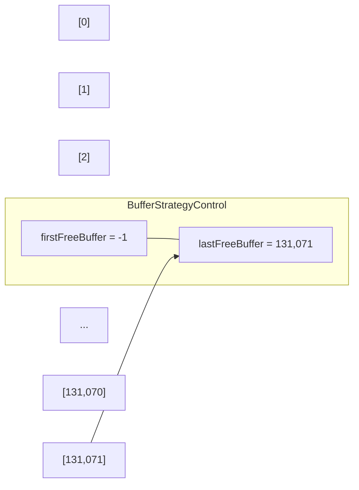

- [Shared Buffer 동작 원리](#shared-buffer-동작-원리)
  - [개요](#개요)
  - [성능 향상 위한 Shared Buffer의 3가지 목표](#성능-향상-위한-shared-buffer의-3가지-목표)
    - [매우 큰(수십, 수백 GB) 버퍼를 빠르게 액세스](#매우-큰수십-수백-gb-버퍼를-빠르게-액세스)
    - [많은 사용자가 동시 접근 시 경합 최소화](#많은-사용자가-동시-접근-시-경합-최소화)
    - [자주 사용되는 블록은 최대한 오랫동안 버퍼에 생존](#자주-사용되는-블록은-최대한-오랫동안-버퍼에-생존)
  - [Shared Buffer 구조](#shared-buffer-구조)
    - [해시 테이블](#해시-테이블)
      - [해시 테이블 크기와 해시 세그먼트](#해시-테이블-크기와-해시-세그먼트)
      - [해시 테이블 크기 중간 정리](#해시-테이블-크기-중간-정리)
    - [버퍼 파티션?](#버퍼-파티션)
      - [버퍼 파티션 개수](#버퍼-파티션-개수)
    - [해시 엘리먼트](#해시-엘리먼트)
      - [구성](#구성)
      - [엘리먼트 구성 요소](#엘리먼트-구성-요소)
      - [엘리먼트 키 구성 요소](#엘리먼트-키-구성-요소)
      - [`BufferTag`?](#buffertag)
      - [해시 엘리먼트 메모리 할당 방식](#해시-엘리먼트-메모리-할당-방식)
      - [여러 개의 `freeList`](#여러-개의-freelist)
    - [버퍼 디스크립터](#버퍼-디스크립터)
      - [`state`](#state)
      - [`flag`](#flag)
      - [`freeNext`](#freenext)
        - [초기 기동](#초기-기동)
        - [1개 버퍼 할당](#1개-버퍼-할당)
        - [131,071개 버퍼 할당](#131071개-버퍼-할당)
        - [131,072개 버퍼 할당](#131072개-버퍼-할당)
    - [`spinlock`과 `light-weight lock`](#spinlock과-light-weight-lock)
      - [`spinlock`과 `light-weight lock` 차이점](#spinlock과-light-weight-lock-차이점)
      - [`spinlock`](#spinlock)
        - [`spinlock` 구현 방식](#spinlock-구현-방식)
        - [Hardware Synchronization Algorithms : Unlock and Lock, Test and Set, Swap](#hardware-synchronization-algorithms--unlock-and-lock-test-and-set-swap)
        - [Mutex lock for Linux Thread Synchronization](#mutex-lock-for-linux-thread-synchronization)
      - [`light-weight lock`](#light-weight-lock)
        - [`light-weight lock` 획득 절차](#light-weight-lock-획득-절차)
  - [Shared Buffer에서 버퍼 읽기](#shared-buffer에서-버퍼-읽기)
  - [기타](#기타)
    - [참고 링크](#참고-링크)

# Shared Buffer 동작 원리

- from PostgreSQL 9.6 성능 이야기

## 개요

- 디스크에서 데이터 읽기/쓰기하는 것보다 메모리에서 읽기/쓰기하는 게 더 빠르며, 이를 위해 PostgreSQL에서는 `shared_buffer`로 제어되는 공유 버퍼를 사용
- 공유 버퍼는 PostgreSQL 인스턴스의 생애 동안 고정된다
- 공유 버퍼는 모든 백그라운드 서버와 데이터베이스에 연결하려는 유저 프로세스가 접근한다
- 공유 버퍼는 dirty buffer를 OS 캐시에 쓰기하고, 별도의 시스템 콜을 통해 페이지를 디스크에 flush 한다
- 특징들을 알아야 I/O 처리가 갑자기 느려질 때 원인 파악할 수 있다
  - I/O 전략
  - Ring 버퍼
  - Clock Sweep 알고리즘



## 성능 향상 위한 Shared Buffer의 3가지 목표

### 매우 큰(수십, 수백 GB) 버퍼를 빠르게 액세스

- *빠르게*가 관건인 만큼,
  - 버퍼에 있는지 없는지 여부 판단 속도
  - 버퍼에 있다면 해당 블록을 찾는 속도
- 자료구조의 형태가 중요하며, shared buffer는 이 목표를 위한 노력의 결과물

### 많은 사용자가 동시 접근 시 경합 최소화

- 공유 자원 보호 위해 Lock 메커니즘이 필수
- Lock의 경합 최소화 위해 여러 Lock 사용 방식 필요

### 자주 사용되는 블록은 최대한 오랫동안 버퍼에 생존

- Clock sweep 알고리즘 사용
  - [Second Chance (or Clock) Page Replacement Policy](https://www.geeksforgeeks.org/second-chance-or-clock-page-replacement-policy/)
  - [The Second Chance Page Replacement Policy](http://www.mathcs.emory.edu/~cheung/Courses/355/Syllabus/9-virtual-mem/SC-replace.html)
- 메모리 상에서 연달아 방문이 이뤄지면 기회를 한번 주고, 그 다음에 방문을 하지 않으면 그 기회를 없앤다.

## Shared Buffer 구조

1. 해시 테이블
2. 해시 테이블의 엘리먼트 및 엘리먼트 키
3. 버퍼 디스크립터: 버퍼 상태 관리
4. 버퍼 풀: 실제 블록을 저장

### 해시 테이블

- `Segmented hash table`
  - 키를 해시해서 특정 규칙에 따라 메모리 공간에서 빠르게 찾아갈 수 있어서 읽기/쓰기에 좋다. 하지만 해시 충돌(hash colision) 발생 가능
  - 해시 충돌 완화 위해 해시 테이블을 *논리적인 N개의 세그먼트(해시 세그먼트)로 나누어서* 관리
- 해시 테이블을 논리적으로
  - `버퍼 파티션`과
  - `해시 세그먼트`로 나눈다
    - 각 `해시 세그먼트`는 256개의 `버킷`으로 구성된다



- `Directory`?
  - 논리적으로 나눈 N개의 세그먼트의 각 시작 위치를 가리키는 별도의 배열 필요한데, 이 배열을 디렉토리라 한다
  - 기본값 설정은 256
  - `shared_buffer`를 크게 설정 $\to$ 버퍼 증가 $\to$ 버킷 증가 $\to$ 해시 세그먼트 증가 $\to$ 디렉토리 크기 증가
- `해시 세그먼트`?
  - 해시 테이블을 논리적으로 나누는 단위
  - 256개의 버킷으로 구성
- `버킷`?
  - 배열의 요소를 의미
  - 버킷의 개수 = 배열의 길이

#### 해시 테이블 크기와 해시 세그먼트

```c++
// src/backend/utils/hash/dynahash.c
#define DEF_SEGSIZE         256
#define DEF_SEGSIZE_SHIFT   8 /* must be log2(DEF_SEGSIZE) */
#define DEF_DIRSIZE         256
#define DEF_FFACTOR         1 /* default fill factor */
```

```c++
// src/include/storage/lwlock.h
/* Number of partitions of the shared buffer mapping hashtable */
#define NUM_BUFFER_PARTITIONS  128
```

```c++
// src/backend/utils/hash/dynahash.c
/*
 * Top control structure for a hashtable --- in a shared table, each backend
 * has its own copy (OK since no fields change at runtime)
 */
struct HTAB
{
  HASHHDR           *hctl;        /* => shared control information */
  HASHSEGMENT       *dir;         /* directory of segment starts */
  HashValueFunc     hash;         /* hash function */
  HashCompareFunc   match;        /* key comparison function */
  HashCopyFunc      keycopy;      /* key copying function */
  HashAllocFunc     alloc;        /* memory allocator */
  MemoryContext     hcxt;         /* memory context if default allocator used */
  char              *tabname;     /* table name (for error messages) */
  bool              isshared;     /* true if table is in shared memory */
  bool              isfixed;      /* if true, don't enlarge */

  /* freezing a shared table isn't allowed, so we can keep state here */
  bool              frozen;       /* true = no more inserts allowed */

  /* We keep local copies of these fixed values to reduce contention */
  Size              keysize;      /* hash key length in bytes */
  long              ssize;        /* segment size --- must be power of 2 */
  int               sshift;       /* segment shift = log2(ssize) */
};

/* calculate first power of 2 >= num, bounded to what will fit in an int */
static int
next_pow2_int(long num)
{
 if (num > INT_MAX / 2)
  num = INT_MAX / 2;
 return 1 << my_log2(num); /* my_log2: calculate ceil(log base 2) of num */
}

/*
 * Compute derived fields of hctl and build the initial directory/segment
 * arrays
 */
static bool
init_htab(HTAB *hashp, long nelem)
{
  HASHHDR     *hctl = hashp->hctl;
  HASHSEGMENT *segp;
  int         nbuckets;
  int         nsegs;
  int         i;

  /*
    * initialize mutexes if it's a partitioned table
    */
  if (IS_PARTITIONED(hctl))
    for (i = 0; i < NUM_FREELISTS; i++)
      SpinLockInit(&(hctl->freeList[i].mutex));

  /*
    * Divide number of elements by the fill factor to determine a desired
    * number of buckets.  Allocate space for the next greater power of two
    * number of buckets
    */
  nbuckets = next_pow2_int((nelem - 1) / hctl->ffactor + 1);

  /*
    * In a partitioned table, nbuckets must be at least equal to
    * num_partitions; were it less, keys with apparently different partition
    * numbers would map to the same bucket, breaking partition independence.
    * (Normally nbuckets will be much bigger; this is just a safety check.)
    */
  while (nbuckets < hctl->num_partitions)
    nbuckets <<= 1;

  hctl->max_bucket = hctl->low_mask = nbuckets - 1;
  hctl->high_mask = (nbuckets << 1) - 1;

  /*
    * Figure number of directory segments needed, round up to a power of 2
    */
  nsegs = (nbuckets - 1) / hctl->ssize + 1;
  nsegs = next_pow2_int(nsegs);

  /*
    * Make sure directory is big enough. If pre-allocated directory is too
    * small, choke (caller screwed up).
    */
  if (nsegs > hctl->dsize)
  {
    if (!(hashp->dir))
      hctl->dsize = nsegs;
    else
      return false;
  }

  /* Allocate a directory */
  if (!(hashp->dir))
  {
    CurrentDynaHashCxt = hashp->hcxt;
    hashp->dir = (HASHSEGMENT *)
      hashp->alloc(hctl->dsize * sizeof(HASHSEGMENT));
    if (!hashp->dir)
      return false;
  }

  /* Allocate initial segments */
  for (segp = hashp->dir; hctl->nsegs < nsegs; hctl->nsegs++, segp++)
  {
    *segp = seg_alloc(hashp);
    if (*segp == NULL)
      return false;
  }

  /* Choose number of entries to allocate at a time */
  hctl->nelem_alloc = choose_nelem_alloc(hctl->entrysize);
}
```

- 조건: **Shared Buffer가 1 GiB**
- `nbuckets = next_pow2_int((nelem - 1) / hctl->ffactor + 1);`
  - `nbuckets`?
    - 해시 테이블 버킷 수
    - 실제 버퍼 수보다 크게 잡는데, **해시 충돌을 피하기** 위함
  - `next_pow2_int`?
    - 입력 값보다 큰 2의 지수 값을 리턴하는 함수
    - next_pow2_int$(((131,200 -1)\div{1}) + 1)$
    - `(1 << Math.log2(131200)) * 2 = 262,144` = $2^{18}$
      - 참고로 `1 << {NUM}`하면 $2^{NUM}$이 된다
  - `nelem`?
    - 주석에 따르면 *예상되는 최대 엘레먼트 수(maximum number of elements expected)*. 해시 테이블의 버킷 수 계산 위한 입력 값으로 사용.
    - 버퍼 수 + `NUM_BUFFER_PARTITIONS`
    - 버퍼 수는 131,072 + NUM_BUFFER_PARTITIONS 128 = 131,200
      - 1 GiB 버퍼 수 계산법
        - $1 GiB(= 2^{30}$) / $8 KiB(= 2^{3}\times{2^{10}} = 2^{13})$
        - = $2^{30-13} = 2^{17} = 131,072$
  - [`ffactor`](https://www.cybertec-postgresql.com/en/what-is-fillfactor-and-how-does-it-affect-postgresql-performance/)?
    - 이 값에 따라 버킷의 수를 결정.
    - fillfactor의 기본값은 1() `#define DEF_FFACTOR      1`)
      - 어디서는 기본값이 100이라고도 하는데, 이는 [테이블에 대한 fill factor](https://www.cybertec-postgresql.com/en/what-is-fillfactor-and-how-does-it-affect-postgresql-performance/)다
    - ffactor 증가 $\to$ 버킷 수 감소 $\to$ 해시 충돌 가능성 증가
    - ffactor 감소 $\to$ 버킷 수 증가 $\to$ 해시 충돌 가능성 감소(GOOD)
- `hctl->max_bucket = hctl->low_mask = nbuckets - 1;`
  - `max_bucket`?
    - 해시 테이블 버킷 수(= 배열의 크기)
    - 배열의 인덱스는 0부터 시작하므로 `nbuckets - 1`로 설정
- `nsegs = (nbuckets - 1) / hctl->ssize + 1;`
  - `nsegs`?
    - 해시 세그먼트 개수. 주석에 따르면 필요한 디렉토리 세그먼트의 개수.
  - 계산?
    - `nbuckets`은 262,144(`(1 << Math.log2(131200)) * 2`).
    - $((262,144 -1)\div{256}) + 1$
- `nsegs = next_pow2_int(nsegs);`
  - next_pow2_int(nsegs) = next_pow2_int(1024) = 1024(`1 << Math.log2(1024) = 1024`)

#### 해시 테이블 크기 중간 정리
  
- `버퍼 수`: Share Buffer 크기에 따라 버퍼의 수가 정해지고,
- `버킷 수`:
  - 버퍼 수 + NUM_BUFFER_PARTITIONS와 `fill factor`로 좀 더 넉넉한 수의 버킷 수를 계산한다. 기본값은 1로 결국 할당된 버퍼 수보다 바로 다음으로 큰 2의 지수 값을 버킷 수로 정한다
- `최대 버킷 인덱스`: 인덱스가 0부터 시작함을 감안하여 계산한 `nbuckets`(계산된 버킷 수)의 -1을 한다
- `세그먼트 수`:
  - (최대 버킷 인덱스 $\div$ 세그먼트의 크기) + 1
  - 그리고 최대 버킷 수를 세그먼트 사이즈로 나누고 +1을 하여 세그먼트의 개수를 구하고, 마찬가지로 공간을 넉넉하게 잡아두기 위해 그 다음으로 큰 2의 지수 값을 구한다
- `버퍼 수`, `버킷 수`, `세그먼트 수`를 가지고 해시 테이블 공간을 잡는다

### 버퍼 파티션?

- 공유 리소스:
  - 디렉토리
  - 해시 세그먼트
  - 해시 테이블 등
- `LW` 락
  - 공유 리소스는 `Light Weight(LW)` 락을 이용해서 보호 $\to$ 여러 프로세스가 마구 접근하는 것 보호
  - Backend 프로세스가 공유 메모리 액세스 하려면 `LW` 락을 획득 필요 $\to$ 경합 발생으로 성능 저하 가능
  - 오라클에서는 `Latch`라고 표현한다
- 버퍼 파티션
  - `LW` 락 경합을 줄이기 위해 해시 테이블을 버퍼 파티션으로 나누고, 나눠진 **버퍼 파티션마다 1개의 `LW` 락**을 할당

#### 버퍼 파티션 개수

- `NUM_BUFFER_PARTITIONS`
  - 앞서 `nelem`에서 버킷의 개수를 구할 때 사용된다
- postgres < 9.4까지는 버퍼 파티션 수가 16개로 동시성 높은 환경에서는 버퍼 파티션 액세스 시 `light-weight lock` 경합 발생 가능성이 컸다
- postgres >= 9.5부터는
  - 버퍼 파티션 개수를 128개로 상향 조정
  - 버퍼 파티션 관리하는 `LW` 락의 개수 또한 128개로 상향 조정

### 해시 엘리먼트

#### 구성

1. 엘리먼트
2. 엘리먼트 키

#### 엘리먼트 구성 요소

```c++
/********** src/include/utils/hsearch.h **********/
/*
 * HASHELEMENT is the private part of a hashtable entry.  The caller's data
 * follows the HASHELEMENT structure (on a MAXALIGN'd boundary).  The hash key
 * is expected to be at the start of the caller's hash entry data structure.
 */
typedef struct HASHELEMENT
{
 struct HASHELEMENT *link; /* link to next entry in same bucket */
 uint32  hashvalue;  /* hash function result for this entry */
} HASHELEMENT;
```

- `link`: 같은 버킷의 다음 엘리먼트 가리키는 포인터
- `hashvalue`: 이 엔트리(키/값 한 쌍)의 해시 함수 결과. `BufferTag` 이용해서 계산.
  - `BufferTag`? 버퍼가 어떤 디스크 블록을 갖는지 식별

```c++
/********** src/backend/utils/hash/dynahash.c **********/
/*
 * get_hash_value -- exported routine to calculate a key's hash value
 *
 * We export this because for partitioned tables, callers need to compute
 * the partition number (from the low-order bits of the hash value) before
 * searching.
 */
uint32
get_hash_value(HTAB *hashp, const void *keyPtr)
{
 return hashp->hash(keyPtr, hashp->keysize);
}

/********** src/backend/storage/buffer/buf_table.c **********/
/*
 * BufTableHashCode
 *  Compute the hash code associated with a BufferTag
 *
 * This must be passed to the lookup/insert/delete routines along with the
 * tag.  We do it like this because the callers need to know the hash code
 * in order to determine which buffer partition to lock, and we don't want
 * to do the hash computation twice (hash_any is a bit slow).
 */
uint32
BufTableHashCode(BufferTag *tagPtr)
{
 return get_hash_value(SharedBufHash, (void *) tagPtr);
}
```

#### 엘리먼트 키 구성 요소

- `BufferLookupEnt`: `엘리먼트 키` = `BufferTag` 구조체 + 버퍼 디스크립터 배열 인덱스
  - `BufferTag` 구조체: `RelFileNode` 구조체 + `forkNum` + `blockNum`
    - `RelFileNode` 구조체: 테이블스페이스 번호 + 데이터베이스 번호 + 오브젝트 번호

```c++
/***** src/backend/storage/buffer/buf_table.c *****/
/* entry for buffer lookup hashtable */
typedef struct
{
 BufferTag key;   /* Tag of a disk page */
 int   id;    /* Associated buffer ID */
} BufferLookupEnt;


/***** src/include/storage/buf_internals.h *****/
/*
 * Buffer tag identifies which disk block the buffer contains.
 *
 * Note: the BufferTag data must be sufficient to determine where to write the
 * block, without reference to pg_class or pg_tablespace entries.  It's
 * possible that the backend flushing the buffer doesn't even believe the
 * relation is visible yet (its xact may have started before the xact that
 * created the rel).  The storage manager must be able to cope anyway.
 *
 * Note: if there's any pad bytes in the struct, INIT_BUFFERTAG will have
 * to be fixed to zero them, since this struct is used as a hash key.
 */
typedef struct buftag
{
 RelFileNode rnode;   /* physical relation identifier */
 ForkNumber forkNum;
 BlockNumber blockNum;  /* blknum relative to begin of reln */
} BufferTag;


/***** src/include/storage/relfilenode.h *****/
/*
 * RelFileNode must provide all that we need to know to physically access
 * a relation, with the exception of the backend ID, which can be provided
 * separately. Note, however, that a "physical" relation is comprised of
 * multiple files on the filesystem, as each fork is stored as a separate
 * file, and each fork can be divided into multiple segments. See md.c.
 *
 * spcNode identifies the tablespace of the relation.  It corresponds to
 * pg_tablespace.oid.
 *
 * dbNode identifies the database of the relation.  It is zero for
 * "shared" relations (those common to all databases of a cluster).
 * Nonzero dbNode values correspond to pg_database.oid.
 *
 * relNode identifies the specific relation.  relNode corresponds to
 * pg_class.relfilenode (NOT pg_class.oid, because we need to be able
 * to assign new physical files to relations in some situations).
 * Notice that relNode is only unique within a database in a particular
 * tablespace.
 *
 * Note: spcNode must be GLOBALTABLESPACE_OID if and only if dbNode is
 * zero.  We support shared relations only in the "global" tablespace.
 *
 * Note: in pg_class we allow reltablespace == 0 to denote that the
 * relation is stored in its database's "default" tablespace (as
 * identified by pg_database.dattablespace).  However this shorthand
 * is NOT allowed in RelFileNode structs --- the real tablespace ID
 * must be supplied when setting spcNode.
 *
 * Note: in pg_class, relfilenode can be zero to denote that the relation
 * is a "mapped" relation, whose current true filenode number is available
 * from relmapper.c.  Again, this case is NOT allowed in RelFileNodes.
 *
 * Note: various places use RelFileNode in hashtable keys.  Therefore,
 * there *must not* be any unused padding bytes in this struct.  That
 * should be safe as long as all the fields are of type Oid.
 */
typedef struct RelFileNode
{
 Oid   spcNode;  /* tablespace */
 Oid   dbNode;   /* database */
 Oid   relNode;  /* relation */
} RelFileNode;
```

#### `BufferTag`?

- 블록의 주민등록번호 같은 개념
- 클러스터 데이터베이스 내에서 각 블록을 유일하게 식별할 수 있는 데이터로 구성
  - *the BufferTag data must be sufficient to determine where to write the block*
- 구성
  - 유일한 오브젝트 번호
    - `RelFileNode`: 클러스터 데이터베이스 내에서 유일한 오브젝트 번호 획득. (*must provide all that we need to know to physically access a relation*)
  - 유일한 오브젝트 유형별 블록 번호
    - `ForkNumber`: 오브젝트 유형
      - 0: 테이블 또는 인덱스
      - 1: [FSM, Free Space Map](https://www.postgresql.org/docs/13/storage-fsm.html)
      - 2: [VM, Visibility Map](https://www.postgresql.org/docs/13/storage-vm.html)
    - `BlockNumber`: 블록 번호

#### 해시 엘리먼트 메모리 할당 방식

- DB 기동 시 `버퍼 수 + NUM_BUFFER_PARTITIONS` 개의 해시 엘리먼트 배열을 미리 할당
- 필요 시, 즉 버퍼 할당 시마다 맨 뒤에 있는 해시 엘리먼트부터 꺼내 쓰는 방식 사용
  - 해시 엘리먼트는 맨 뒤에서부터 앞으로 링크가 연결된 구조
- 여러 개의 `freeList`를 사용하여 해시 엘리먼트 배열 관리
  - 여러 프로세스에서 동시에 버퍼 요청 시 병목 발생하여 성능 저하됐었기 때문

```c++
/***** src/backend/utils/hash/dynahash.c *****/
/*
 * Per-freelist data.
 *
 * In a partitioned hash table, each freelist is associated with a specific
 * set of hashcodes, as determined by the FREELIST_IDX() macro below.
 * nentries tracks the number of live hashtable entries having those hashcodes
 * (NOT the number of entries in the freelist, as you might expect).
 *
 * The coverage of a freelist might be more or less than one partition, so it
 * needs its own lock rather than relying on caller locking.  Relying on that
 * wouldn't work even if the coverage was the same, because of the occasional
 * need to "borrow" entries from another freelist; see get_hash_entry().
 *
 * Using an array of FreeListData instead of separate arrays of mutexes,
 * nentries and freeLists helps to reduce sharing of cache lines between
 * different mutexes.
 */
typedef struct
{
 slock_t  mutex;   /* spinlock for this freelist */
 long  nentries;  /* number of entries in associated buckets */
 HASHELEMENT *freeList;  /* chain of free elements */
} FreeListData;

/*
 * Header structure for a hash table --- contains all changeable info
 *
 * In a shared-memory hash table, the HASHHDR is in shared memory, while
 * each backend has a local HTAB struct.  For a non-shared table, there isn't
 * any functional difference between HASHHDR and HTAB, but we separate them
 * anyway to share code between shared and non-shared tables.
 */
struct HASHHDR
{
 /*
  * The freelist can become a point of contention in high-concurrency hash
  * tables, so we use an array of freelists, each with its own mutex and
  * nentries count, instead of just a single one.  Although the freelists
  * normally operate independently, we will scavenge entries from freelists
  * other than a hashcode's default freelist when necessary.
  *
  * If the hash table is not partitioned, only freeList[0] is used and its
  * spinlock is not used at all; callers' locking is assumed sufficient.
  */
 FreeListData freeList[NUM_FREELISTS];
 /* 이하 생략 */
}
```

#### 여러 개의 `freeList`

- postgres >= 9.6, 32개의 `freeList` 사용
- `NUM_FRESSLISTS`로 설정 가능
- 계산법
  - Shared Buffer = 1GiB(=$2^{30}$ bytes) / 8 KiB(=$2^{3}\times{2^{10}} bytes)$ = 131,072 + `NUM_BUFFER_PARTITIONS`(=128) = 131200
  - 131,200 / `NUM_FREELIST`(=32) = 4,100개

```js
[
  freeList0 => [
    [
      el4099_key,
      el4099 => [
        /* ...4100개... */
        el0_key,
        el0
      ]
    ]
  ],
  /* ...32개... */
  freeList31 => [
    [
      el4099_key,
      el4099 => [
        /* ...4100개... */
        el0_key,
        el0
      ]
    ]
  ]
]
```

### 버퍼 디스크립터

- 버퍼 메타 데이터 관리 위한 구조체
  - 뭐에 대한 메타데이터일까?
  - 실제 버퍼는 `buffer pool`에 저장되어 있고,
  - `buffer descriptor`는 `buffer pool`에 저장되어 있는 페이지의 메타데이터를 저장한다

```c++
// src/include/storage/buf_internals.h
/*
 * BufferDesc -- shared descriptor/state data for a single shared buffer.
 *
 * Note: Buffer header lock (BM_LOCKED flag) must be held to examine or change
 * the tag, state or wait_backend_pid fields.  In general, buffer header lock
 * is a spinlock which is combined with flags, refcount and usagecount into
 * single atomic variable.  This layout allow us to do some operations in a
 * single atomic operation, without actually acquiring and releasing spinlock;
 * for instance, increase or decrease refcount.  buf_id field never changes
 * after initialization, so does not need locking.  freeNext is protected by
 * the buffer_strategy_lock not buffer header lock.  The LWLock can take care
 * of itself.  The buffer header lock is *not* used to control access to the
 * data in the buffer!
 *
 * It's assumed that nobody changes the state field while buffer header lock
 * is held.  Thus buffer header lock holder can do complex updates of the
 * state variable in single write, simultaneously with lock release (cleaning
 * BM_LOCKED flag).  On the other hand, updating of state without holding
 * buffer header lock is restricted to CAS, which insure that BM_LOCKED flag
 * is not set.  Atomic increment/decrement, OR/AND etc. are not allowed.
 *
 * An exception is that if we have the buffer pinned, its tag can't change
 * underneath us, so we can examine the tag without locking the buffer header.
 * Also, in places we do one-time reads of the flags without bothering to
 * lock the buffer header; this is generally for situations where we don't
 * expect the flag bit being tested to be changing.
 *
 * We can't physically remove items from a disk page if another backend has
 * the buffer pinned.  Hence, a backend may need to wait for all other pins
 * to go away.  This is signaled by storing its own PID into
 * wait_backend_pid and setting flag bit BM_PIN_COUNT_WAITER.  At present,
 * there can be only one such waiter per buffer.
 *
 * We use this same struct for local buffer headers, but the locks are not
 * used and not all of the flag bits are useful either. To avoid unnecessary
 * overhead, manipulations of the state field should be done without actual
 * atomic operations (i.e. only pg_atomic_read_u32() and
 * pg_atomic_unlocked_write_u32()).
 *
 * Be careful to avoid increasing the size of the struct when adding or
 * reordering members.  Keeping it below 64 bytes (the most common CPU
 * cache line size) is fairly important for performance.
 */
typedef struct BufferDesc
{
 BufferTag tag;   /* ID of page contained in buffer */
 int   buf_id;   /* buffer's index number (from 0) */

 /* state of the tag, containing flags, refcount and usagecount */
 pg_atomic_uint32 state;

 int   wait_backend_pid; /* backend PID of pin-count waiter */
 int   freeNext;  /* link in freelist chain */

 LWLock  content_lock; /* to lock access to buffer contents */
} BufferDesc;


// src/include/storage/buf_internals.h
/*
 * Buffer tag identifies which disk block the buffer contains.
 *
 * Note: the BufferTag data must be sufficient to determine where to write the
 * block, without reference to pg_class or pg_tablespace entries.  It's
 * possible that the backend flushing the buffer doesn't even believe the
 * relation is visible yet (its xact may have started before the xact that
 * created the rel).  The storage manager must be able to cope anyway.
 *
 * Note: if there's any pad bytes in the struct, INIT_BUFFERTAG will have
 * to be fixed to zero them, since this struct is used as a hash key.
 */
typedef struct buftag
{
 RelFileNode rnode;   /* physical relation identifier */
 ForkNumber forkNum;
 BlockNumber blockNum;  /* blknum relative to begin of reln */
} BufferTag;
```

- `tag`: `BufferTag` 저장
- `buf_id`: 실제 버퍼가 저장된 `buffer pool` 배열 내의 인덱스 번호
- `wait_backend_pid`:
  - 현재로서는 버퍼당 하나의 waiter가 있을 수 있다
  - 버퍼 액세스 위해서는 버퍼 `pin`을 획득해야 하고, 버퍼 `pin` 획득 못하면 대기해야 한다. 이 칼럼은 버퍼 `pin`을 대기하는 프로세스 ID를 제공한다.
    - `pin`?
      - 페이지에 접근하면 `refcount`가 증가(`refcount++`)하고, 페이지 접근 후에는 감소(`refcount--`)한다.
      - `refcount` == 0? `unpinned`
      - `refcount` != 0? `pinned`, 즉 페이지 액세스 중이면 `pinned` 된 상태라고 한다
- `content_lock`: 버퍼를 액세스할 때 필요한 `light-weight lock`

#### `state`

```c++
// src/include/storage/buf_internals.h
/*
 * Buffer state is a single 32-bit variable where following data is combined.
 *
 * - 18 bits refcount
 * - 4 bits usage count
 * - 10 bits of flags
 *
 * Combining these values allows to perform some operations without locking
 * the buffer header, by modifying them together with a CAS loop.
 *
 * The definition of buffer state components is below.
 */
#define BUF_REFCOUNT_ONE 1
#define BUF_REFCOUNT_MASK ((1U << 18) - 1)
#define BUF_USAGECOUNT_MASK 0x003C0000U
#define BUF_USAGECOUNT_ONE (1U << 18)
#define BUF_USAGECOUNT_SHIFT 18
#define BUF_FLAG_MASK 0xFFC00000U

/* Get refcount and usagecount from buffer state */
#define BUF_STATE_GET_REFCOUNT(state) ((state) & BUF_REFCOUNT_MASK)
#define BUF_STATE_GET_USAGECOUNT(state) (((state) & BUF_USAGECOUNT_MASK) >> BUF_USAGECOUNT_SHIFT)
```

- 총 32비트(인덱스 0부터 시작)로 구성. 32비트를 모두 그대로 사용하기 위해 부호 없는 `UNSINGED` 사용
  - `refcount`: 0~17 bits
  - `usage_count`: 18~21 bits
  - `flags`: 22~31 bits
- `BUF_REFCOUNT_MASK`:
  - `1U`: UNSIGNED
  - `<< 18`: 18개 비트를 좌 시프트 연산
  - `-1`: 비트 연산 후 -1
  - 연산 결과 262,143이 나오며, `111111111111111111`(LENGTH: 18)가 된다
- `BUF_USAGECOUNT_MASK`:
  - `U`: UNSIGNED
  - `0x003C0000`: `0011 1100 0000 0000 0000 0000`(LENGTH: 22): 18~21 bits 의미. `usage_count`만 남게 된다.
    - `C`: 12 = `1100`
    - `3`: `0011`
- `BUF_USAGECOUNT_ONE`
  - `1U << 18`: `100 0000 0000 0000 0000`(LENGTH: 19)
  - 이 값 상수로 사용하면 `usage_count`의 비트 증감을 편하게 할 수 있다
- `BUF_FLAG_MASK`
  - `U`: UNSIGNED
  - `1111 1111 1100 0000 0000 0000 0000 0000`(LENGTH: 32): 22~31 bits 의미. `flags`만 남게 된다

#### `flag`

```c++
/*
 * Flags for buffer descriptors
 *
 * Note: BM_TAG_VALID essentially means that there is a buffer hashtable
 * entry associated with the buffer's tag.
 */
#define BM_LOCKED    (1U << 22) /* buffer header is locked */
#define BM_DIRTY    (1U << 23) /* data needs writing */
#define BM_VALID    (1U << 24) /* data is valid */
#define BM_TAG_VALID   (1U << 25) /* tag is assigned */
#define BM_IO_IN_PROGRESS  (1U << 26) /* read or write in progress */
#define BM_IO_ERROR    (1U << 27) /* previous I/O failed */
#define BM_JUST_DIRTIED   (1U << 28) /* dirtied since write started */
#define BM_PIN_COUNT_WAITER  (1U << 29) /* have waiter for sole pin */
#define BM_CHECKPOINT_NEEDED (1U << 30) /* must write for checkpoint */
#define BM_PERMANENT   (1U << 31) /* permanent buffer (not unlogged, or init fork) */
```

|       | `flag`                 | 의미                                             | 비트연산   | 비트 연산 결과                              | 정수          |
| :---: | ---------------------- | ------------------------------------------------ | ---------- | ------------------------------------------- | ------------- |
|   1   | `BM_LOCKED`            | 버퍼 헤더 LOCKED                                 | (1U << 22) | 0000 0000 0**1**00 0000 0000 0000 0000 0000 | 4,194,304     |
|   2   | `BM_DIRTY`             | 데이터 쓰기 필요                                 | (1U << 23) | 0000 0000 **1**000 0000 0000 0000 0000 0000 | 8,388,608     |
|   3   | `BM_VALID`             | 데이터 유효함                                    | (1U << 24) | 0000 000**1** 0000 0000 0000 0000 0000 0000 | 16,777,216    |
|   4   | `BM_TAG_VALID`         | 태그 할당됨                                      | (1U << 25) | 0000 00**1**0 0000 0000 0000 0000 0000 0000 | 33,554,432    |
|   5   | `BM_IO_IN_PROGRESS`    | 읽기 또는 쓰기 진행 중                           | (1U << 26) | 0000 0**1**00 0000 0000 0000 0000 0000 0000 | 67,108,864    |
|   6   | `BM_IO_ERROR`          | 이전 I/O 실패                                    | (1U << 27) | 0000 **1**000 0000 0000 0000 0000 0000 0000 | 134,217,728   |
|   7   | `BM_JUST_DIRTIED`      | 쓰기 시작 후 DIRTIED 됨                          | (1U << 28) | 000**1** 0000 0000 0000 0000 0000 0000 0000 | 268,435,456   |
|   8   | `BM_PIN_COUNT_WAITER`  | 하나의 `pin`에 대한 대기 있음                    | (1U << 29) | 00**1**0 0000 0000 0000 0000 0000 0000 0000 | 536,870,912   |
|   9   | `BM_CHECKPOINT_NEEDED` | 체크포인트에 쓰기(?)                             | (1U << 30) | 0**1**00 0000 0000 0000 0000 0000 0000 0000 | 1,073,741,824 |
|  10   | `BM_PERMANENT`         | unlogged 아니고 init fork 아닌, 영구적인 버퍼(?) | (1U << 31) | **1**000 0000 0000 0000 0000 0000 0000 0000 | 2,147,483,648 |

#### `freeNext`

- 다음 빈 버퍼를 가리키는 포인터
- `BufferStrategyControl` 구조체의
  - `firstFreeBuffer` 항목은 `freeNext` 링크 `헤더`(header, 링크드 리스트 앞 부분. 계속 이동한다.) 가리킨다
  - `lastFreeBuffer` 항목은 `freeNext` 링크 `테일`(tail, 링크드 리스트 끝 부분) 가리킨다
- 빈 버퍼가 존재하지 않는데 새로운 버퍼 할당 요청을 받으면, `Clock Sweep` 알고리즘에 따라 Victim 버퍼를 선정한다

##### 초기 기동



- 131,072개의 버퍼 후에는 `NUM_BUFFER_PARTITIONS`, 공유 버퍼가 해시테이블에 맵핑하는 파티션의 수

> Number of partitions of the shared buffer mapping hashtable

##### 1개 버퍼 할당



##### 131,071개 버퍼 할당



##### 131,072개 버퍼 할당



### `spinlock`과 `light-weight lock`

- Shared Buffer 액세스 시 `spinlock`과 `light-weight lock`을 획득해야 한다

| PostgreSQL          | Orcle   |
| ------------------- | ------- |
| `spinlock`          | `mutex` |
| `light-weight lock` | `latch` |

- Spin은 Loop, 반복을 의미

#### `spinlock`과 `light-weight lock` 차이점

- 둘을 구분하는 이유는 성능 향상을 위해서다
- `light-weight lock`은 Light Weight라는 말처럼 가벼운 락이고, `spinlock`은 `light-weight lock`보다 더 가벼운 락이다

| 항목              | `spinlock`                            | `light-weight lock`           |
| ----------------- | ------------------------------------- | ----------------------------- |
| 사용 부하         | 매우 매우 적음                        | 매우 적음                     |
| Context Switching | 발생하지 않음                         | 발생할 수 있음                |
| 동작 방식         | Spin 방식                             | 큐 & 포스팅 방식              |
| 사용 용도         | **구조체 내 변수**를 액세스할 때 사용 | **구조체**를 액세스할 때 사용 |
| 사용 모드         | `EXCLUSIVE`                           | `SHARE` & `EXCLUSIVE`         |

#### `spinlock`

- 언제? 공유 메모리 내에 존재하는 구조체 변수의 값을 읽기/변경 시
- 왜? 구조체 변수값 읽기/변경 작업은 매우 짧은 시간에 수행 가능하기 때문. 몇 번의 Spin(Loop) 수행 후 `spinlock` 획득 가능성이 매우 높다.
- 장점? Sleep 상태로 빠지지 않기 때문에 Context Switching이 없다

##### `spinlock` 구현 방식

|       | 구현 방식                                  | db         |
| :---: | ------------------------------------------ | ---------- |
|   1   | `mutext` 이용                              | Oracle     |
|   2   | TAS(Test & Set)를 인라인 어셈블리어로 구현 | PostgreSQL |

- 말 그대로 테스트 후 set 한다는 의미로 보인다
- 소스 코드를 보면 여러 CPU 아키텍처에 맞는 어셈블리어로 구현되어 있다. 어셈블리어는 아직 잘 모르겠다...

```c++
// src/include/storage/s_lock.h
#ifdef __x86_64__  /* AMD Opteron, Intel EM64T */
#define HAS_TEST_AND_SET

typedef unsigned char slock_t;

#define TAS(lock) tas(lock)

/*
 * On Intel EM64T, it's a win to use a non-locking test before the xchg proper,
 * but only when spinning.
 *
 * See also Implementing Scalable Atomic Locks for Multi-Core Intel(tm) EM64T
 * and IA32, by Michael Chynoweth and Mary R. Lee. As of this writing, it is
 * available at:
 * http://software.intel.com/en-us/articles/implementing-scalable-atomic-locks-for-multi-core-intel-em64t-and-ia32-architectures
 */
#define TAS_SPIN(lock)    (*(lock) ? 1 : TAS(lock))

static __inline__ int
tas(volatile slock_t *lock)
{
 register slock_t _res = 1;

 __asm__ __volatile__(
  " lock   \n"
  " xchgb %0,%1 \n"
:  "+q"(_res), "+m"(*lock)
:  /* no inputs */
:  "memory", "cc");
 return (int) _res;
}

#define SPIN_DELAY() spin_delay()

static __inline__ void
spin_delay(void)
{
 /*
  * Adding a PAUSE in the spin delay loop is demonstrably a no-op on
  * Opteron, but it may be of some use on EM64T, so we keep it.
  */
 __asm__ __volatile__(
  " rep; nop   \n");
}

#endif  /* __x86_64__ */
```

##### [Hardware Synchronization Algorithms : Unlock and Lock, Test and Set, Swap](https://www.geeksforgeeks.org/hardware-synchronization-algorithms-unlock-and-lock-test-and-set-swap/)

- 로직
  - false로 초기화된 공유 변수를 락으로 사용
  - 전달된 값을 항상 반환하며, lock을 true로 설정
  - critical section이 끝나면 lock을 false로 설정

```c++
//Shared variable lock initialized to false
boolean lock;

boolean TestAndSet (boolean &target){
    boolean rv = target;
    target = true;
    return rv;
}

while(1){
    while (TestAndSet(lock));
    critical section
    lock = false;
    remainder section
}
```

##### [Mutex lock for Linux Thread Synchronization](https://www.geeksforgeeks.org/mutex-lock-for-linux-thread-synchronization/?ref=rp)

#### `light-weight lock`

- PostgreSQL은 `queue & posting` 방식 이용(검색해도 안나온다?)
  - 해시 버킷에 딸린 해시 엘리먼트 **검색** 경우?
    - **읽기 모드**이므로 `light-weight lock`을 `SHARED` 모드로 획득
  - 해시 엘리먼트 내에 `BufferTag` 정보 **입력** 경우?
    - **쓰기 모드**이므로 `light-weight lock`을 `EXCLUSIVE` 모드로 획득

##### `light-weight lock` 획득 절차

- `mode`는 두 가지 있다
  - `LW_SHARED`: 검색
  - `LW_EXCLUSIVE`: 입력
- 반복문을 돌면서 `LWLockAttemptLock()` 함수로 `light-weight lock` 획득 시도
  - 획득 O?
    - 반복문 break
    - `return true`: 대기 없었음 의미
  - 획득 X? 대기 큐에 등록
  - 큐에 추가하면서 락이 해제됐을 수 있으므로 다시 한번 `LWLockAttemptLock()` 함수록 락 획득 시도
    - 획득 O?
      - 대기 큐에서 제거
      - 반복문 break
      - `return true`: 대기 없었음 의미
    - 획득 X?
      - 대기 상태 시작
      - 다른 프로세스가 깨워줄 때까지 대기 상태 유지
        - 프로세스 대기 세마포어(process wait semaphore)를 일반 락 관리자(regular lock manager) 및 `ProcWaitForSignal`과 세마포어 공유하고, 둘 중 하나가 보류중(pending)인 동안 `LWLock`을 획득할 필요가 있을 수 있으므로, `LWLockRelease`에 의한 시그널 외의 다른 이유로 깨어날 수 있다(?)
      - 락 획득하면 종료
      - `return false`: 대기 있었음 의미

```c++
// src/backend/storage/lmgr/lwlock.c
/*
 * LWLockAcquire - acquire a lightweight lock in the specified mode
 *
 * If the lock is not available, sleep until it is.  Returns true if the lock
 * was available immediately, false if we had to sleep.
 *
 * Side effect: cancel/die interrupts are held off until lock release.
 */
bool
LWLockAcquire(LWLock *lock, LWLockMode mode)
{
 PGPROC    *proc = MyProc;
 bool  result = true;
 int   extraWaits = 0;
#ifdef LWLOCK_STATS
 lwlock_stats *lwstats;

 lwstats = get_lwlock_stats_entry(lock);
#endif

 AssertArg(mode == LW_SHARED || mode == LW_EXCLUSIVE);

 PRINT_LWDEBUG("LWLockAcquire", lock, mode);

#ifdef LWLOCK_STATS
 /* Count lock acquisition attempts */
 if (mode == LW_EXCLUSIVE)
  lwstats->ex_acquire_count++;
 else
  lwstats->sh_acquire_count++;
#endif       /* LWLOCK_STATS */

 /*
  * We can't wait if we haven't got a PGPROC.  This should only occur
  * during bootstrap or shared memory initialization.  Put an Assert here
  * to catch unsafe coding practices.
  */
 Assert(!(proc == NULL && IsUnderPostmaster));

 /* Ensure we will have room to remember the lock */
 if (num_held_lwlocks >= MAX_SIMUL_LWLOCKS)
  elog(ERROR, "too many LWLocks taken");

 /*
  * Lock out cancel/die interrupts until we exit the code section protected
  * by the LWLock.  This ensures that interrupts will not interfere with
  * manipulations of data structures in shared memory.
  */
 HOLD_INTERRUPTS();

 /*
  * Loop here to try to acquire lock after each time we are signaled by
  * LWLockRelease.
  *
  * NOTE: it might seem better to have LWLockRelease actually grant us the
  * lock, rather than retrying and possibly having to go back to sleep. But
  * in practice that is no good because it means a process swap for every
  * lock acquisition when two or more processes are contending for the same
  * lock.  Since LWLocks are normally used to protect not-very-long
  * sections of computation, a process needs to be able to acquire and
  * release the same lock many times during a single CPU time slice, even
  * in the presence of contention.  The efficiency of being able to do that
  * outweighs the inefficiency of sometimes wasting a process dispatch
  * cycle because the lock is not free when a released waiter finally gets
  * to run.  See pgsql-hackers archives for 29-Dec-01.
  */
 for (;;)
 {
  bool  mustwait;

  /*
   * Try to grab the lock the first time, we're not in the waitqueue
   * yet/anymore.
   */
  mustwait = LWLockAttemptLock(lock, mode);

  if (!mustwait)
  {
   LOG_LWDEBUG("LWLockAcquire", lock, "immediately acquired lock");
   break;    /* got the lock */
  }

  /*
   * Ok, at this point we couldn't grab the lock on the first try. We
   * cannot simply queue ourselves to the end of the list and wait to be
   * woken up because by now the lock could long have been released.
   * Instead add us to the queue and try to grab the lock again. If we
   * succeed we need to revert the queuing and be happy, otherwise we
   * recheck the lock. If we still couldn't grab it, we know that the
   * other locker will see our queue entries when releasing since they
   * existed before we checked for the lock.
   */

  /* add to the queue */
  LWLockQueueSelf(lock, mode);

  /* we're now guaranteed to be woken up if necessary */
  mustwait = LWLockAttemptLock(lock, mode);

  /* ok, grabbed the lock the second time round, need to undo queueing */
  if (!mustwait)
  {
   LOG_LWDEBUG("LWLockAcquire", lock, "acquired, undoing queue");

   LWLockDequeueSelf(lock);
   break;
  }

  /*
   * Wait until awakened.
   *
   * Since we share the process wait semaphore with the regular lock
   * manager and ProcWaitForSignal, and we may need to acquire an LWLock
   * while one of those is pending, it is possible that we get awakened
   * for a reason other than being signaled by LWLockRelease. If so,
   * loop back and wait again.  Once we've gotten the LWLock,
   * re-increment the sema by the number of additional signals received,
   * so that the lock manager or signal manager will see the received
   * signal when it next waits.
   */
  LOG_LWDEBUG("LWLockAcquire", lock, "waiting");

#ifdef LWLOCK_STATS
  lwstats->block_count++;
#endif

  LWLockReportWaitStart(lock);
  if (TRACE_POSTGRESQL_LWLOCK_WAIT_START_ENABLED())
   TRACE_POSTGRESQL_LWLOCK_WAIT_START(T_NAME(lock), mode);

  for (;;)
  {
   PGSemaphoreLock(proc->sem);
   if (!proc->lwWaiting)
    break;
   extraWaits++;
  }

  /* Retrying, allow LWLockRelease to release waiters again. */
  pg_atomic_fetch_or_u32(&lock->state, LW_FLAG_RELEASE_OK);

#ifdef LOCK_DEBUG
  {
   /* not waiting anymore */
   uint32  nwaiters PG_USED_FOR_ASSERTS_ONLY = pg_atomic_fetch_sub_u32(&lock->nwaiters, 1);

   Assert(nwaiters < MAX_BACKENDS);
  }
#endif

  if (TRACE_POSTGRESQL_LWLOCK_WAIT_DONE_ENABLED())
   TRACE_POSTGRESQL_LWLOCK_WAIT_DONE(T_NAME(lock), mode);
  LWLockReportWaitEnd();

  LOG_LWDEBUG("LWLockAcquire", lock, "awakened");

  /* Now loop back and try to acquire lock again. */
  result = false;
 }

 if (TRACE_POSTGRESQL_LWLOCK_ACQUIRE_ENABLED())
  TRACE_POSTGRESQL_LWLOCK_ACQUIRE(T_NAME(lock), mode);

 /* Add lock to list of locks held by this backend */
 held_lwlocks[num_held_lwlocks].lock = lock;
 held_lwlocks[num_held_lwlocks++].mode = mode;

 /*
  * Fix the process wait semaphore's count for any absorbed wakeups.
  */
 while (extraWaits-- > 0)
  PGSemaphoreUnlock(proc->sem);

 return result;
}
```

## Shared Buffer에서 버퍼 읽기

## 기타

### 참고 링크

- [There is always a bit of mystery around the different memory components of a PostgreSQL instance.](https://www.postgresql.fastware.com/blog/back-to-basics-with-postgresql-memory-components)
- [A Comprehensive Guide: PostgreSQL Shared Buffers](https://postgreshelp.com/postgresql_shared_buffers/)
- [Postgres FILLFACTOR — deep dive](https://medium.com/nerd-for-tech/postgres-fillfactor-baf3117aca0a)
