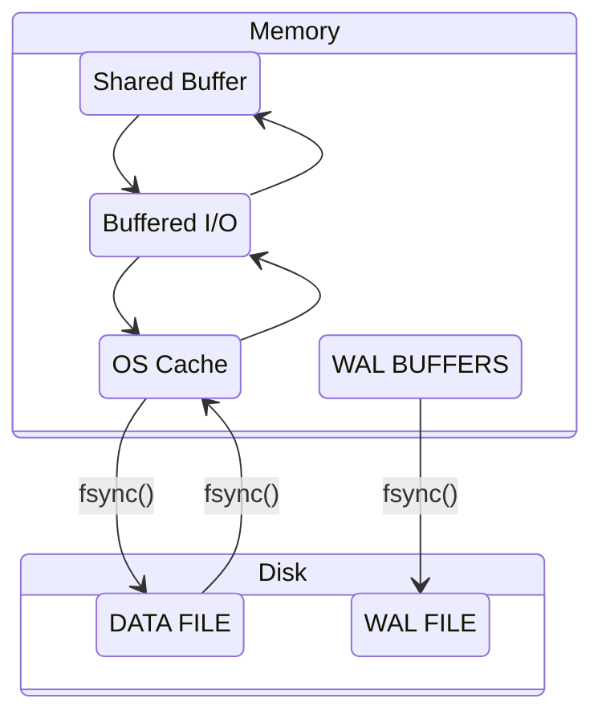

# Shared Buffer 동작 원리

## 개요

- 디스크에서 데이터 읽기/쓰기하는 것보다 메모리에서 읽기/쓰기하는 게 더 빠르며, 이를 위해 PostgreSQL에서는 `shared_buffer`로 제어되는 공유 버퍼를 사용
- 공유 버퍼는 PostgreSQL 인스턴스의 생애 동안 고정된다
- 공유 버퍼는 모든 백그라운드 서버와 데이터베이스에 연결하려는 유저 프로세스가 접근한다
- 공유 버퍼는 dirty buffer를 OS 캐시에 쓰기하고, 별도의 시스템 콜을 통해 페이지를 디스크에 flush 한다
- 특징들을 알아야 I/O 처리가 갑자기 느려질 때 원인 파악할 수 있다
  - I/O 전략
  - Ring 버퍼
  - Clock Sweep 알고리즘



## 성능 향상 위한 Shared Buffer의 3가지 목표

### 매우 큰(수십, 수백 GB) 버퍼를 빠르게 액세스

- *빠르게*가 관건인 만큼,
  - 버퍼에 있는지 없는지 여부 판단 속도
  - 버퍼에 있다면 해당 블록을 찾는 속도
- 자료구조의 형태가 중요하며, shared buffer는 이 목표를 위한 노력의 결과물

### 많은 상요자가 동시 접근 시 경합 최소화

- 공유 자원 보호 위해 Lock 메커니즘이 필수
- Lock의 경합 최소화 위해 여러 Lock 사용 방식 필요

### 자주 사용되는 블록은 최대한 오랫동안 버퍼에 생존

- Clock sweep 알고리즘 사용
  - [Second Chance (or Clock) Page Replacement Policy](https://www.geeksforgeeks.org/second-chance-or-clock-page-replacement-policy/)
  - [The Second Chance Page Replacement Policy](http://www.mathcs.emory.edu/~cheung/Courses/355/Syllabus/9-virtual-mem/SC-replace.html)
- 메모리 상에서 연달아 방문이 이뤄지면 기회를 한번 주고, 그 다음에 방문을 하지 않으면 그 기회를 없앤다.

## Shared Buffer 구조

1. 해시 테이블
2. 해시 테이블의 엘리먼트 및 엘리먼트 키
3. 버퍼 디스크립터: 버퍼 상태 관리
4. 버퍼 풀: 실제 블록을 저장

### 해시 테이블

- `Segmented hash table`
  - 키를 해시해서 특정 규칙에 따라 메모리 공간에서 빠르게 찾아갈 수 있어서 읽기/쓰기에 좋다. 하지만 해시 충돌(hash colision) 발생 가능
  - 해시 충돌 완화 위해 해시 테이블을 *논리적인 N개의 세그먼트(해시 세그먼트)로 나누어서* 관리

```mermaid
stateDiagram-v2
  bucket0 --> directory0
  bucket1 --> directory1
  bucket2 --> directory2
  bucket3 --> directory3
  bucketn_1 --> directoryn_1
  bucketn --> directoryn
  state HashTable {
    bucket0: Bucket 0 [0-255]
    bucket1: Bucket 1 [0-255]
    bucket2: Bucket 2 [0-255]
    bucket3: Bucket 3 [0-255]
    bucketn_1: Bucket N-1 [0-255]
    bucketn: Bucket N [0-255]
  }
  state Directory{
    directory0
    directory1
    directory2
    directory3
    directoryn_1:
    directoryn
  }
```

- `Directory`?
  - 논리적으로 나눈 N개의 세그먼트의 각 시작 위치를 가리키는 별도의 배열 필요한데, 이 배열을 디렉토리라 한다
  - 기본값 설정은 256
  - `shared_buffer`를 크게 설정한 경우 디렉코리 크기 증가
- `해시 세그먼트`?
  - 해시 테이블을 논리적으로 나누는 단위
  - 256개의 버킷으로 구성
- `버킷`?
  - 배열의 요소를 의미
  - 버킷의 개수 = 배열의 길이

#### 해시 테이블 크기와 해시 세그먼트

```c
// src/backend/utils/hash/dynahash.c
#define DEF_SEGSIZE         256
#define DEF_SEGSIZE_SHIFT   8 /* must be log2(DEF_SEGSIZE) */
#define DEF_DIRSIZE         256
#define DEF_FFACTOR         1 /* default fill factor */
```

```c
// src/include/storage/lwlock.h
/* Number of partitions of the shared buffer mapping hashtable */
#define NUM_BUFFER_PARTITIONS  128
```

```c
// src/backend/utils/hash/dynahash.c
/*
 * Top control structure for a hashtable --- in a shared table, each backend
 * has its own copy (OK since no fields change at runtime)
 */
struct HTAB
{
  HASHHDR           *hctl;        /* => shared control information */
  HASHSEGMENT       *dir;         /* directory of segment starts */
  HashValueFunc     hash;         /* hash function */
  HashCompareFunc   match;        /* key comparison function */
  HashCopyFunc      keycopy;      /* key copying function */
  HashAllocFunc     alloc;        /* memory allocator */
  MemoryContext     hcxt;         /* memory context if default allocator used */
  char              *tabname;     /* table name (for error messages) */
  bool              isshared;     /* true if table is in shared memory */
  bool              isfixed;      /* if true, don't enlarge */

  /* freezing a shared table isn't allowed, so we can keep state here */
  bool              frozen;       /* true = no more inserts allowed */

  /* We keep local copies of these fixed values to reduce contention */
  Size              keysize;      /* hash key length in bytes */
  long              ssize;        /* segment size --- must be power of 2 */
  int               sshift;       /* segment shift = log2(ssize) */
};

/*
 * Compute derived fields of hctl and build the initial directory/segment
 * arrays
 */
static bool
init_htab(HTAB *hashp, long nelem)
{
  HASHHDR     *hctl = hashp->hctl;
  HASHSEGMENT *segp;
  int         nbuckets;
  int         nsegs;
  int         i;

  /*
    * initialize mutexes if it's a partitioned table
    */
  if (IS_PARTITIONED(hctl))
    for (i = 0; i < NUM_FREELISTS; i++)
      SpinLockInit(&(hctl->freeList[i].mutex));

  /*
    * Divide number of elements by the fill factor to determine a desired
    * number of buckets.  Allocate space for the next greater power of two
    * number of buckets
    */
  nbuckets = next_pow2_int((nelem - 1) / hctl->ffactor + 1);

  /*
    * In a partitioned table, nbuckets must be at least equal to
    * num_partitions; were it less, keys with apparently different partition
    * numbers would map to the same bucket, breaking partition independence.
    * (Normally nbuckets will be much bigger; this is just a safety check.)
    */
  while (nbuckets < hctl->num_partitions)
    nbuckets <<= 1;

  hctl->max_bucket = hctl->low_mask = nbuckets - 1;
  hctl->high_mask = (nbuckets << 1) - 1;

  /*
    * Figure number of directory segments needed, round up to a power of 2
    */
  nsegs = (nbuckets - 1) / hctl->ssize + 1;
  nsegs = next_pow2_int(nsegs);

  /*
    * Make sure directory is big enough. If pre-allocated directory is too
    * small, choke (caller screwed up).
    */
  if (nsegs > hctl->dsize)
  {
    if (!(hashp->dir))
      hctl->dsize = nsegs;
    else
      return false;
  }

  /* Allocate a directory */
  if (!(hashp->dir))
  {
    CurrentDynaHashCxt = hashp->hcxt;
    hashp->dir = (HASHSEGMENT *)
      hashp->alloc(hctl->dsize * sizeof(HASHSEGMENT));
    if (!hashp->dir)
      return false;
  }

  /* Allocate initial segments */
  for (segp = hashp->dir; hctl->nsegs < nsegs; hctl->nsegs++, segp++)
  {
    *segp = seg_alloc(hashp);
    if (*segp == NULL)
      return false;
  }

  /* Choose number of entries to allocate at a time */
  hctl->nelem_alloc = choose_nelem_alloc(hctl->entrysize);
}
```

## 기타

### 참고 링크

- [There is always a bit of mystery around the different memory components of a PostgreSQL instance.](https://www.postgresql.fastware.com/blog/back-to-basics-with-postgresql-memory-components)
- [A Comprehensive Guide: PostgreSQL Shared Buffers](https://postgreshelp.com/postgresql_shared_buffers/)
