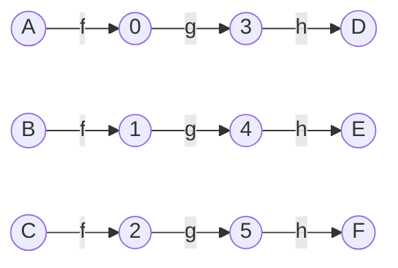

- [1. 함수](#1-함수)
  - [1.1 집합에 대한 용어와 표기법](#11-집합에-대한-용어와-표기법)
    - [개요](#개요)
    - [표현](#표현)
  - [1.2 카테시안 곱(Cartesian product)](#12-카테시안-곱cartesian-product)
  - [1.3 함수](#13-함수)
    - [개요](#개요-1)
    - [정의](#정의)
    - [`매핑하는 함수`의 의미](#매핑하는-함수의-의미)
    - [치역](#치역)
    - [1.3.1 함수, 프로시저, 계산 문제](#131-함수-프로시저-계산-문제)
      - [프로시저](#프로시저)
      - [계산 문제](#계산-문제)
      - [차이점](#차이점)
    - [1.3.2 함수와 연관된 두 가지 계산 문제](#132-함수와-연관된-두-가지-계산-문제)
    - [1.3.3 주어진 정의역과 공역을 가지는 `함수들의 집합`에 대한 표기법](#133-주어진-정의역과-공역을-가지는-함수들의-집합에-대한-표기법)
    - [1.3.4 항등함수](#134-항등함수)
    - [1.3.5 함수의 합성](#135-함수의-합성)
    - [1.3.6 함수 합성의 결합법칙](#136-함수-합성의-결합법칙)
    - [1.3.7 역함수](#137-역함수)
    - [1.3.8 가역함수를 합성한 함수의 가역성](#138-가역함수를-합성한-함수의-가역성)
  - [1.4 확률](#14-확률)
    - [1.4.0 개요](#140-개요)
    - [1.4.1 확률분포](#141-확률분포)
      - [1.4.1.1 균등 분포](#1411-균등-분포)
      - [1.4.1.2 비균등 분포](#1412-비균등-분포)
    - [1.4.2 사건과 확률의 합](#142-사건과-확률의-합)
    - [1.4.3 랜덤 입력에 함수 적용](#143-랜덤-입력에-함수-적용)

# 1. 함수

- 벡터 및 행렬 이해에 중요한 기본적 수학 개념
  - 집합(set)
  - 시퀀스(sequence, 순서 있는 리스트)
  - 함수
  - 확률이론

## 1.1 집합에 대한 용어와 표기법

### 개요

- 수학 객체를 모아 놓은 것
- 집학에 속하는 각 객체는 많아야 한 번 그 집합에 나타나는 것으로 간주(중복X)
- 원소들 사이에 순서가 없다
- 원소 수가 무한 개인 무한 집합이 가능하다

### 표현

- {}: 원소를 중괄호 안에 열거하여 나타낸다
  - {1, 2, 3, 4}
- $\in$: 집합에 속하는 것을 나타내기 위해 사용
  - 1 $\in$ {1, 2, 3, 4}
- $\subseteq$: 집합 $S_1$의 모든 원소가 $S_2$에 속하면(포함), $S_1 \subseteq S_2$
- 두 집합이 정확하게 동일한 원소로 이루어지면, 두 집합은 같다. 증명은:
  1. 첫 번째 집합이 두 번째 집합에 포함됨을 증명 $S_1 \subseteq S_2$
  2. 두 번째 집합이 첫 번째 집합에 포함됨을 중명 $S_2 \subseteq S_1$
- $|S|$: S가 유한 집합일 경우 집합의 크기(_cardinality_), 즉 집합에 포함되는 원소의 개수를 나타낸다

## 1.2 카테시안 곱(Cartesian product)

- 집합 A와 집합 B의 카테시안 곱 = $a\in A$와 $b\in B$의 모든 쌍 (a, b)로 이루어진 집합
- A = {1, 2}, B = {3, 4} 카테시안 곱
  - {(1, 3), (1, 4), (2, 3), (2, 4)}
  - |A X B| = $|A|\cdot|B|=$ $2\times2=4$개의 요소를 가진다

## 1.3 함수

### 개요

- 가능한 입력 집합 D의 각 원소에 대해 가능한 출력을 할당하는 규칙
  - 가능한 입력 집합 D: 정의역(_domain_)
  - 입력: 출력의 원상(_pre-image_)
  - 출력: 입력의 상(_image_)
- 쌍 (a, b)들의 집합(무한 집합도 가능)

> 예제 1.3.1
> D = {1, 2, 3, ...}을 가지는 배수 함수(doubling function)

```
{
  (1, 2),
  (2, 4),
  (3, 6),
  (4, 8) ...
}
```

> 예제 1.3.2
> D = {1,2,3,...} x {1,2,3,...} 가지는 곱셈 함수(multiplication function)

```
{
  ((1,1), 1),
  ((1,2), 2),
    ...
  ((2,1), 2),
  ((2,2), 4),
  ((2,4), 6),
    ...
}
```

### 정의

- $f(q)$: 함수 f에 대하여, f에 의한 q의 상(함수값, 즉 출력)
- $r = f(q)$: q는 f에 의해 r로 매핑된다($q \mapsto r$로 표기)
- 함수를 나타낼 때 함수의 공역(*co-domain*, 함수값이 선택되는 집합)을 명시하는 것이 편리하다. 다만 공역의 모든 원소가 함수값이 되어야 하는 것은 아니다.

### `매핑하는 함수`의 의미

$f : D \longrightarrow F$
= **D에서 F로의 함수**
= **D를 F로 매핑하는 함수**

- f: 함수
- D: 함수의 정의역(domain)
- F: 공역(가능한 출력의 집합)

> 예제 1.3.3 시저의 암호체계. 알파벳 각 문자를 그 다음 세 번째 문자로 대치(마지막 세 문자 X, Y, Z는 wrap-around 적용). MATRIX -> PDWULA 평문의 문자를 암호문의 문자로 매핑하는 함수는 다음과 같다
> $A\mapsto D, B\mapsto E, C\mapsto F, D\mapsto G, W\mapsto Z, X\mapsto A, Y\mapsto B, Z\mapsto C$
> 이 함수의 정으역과 공역은 둘 다 알파벳 ${A, B, \dotsc, Z}$

> 예제 1.3.4 코사인 함수 *cos*는 실수의 집합 $\R$을 실수의 집합으로 매핑하는 함수
> $cos: \R \longrightarrow \R$
> cos 함수의 함수값은 모든 실수를 포함하는 것이 아니라 -1과 1 사이의 값만 가진다

### 치역

- 모든 정의역 원소들에 대한 함수값들의 집합, 즉
  - 공역(co-domain)의 원소들 중
  - 실제 함수값이 되는
  - 공역 원소들의 집합
- 예제
  - 시저 암호화 함수에서는 알파벳 전체
  - cos 함수에서는 -1과 1 사이에 존재하는 수의 집합

> 예제 1.3.5
> 함수 prod = 1보다 큰 정수 쌍을 입력으로 받아 두 정수의 곱을 출력.
>
> - 정의역: 1보다 큰 정수 쌍
> - 공역: 1보다 큰 모든 정수들의 집합
> - 치역: 합성수(composite number)들의 집합. 소수(prime number)와 매핑되지 않는다.

### 1.3.1 함수, 프로시저, 계산 문제

#### 프로시저

- 계산 절차에 대한 정확한 기술
- 입력(매개변수) 받아들여 출력(리턴 값) 생성
- 일반적으로 프로시저를 함수로 언급하지만, 여기서는 혼란 방지 위해 그렇게 언급하지 않는다

> 예제 1.3.6
> 프로시저 정의하는 파이썬 문법

```python
def mul(p, q):
  return p * q
```

#### 계산 문제

- 프로시저가 필요할 수도 있는 입력-출력에 대한 사양. (우선 프로시저 전 문제 정의 단계로 이해)

> 예제 1.3.7: `예제 1.3.2에 정의된 함수`에 대응하는 계산문제
>
> - 입력: 1보다 큰 정수의 쌍(p, q)
> - 출력: 곱 pq

> 예제 1.3.8
>
> - 입력: 1보다 큰 정수 m
> - 출력: 곱이 m인 정수 쌍 (p, q)

#### 차이점

- 함수:
  - 프로시저와 달리, 입력을 사용하여 출력을 어떻게 계산 하는지에 대한 정보 주지 않는다
  - 계산 문제와 달리, 모든 입력에 대해 하나의 유일한 출력을 명시할 필요 있다
- 계산 문제
  - 프로시저와 달리, 입력을 사용하여 출력을 어떻게 계산 하는지에 대한 정보 주지 않는다
  - 함수와 달리, 모든 입력에 대해 하나의 유일한 출력을 명시할 필요 없다
    - 예제 1.3.8에서 m = 12일 때, 출력은 {(2, 6), (3, 4), (4, 3), (6, 2)} 가능
- 프로시저
  - 입력을 사용하여 출력을 어떻게 계산 하는지에 대한 정보를 준다
  - 따라서 구현 방식(계산 방법) 등에 따라 많은 프로시저 존재 가능
    - 동일한 입력-출력 사양을 만족
    - 또는 동일한 함수를 구현
  - 정수 곱셈을 예로 들자면,
    - 일반적인 긴 곱셈 방법
    - Karatsuba 알고리즘
    - Schonghage-Strassen 알고리즘(11ㅏㅈㅇ에서 다루는 패스트 푸리에 변환 사용)
    - Furer 알고리즘
- 동일한 프로시저가 다른 함수 위해 사용될 수 있다
  - 위의 `def mul(p,q):`는 입력 타입, 리턴 타입이 명시되어 있지 않다
  - 따라서 음의 정수와 정수 아닌 수를 곱하는 데 사용될 수 있다

### 1.3.2 함수와 연관된 두 가지 계산 문제

> Forward 문제
> 함수 $f$의 정의역에 속하는 원소 $a$에 대해, $a$의 함수값 $f(a)$ 계산

> Backward 문제
> 함수의 공역의 원소 $r$에 대해 임의의 원상을 계산하여라
> (원상이 존재하지 않을 경우, 조재하지 않음을 리포트)

- $P(x)$:
  - 정의역의 임의의 원소에 대해
  - $f$의 함수값을 계산하는 프로시저
- 함수값 $r$(출력)의 원상(pre-image, 입력) 계산 위한 프로시저?
  - 프로시저 내용
    - 정의역의 각 원소 $q$에 대해
    - $P(x)$를 적용하여
    - 출력 $r$이 되는지 확인
  - $P(x)$ 계산 시간 $\le$ 원상(pre-image, 입력) 계산 시간.
    - 하지만 모든 함수에 적용 가능한 더 나은 방법은 없다.
    - 예제 1.3.7 정수의 곱셈이 예제 1.3.8 정수의 인수분해보다 간단하고, RSA 암호 체계는 이에 기반한다

### 1.3.3 주어진 정의역과 공역을 가지는 `함수들의 집합`에 대한 표기법

- $F^{D}$: 집합 D와 F에 대해, D에서 F로의 모든 함수
- $\R^{W}$: 단어 집합 W에서 실수의 집합 $\R$로의 모든 함수

### 1.3.4 항등함수

- $id_{D}: D \longrightarrow D$: 임의의 정의역 D에 대한 항등함수
- $id_{D}(d) = d$: 모든 $d \in D$에 대한 항등함수

### 1.3.5 함수의 합성

- 두 개의 함수를 결합하여 하나의 새로운 함수를 얻는 것
- $g\circ f$:
  - $f: A \longrightarrow B$와 $g: B \longrightarrow C$ 두 함수의 합성함수
  - 정의역: A
  - 공역(*co-domain*, 가능한 출력의 집합): C
  - 이 합성 함수는, 모든 $x \in A$(정의역)에 대해, $g\circ f(x) = g(f(x))$ 규칙에 의해 정의된다
- 아래 그림은 $f, g, h$의 합성을 나타낸 것. 각 함수는 정의역을 나타내는 원에서 공역을 나타내는 원까지의 화살표로 표현



- 함수 $f$의 치역이 함수 $g$의 정의역에 포함되지 않는다면, $g \circ f$라 쓰는 것은 맞는 표현이 아니다
  - 치역?
    - 모든 정의역 원소들에 대한 함수값들의 집합.
    - 즉, 공역(co-domain)의 원소들 중 **실제 함수값이 되는 공역 원소들의 집합**

> 예제 1.3.10
> 함수 $f$와 $g$의 정의역과 공역이 $\Reals$
>
> $f(x) = x + 1$
> $g(y) = y^2$
> 그렇다면 $g \circ f(x) = (x + 1)^2$(이는 $g(f(x))$와 같다)

> 예제 1.3.11:
>
> - 함수 $f$:
> $f:\{A,B,C,\dotsc,Z\} \longrightarrow \{0,1,2,\dotsc,25\}$
> 위 함수를 다음을 사용하여 정의해 보자
> $A \mapsto 0, B \mapsto 1, C \mapsto 2, \dotsb Z \mapsto 25$
>
> - 함수 $g$:
>   - 정의역: {0,1,2,...,25}
>   - 공역: {0,1,2,...,25}
>   - $g(x) = (x + 3) \mod 26$: 알파벳에 3을 더하고(가령 A는 D가 된다) 이를 알파벳 26자리로 모듈러 연산
> - 함수 $h$:
>   - 정의역: {0,...25}
>   - 공역: {A,...,Z} 그리고 $0 \mapsto A, 1 \mapsto B, \dotsb$
>
> 이때 $h \circ (g \circ f)$는 예제 1.3.3의 시저 암호 구현한 함수

### 1.3.6 함수 합성의 결합법칙

- 함수 합성 시 결합 법칙 성립
- $f, g, h$에 대해 만약 합성 함수가 존재한다면, $h \circ (g \circ f) = (h \circ g) \circ f$ 성립. 즉, 괄호 위치 변경 가능.

```mermaid
graph LR
    subgraph U -> V
    U1[U1] --> V1[V1]
    U2[U2] --> V2[V2]
    U3[U3] --> V3[V3]
               V4[V4]
    end
```

- $f:U \rightarrow V$는 **전사함수**가 아니다. 공역(V)의 네 번째 원소는 $f$의 함수값이 되지 않기 때문
- 증명

> x를 $f$의 정의역에 속하는 임의의 원소라 하자
>
> $(h \circ (g \circ f))(x)$는
>
> - $h \circ (g \circ f)$ 정의에 의해
>   - $h((g \circ f))(x)$
>   - $h((g \circ f)(x))$
> - $g \circ f$ 정의에 의해 $h(g(f(x)))$
> - $h \circ g$ 정의에 의해 $(h \circ g)(f(x))$
> - $(h \circ g) \circ f$ 정의에 의해 $((h \circ g) \circ f)(x)$, 결합 법칙 성립
> - 따라서, $h \circ (g \circ f) = (h \circ g) \circ f = h \circ g \circ f$

### 1.3.7 역함수

- 함수의 효과를 거꾸로 뒤집는 함수
- 예제 1.3.11에서 $f$와 $h$는 서로 다른 함수의 효과를 뒤집는 함수
  - $f:\{A,\dotsc,Z\} \longrightarrow \{0,\dotsc,25\}$
  - $h:\{0,\dotsc,25\} \longrightarrow \{A,\dotsc,Z\}$
  - $h \circ f$는 $\{A,\dotsc,Z\}$(=f의 정의역)에 대한 항등함수
  - $f \circ h$는 $\{0,\dotsc,25\}$(=h의 정의역)에 대한 항등함수
  - $h$는 $f$의 역함수
  - $f$는 $h$의 역함수

> 정의 1.3.13 다음 조건 만족하면 f와 g는 서로의 역함수
>
> - $f \circ g$가 정의되고, $g$의 정의역에 대해 항등함수
> - $g \circ f$가 정의되고, $f$의 정의역에 대해 항등함수

- 모든 함수가 역함수를 가지지는 않는다
- 역함수 가지는 함수는 가역적

```mermaid
graph LR
    subgraph U -> V
    U1[U1] --> V1[V1]
    U2[U2] --> V2[V2]
    U3[U3] --> V3[V3]
    U4[U4] --> V3[V3]
    end
```

- $f:U \rightarrow V$는 **단사함수**가 아니다. 공역의 세번째 원소는 두 개의 원소에 대한 함수값이기 때문.

> 정의 1.3.14
> $f: D \rightarrow F$
> 모든 $x,y \in D$에 대해 $f(x) = f(y)$는 $x = y$임을 의미 $\to f$는 단사함수(one-to-one)
> 모든 $z \in F$에 대해 $f(x) = z$ 만족하는 $x \in D$가 존재 $\to f$는 전사함수(onto)

> 예제 1.3.15 예제 1.3.5에서 정의된 함수 *prod(1보다 큰 정수 쌍을 입력으로 받아 두 정수의 곱을 출력)* 생각해 보자
> 소수는 원상을 가지지 않으므로, 이 함수는 전사함수가 아니다
> (2,3)과 (3,2) 같이 동일한 정수에 매핑되는 복수의 정수 쌍이 존재하므로 단사함수도 아니다

> 부명제(Lemma) 1.3.16: 가역함수는 단사함수
> @증명
>
> - 가정:
>   1. $f$는 단사함수 아니다
>   2. $x_1,x_2$는 $f(x_1) = f(x_2)$ 만족하는 정의역 내 서로 다른 원소
>   3. $y = f(x_1)$
>   4. $f$는 가역적
>
> 역함수 정의에 의해 $f^{-1}(y) = x_1$이며 동시에 $f^{-1}(y) = x_2$다 된다
> 하지만 앞서 $x_1,x_2$는 정의역 내 서로 다른 원소라 했으므로 둘 다 참이 되는 것은 불가능, 즉 모순(귀류법)

> 부명제 1.3.17: 가역함수는 전사함수:
> @증명
>
> - 가정  
>   1. $f$는 전사함수 아니다
>   2. $\hat{y}$는 정의역 내 어떠한 원소의 함수값(image)도 되지 않는 공역의 원소
>   3. $f$는 가역적
>
> $\hat{y}$는 $f^{-1}$에 의한 함수값 $\hat{x}$를 갖게 되며,
> 역함수 정의에 따라 $f(\hat{x}) = \hat{y}$ 되지만
> 함수값이 되지 않는 공역의 원소라 가정했으므로 모순이다(귀류법)

> 정리(Theorem) 1.3.18 (**Function Invertibility Theorem**):
>
> - 함수가 가역적이 될 필요충분조건은 전단사함수
>   1. 단사함수이며
>   2. 동시에 전사함수
>
> @증명
> 부명제 1.3.16과 1.3.17은 **가역함수는 단사함수이며 전사함수**임을 보여준다.
>
> - 가정1
>   - $f$: 단사함수이자 전사함수
>   - $g$: $f$의 공역인 함수
>     - $\hat{y}$: $f$의 공역의 각 원소
>     - $f$는 전사함수이므로 $f$의 정의역은 $f(\hat{x}) = \hat{y}$인 어떤 원소 $\hat{x}$를 포함
>     - 이 경우 $g(\hat{y}) = \hat{x}$라 정의
>   - $g \circ f$: $f$의 정의역에 대한 항등함수
>
> $f$는 단사함수이므로 $\hat{x}$는 $f$의 함수값이 $\hat{y}$가 되는 $f$의 정의역에 있는 유일한 원소다. 따라서 $g(\hat{y}) = \hat{x}$에서 $\hat{x}$가 여러 값이 될 수 없으며, 이는 $g \circ f$가 항등함수임을 보여준다
>
> - 가정2
>   - $f \circ g$는 $g$의 정의역에 대해 항등함수
>   - $\hat{y}$는 $g$의 정의역에 있는 임의의 원소
>
> $g$의 정의에 의해 $f(g(\hat{y})) = \hat{y}$

> 부명제 1.3.19: 모든 함수는 많아야 하나의 역함수를 가진다
> @ 증명
>
>- 가정
>   - $f: U \rightarrow V$는 가역함수
>   - $g_1$: $f$의 역함수
>   - $g_2$: $f$의 역함수
>   - $v \in V$: $f$의 공역에 있는 임의의 원소
>
> $f$는 단사함수이므로(부명제 1.3.17), $v = f(v)$ 만족하는 어떤 원서 $u \in U$가 존재.
> 역함수 정의에 의해 $g_1(v) = u$이고 $g_2(v) = u$이며, 따라서 $g_1(v) = g_2(v)$이다.
> 즉 $g_1$과 $g_2$는 같다.

### 1.3.8 가역함수를 합성한 함수의 가역성

- 합성한 세 개의 함수는 모두 가역적이며, 이들을 합성한 함수도 가역적

> 부명제 1.3.20: if ($f$와 $g$가 가역함수 && $f \circ g$ 존재) $\to$ ($f \circ g$는 가역함수 && $(f \circ g)^{-1} = g^{-1} \circ f^{-1}$)

> 문제 1.3.21 부명제 1.3.20 증명
> @증명
>
> - 가정
>   - $f: U \to V$는 가역함수
>   - $v \in V$는 $f$의 공역에 있는 임의의 원소
>   - $g: X \to Z$는 가역함수
>   - $z \in Z$는 $g$의 공역에 있는 임의의 원소
>   - $f \circ g$ 존재
>
> 가역함수는 정리 1.3.18에 따라 전단사함수.
> $f(v)^{-1} = u$, $g(z)^{-1} = x$
> $f \circ g = f(g(x)) = f(z) = v$

- 어떻게 가정을 하고 어떻게 풀어나가야 할까??

## 1.4 확률

### 1.4.0 개요

- 확률: 벡터와 행렬이 중요하게 사용되는 한 분야
  - 구글의 페이지 랭크 시스템: 벡터와 행렬을 확률 계산에 사용
- 확률 이론?
  - 무엇이 일어날 수 있는지
  - 그 무엇이 일어날 가능성이 얼마나 되는지
  - 확률에 대한 계산법(calculus)이며, 가상적 실험에 대해 **예측**하는 데 사용
  - 하지만 후에 실제로 발생하면 통계를 사용하여 의미 파악

### 1.4.1 확률분포

$$\textstyle\sum_{\omega\in \varOmega}Pr(\omega) = 1 \to \text{(이산) 확률분포}$$

- $\varOmega$:
  - 유한한 정의역
  - 정의역의 원소는 실험결과(outcome)이라고 한다
- $\Reals^{+}$: 음수가 아닌 실수의 집합
- $Pr(\cdot)$:
  - $\varOmega$에서 $\Reals^{+}$로의 함수
  - 실험결과의 함수값 = 실험결과의 *확률*
  - 확률은 실험결과의 상대적인 가능도(relative likelihoods)에 비례한다고 가정

#### 1.4.1.1 균등 분포

- 균등(uniform): 모든 실험결과가 동일한 가능성을 가지며 동일한 확률이 할당되는 경우

> 예제 1.4.1 동전을 던지는 경우를 모델링하면,  
> $$\varOmega = \lbrace heads(앞면), tails(뒷면)\rbrace$$  
> 두 실험결과가 동일한 가능성을 가지므로, 두 결과에 동일한 확률을 할당  
> $$Pr(heads) = Pr(tails)$$  
> 확률의 합은 1이 되어야 하므로, $Pr(heads) = \frac{1}{2}$, $Pr(tails) = \frac{1}{2}$  

```python
Pr = {
  'heads': 1/2,
  'tails': 1/2
}
```

> 예제 1.4.2 하나의 주사위를 굴리는 경우를 모델링하면,  
> $$\varOmega = \lbrace1,2,3,4,5,6\rbrace$$  
> $$Pr(1) = Pr(2) = Pr(3) = \dotsc = Pr(6)$$  

```python
Pr = {
    1:1/6,
    2:1/6,
    3:1/6,
    4:1/6,
    5:1/6,
    6:1/6
}
```

> 예제 1.4.3 두 개의 동전을 던지는 경우를 모델링하면,  
> $$\varOmega = \{HH, HT, TH, TT\}$$  
> 각 실험결과는 동일한 확률 1/4 갖는다

```python
Pr = {
    ('H', 'H'): 1/4,
    ('H', 'T'): 1/4,
    ('T', 'H'): 1/4,
    ('T', 'T'): 1/4
}
```

#### 1.4.1.2 비균등 분포

- 서로 다른 실험결과는 상이한 확률을 가진다

> 예제 1.4.4 스크래블 게임  
> $$\varOmega = \{A, B, C, \dotsc, Z\}$$  
> 문자를 뽑을(추출할) 가능성에 따라 확률을 할당.  
> 스크래블 타일의 수는  
> A:9, B:2, C:2, D:4, E:12, F:2, G:3, H:2, I:9, J:1, K:1, L:1, M:2, N:6, O:8, P:2, Q:1, R:6, S:4, T:6, U:4, V:2, W:2, X:1, Y:2, Z:1  
>
> - 문자 R:6 뽑을 가능성은
>   - G:3 뽑을 가능성보다 2배 더 크다
>   - C:2 뽑을 가능성보다 3배 더 크다
>   - Z:1 뽑을 가능성보다 6배 더 크다
>
> 확률은 이 가능성에 비례하여 할당해야 한다.
> $$Pr[\text{문자 X 추출}] = c\cdot \text{문자 X가 적힌 타일 수}$$
> 모든 문자에 대한 확률을 더하면,  
> $$1 = c\cdot \text{총 타일 수}$$  
>
> 총 타일 수는 95개이므로, $c = \frac{1}{95}$라 정의  

```python
Pr = {
    'A':9/95,
    'B':2/95,
    'C':2/95,
    'D':4/95,
    'E':12/95,
    'F':2/95,
    'G':3/95,
    'H':2/95,
    'I':9/95,
    'J':1/95,
    'K':1/95,
    'L':1/95,
    'M':2/95,
    'N':6/95,
    'O':8/95,
    'P':2/95,
    'Q':1/95,
    'R':6/95,
    'S':4/95,
    'T':6/95,
    'U':4/95,
    'V':2/95,
    'W':2/95,
    'X':1/95,
    'Y':2/95,
    'Z':1/95
}
```

### 1.4.2 사건과 확률의 합

> 예제 1.4.4에서 모음(vowel) 뽑을 확률?

- 사건(event): 실험결과들에 대한 집합
  - 모음을 뽑을 사건 집합: $\{A,E,I,O,U\}$
  - $\frac{9}{95} + \frac{12}{95} + \frac{9}{95} + \frac{8}{95} + \frac{4}{95} = \frac{42}{95} $

> Principle 1.4.5(확률이론의 기본 원칙):  
> 어떤 사건에 대한 확률 = 사건 구성하는 실험결과들에 대한 확률의 합

### 1.4.3 랜덤 입력에 함수 적용

- 입력이 랜덤이므로, 출력도 랜덤하닥 간주
- *입력에 대한 확률분포와 함수*의 사양이 주어진 경우, 확률이론 사용하여 *출력의 확률분포* 구할 수 있다

> 예제 1.4.6  
> $$f:\lbrace1,2,3,4,5,6\rbrace \longrightarrow \{0,1\}$$  
> $$f(x) = \begin{cases}
> 0 &\text{만약 x가 짝수인 경우} \\
> 1 &\text{만약 x가 홀수인 경우}
> \end{cases}$$  
> 주사위 굴려 집합 $\{1,2,3,4,5,6\}$에서 수 하나를 얻어 $f(\cdot)$ 적용하여 0 또는 1을 얻는다고 할 때, 이러한 실험의 결과에 대한 롹률 함수는 무엇인가?  
> $\lbrace2,4,6\rbrace$에 대하여 실험 결과는 0이므로, $\frac{1}{6} + \frac{1}{6} + \frac{1}{6} = \frac{1}{2}$ 확률로 0이 된다  
> $\lbrace 1,3,5\rbrace$에 대하여 실험 결과는 0이므로, $\frac{1}{6} + \frac{1}{6} + \frac{1}{6} = \frac{1}{2}$ 확률로 0이 된다  

```python
# 위 함수의 출력의 확률분포
{
  0:1/2, 
  1:1/2
}
```
